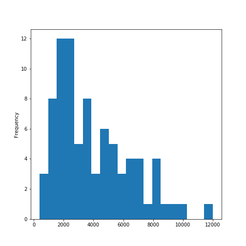

This script uses the previous scripts on the healthcare recommender systems, but without the non-professional category as it was replaced with two new categories of lymphatic drainage massage and dry brushing. The risks, side-effects, and contraindications were removed from the healthcare documents, and so were the sponsored ads, images, and author information. The link to the documents is included in the dataset to get the original source material. The focus is to build a recommender system by user input that will take these documents on various healthcare and wellness services to recommend a health and wellness service based on user input. 

The random forest classifier (RFC), Gradient Boosting Classifier (GBC), and the multinomial naive bayes classifiers will be used starting with the multinomial naive bayes classifier. The vectorization of the words as tokens will be tested using term frequency-inverse document frequency (TF-IDF), Count, and N-gram vectorized tokens for our separate document term matrices within the RFC and GBC classifiers. There will also be a split for each tokenization method for the RFC and GBC classifiers. The recall, precision, and accuracy measures will be recorded for each, and user input of short text will be used after the model is built and tested on the testing set for each relative model to predict the health and wellness class recommendation for the short input supplied by a user.

This is an R-markdown document in Rstudio, mostly using python 3 to run the machine learning model builds using the R package 'reticulate.' The RFC and GBC models were built using sci-kit learn or sklearn as well as the multinomial naive bayes model that starts this script. Other packages include 
pandas, numpy, matplotlib, re (regex), string, and nltk for the python modules used inside Rstudio.
```{r}
library(reticulate)
```

```{r}
conda_list(conda = "auto") 

```

Without having my python IDE, Anaconda, open in the console I want to use the python36 environment, all the environments in Anaconda for python are listed above.

```{r}
use_condaenv(condaenv = "python36")

```

```{python,error=FALSE,message=FALSE,warning=FALSE,FutureWarning=FALSE}
import pandas as pd 
import matplotlib.pyplot as plt 
from textblob import TextBlob 
import sklearn 
import numpy as np 
from sklearn.feature_extraction.text import CountVectorizer, TfidfVectorizer 
from sklearn.naive_bayes import MultinomialNB 
from sklearn.metrics import classification_report, f1_score, accuracy_score, confusion_matrix 

import re
import string
import nltk 

np.random.seed(47) 
```

```{r}
set.seed(47)
```

The following data table will not show in your Rstudio environment, but python inside your python IDE will store the table.
```{python,error=FALSE,message=FALSE,warning=FALSE,FutureWarning=FALSE}
modalities = pd.read_csv('benefitsContraindications4.csv', encoding = 'unicode_escape') 
```


```{python,error=FALSE,message=FALSE,warning=FALSE,FutureWarning=FALSE}
print(modalities.shape)
print(modalities.columns)
print(modalities.head())
print(modalities.tail())
```


```{python,error=FALSE,message=FALSE,warning=FALSE,FutureWarning=FALSE}
print(modalities['Topic'].unique())
```
There are a total of 10 classes to classify in this table of healthcare and wellness documents.

```{python,error=FALSE,message=FALSE,warning=FALSE,FutureWarning=FALSE}
import regex
def preprocessor(text):
    text = regex.sub('<[^>]*>', '', text)
    emoticons = regex.findall('(?::|;|=)(?:-)?(?:\)|\(|D|P)', text)
    text = regex.sub('[\W]+', ' ', text.lower()) +\
        ' '.join(emoticons).replace('-', '')
    return text
```


```{python,error=FALSE,message=FALSE,warning=FALSE,FutureWarning=FALSE}
modalities.tail()
```

Reorder the observations so that they are mixed and not grouped together as they are in the original file.
```{python,error=FALSE,message=FALSE,warning=FALSE,FutureWarning=FALSE}
import numpy as np

modalities = modalities.reindex(np.random.permutation(modalities.index))

print(modalities.head())
print(modalities.tail())
```


```{python,error=FALSE,message=FALSE,warning=FALSE,FutureWarning=FALSE}
modalities.groupby('Topic').describe()
```


```{python,error=FALSE,message=FALSE,warning=FALSE,FutureWarning=FALSE}
modalities['length'] = modalities['Document'].map(lambda text: len(text))
print(modalities.head())
```


```{python,eval=FALSE}
modalities.length.plot(bins=20, kind='hist')
plt.show()
```

```{r echo=FALSE, out.width='100%'}

```


```{python,error=FALSE,message=FALSE,warning=FALSE,FutureWarning=FALSE}
modalities.length.describe()
```


```{python,error=FALSE,message=FALSE,warning=FALSE,FutureWarning=FALSE}
print(list(modalities.Document[modalities.length > 3900].index))
print(list(modalities.Topic[modalities.length > 3900]))

```


```{python,eval=FALSE}

modalities.hist(column='length', by='Topic', bins=5)


plt.show()
```

```{r echo=FALSE, out.width='100%'}

```

```{python,error=FALSE,message=FALSE,warning=FALSE,FutureWarning=FALSE}
def split_into_tokens(review):
    
    return TextBlob(review).words
```


```{python,error=FALSE,message=FALSE,warning=FALSE,FutureWarning=FALSE}
modalities.Document.head().apply(split_into_tokens)
```


```{python,error=FALSE,message=FALSE,warning=FALSE,FutureWarning=FALSE}
TextBlob("hello world, how is it going?").tags  # list of (word, POS) pairs
```


```{python,error=FALSE,message=FALSE,warning=FALSE,FutureWarning=FALSE}
import nltk
nltk.download('stopwords')

```


```{python,error=FALSE,message=FALSE,warning=FALSE,FutureWarning=FALSE}
from nltk.corpus import stopwords

stop = stopwords.words('english')
stop = stop + [u'a',u'b',u'c',u'd',u'e',u'f',u'g',u'h',u'i',u'j',u'k',u'l',u'm',u'n',u'o',u'p',u'q',u'r',u's',u't',u'v',u'w',u'x',u'y',u'z']


```


```{python,error=FALSE,message=FALSE,warning=FALSE,FutureWarning=FALSE}
def split_into_lemmas(review):
    #review = unicode(review, 'iso-8859-1')
    review = review.lower()
    #review = unicode(review, 'utf8').lower()
    #review = str(review).lower()
    words = TextBlob(review).words
    # for each word, take its "base form" = lemma 
    return [word.lemma for word in words if word not in stop]

modalities.Document.head().apply(split_into_lemmas)
```


```{python,error=FALSE,message=FALSE,warning=FALSE,FutureWarning=FALSE}
bow_transformerNgrams = CountVectorizer(analyzer=split_into_lemmas,ngram_range=(2,2)).fit(modalities['Document'])
          
print(len(bow_transformerNgrams.vocabulary_))


```


```{python,error=FALSE,message=FALSE,warning=FALSE,FutureWarning=FALSE}
modality4 = modalities['Document'][40]
print(modality4)
```


```{python,error=FALSE,message=FALSE,warning=FALSE,FutureWarning=FALSE}
bow4 = bow_transformerNgrams.transform([modality4])
print(bow4)
```


```{python,error=FALSE,message=FALSE,warning=FALSE,FutureWarning=FALSE}
modalities_bow = bow_transformerNgrams.transform(modalities['Document'])
print('sparse matrix shape:', modalities_bow.shape)
print('number of non-zeros:', modalities_bow.nnz)
print('sparsity: %.2f%%' % (100.0 * modalities_bow.nnz / (modalities_bow.shape[0] * modalities_bow.shape[1])))
```


```{python,error=FALSE,message=FALSE,warning=FALSE,FutureWarning=FALSE}
modalities_bow
```

```{python,error=FALSE,message=FALSE,warning=FALSE,FutureWarning=FALSE}

# Split/splice into training ~ 80% and testing ~ 20%
modalities_bow_train = modalities_bow[:65]
modalities_bow_test = modalities_bow[65:]
modalities_sentiment_train = modalities['Topic'][:65]
modalities_sentiment_test = modalities['Topic'][65:]

print(modalities_bow_train.shape)
print(modalities_bow_test.shape)
print
```


```{python,error=FALSE,message=FALSE,warning=FALSE,FutureWarning=FALSE}
modalities_sentiment = MultinomialNB().fit(modalities_bow_train, modalities_sentiment_train)
```


```{python,error=FALSE,message=FALSE,warning=FALSE,FutureWarning=FALSE}
print('predicted:', modalities_sentiment.predict(bow4)[0])
print('expected:', modalities.Topic[40])
```


```{python, error=FALSE, message=FALSE, warning=FALSE}
predictions = modalities_sentiment.predict(modalities_bow_test)
#print(predictions)

prd = pd.DataFrame(predictions)
prd.columns=['predictions']
prd.index=modalities_sentiment_test.index
pred=pd.concat([pd.DataFrame(prd),modalities_sentiment_test],axis=1)
print(pred)

```


```{python,error=FALSE,message=FALSE,warning=FALSE,FutureWarning=FALSE}
print('accuracy', accuracy_score(modalities_sentiment_test, predictions))
print('confusion matrix\n', confusion_matrix(modalities_sentiment_test, predictions))
print('(row=expected, col=predicted)')
```

```{python,error=FALSE,message=FALSE,warning=FALSE,FutureWarning=FALSE}
print(classification_report(modalities_sentiment_test, predictions))
```
From the above, precision accounts for type 1 errors (how many real negatives classified as positives-False Positives: TP/(TP+FP)) and type 2 errors (how many real posiives classified as negatives-False Negatives: TP/(TP+FN)) are part of recall. We can see that in our testing set of samples, by looking at precision, the ER, cold stone benefits, cupping benefits, and physical therapy benefits classes were correctly classified when classified at all. But for recall, all except for cold stone benefits and the Not Professional class were mis-classified as cold stone benefits when the class was not a cold stone benefit. Also, for precision, the massage gun and massage benefits as well as the Not Professional classes were mis-classified as each such class incorrectly. So, when the classifier predicted the class as being massage gun benefits the classification was correct 67% of the time, and half the time for massage benefits as far as precision is concerned. And when the classifications of ER, cupping, massage, massage gun, and physical therapy benefits were classifed, they were all 'found' or recalled, there were no misclassifications of those classes.

A note with precision and recall, because when learning from different sources, they have differnt nmemonics for remembering, even with the way they set up their Type I and Type II diagram, and that could leave to confusion. But it is important to make it simple and not complex nor introduce more confusion when not needed. Recall is analogous to saying, 'out of all those that were class A, we classified them with some percent accuracy.' For precision, it is analogous to saying, 'out of all the classifications we made for class A, we were right this percent of the time.' Or find what works for you. Precision is Type 1 error and recall is a Type 2 error, some nmemonics say to use how many negatives? One or two. If predicted positive when negative, its a false negative or type 2 error, and if predicted negative when positive, it is a false positive or type 1 error.

Aside: If your concern is with improving recall or improving precision, you would need to tune your predictive model to get better prediction or recall and put aside the need for the accuracy to be close to 100%. Because if accuracy is 98% and your recall is 60%, that is not going to help you, if say you needed to find all of the tumor cells and only found 60% of them. Same, for precision, if your accuracy is 98% and your precision is 80% and recall 90%, then if your predicting the next day of a stock price increasing and misclassify it as such when it decreases, your precision needs to be improved. Because you may have classified 90% of those days that increased, but you misclassified some decreasing days by 80%, and could have bought that stock. When in doubt, do as the nerds do and set up 10 analogous examples of real-life outcomes and see if its true, or you could stand in a corner until you fall asleep and dream about what is a type 1 and type 2. Or depending on your access to google just google it. But when classifying, you should definitely make sure you have a clear understanding of the difference and necessity for recall and precision. If this was a movie, there would be an unanswered question as to how to tune for these improvements in precision or recall. Since, the above uses multinomial naive bayes, the probabilities are based on the principle of garbage in and garbage out. You would have to get better data, more relevant features, exclude features, play with the testing and training sets, remove outliers, or normalize the data to include outliers by taking the log, and getting to know the sometimes 100s of features (or appearance of) your algorithm if using a package like nltk on tokenizing words. You will see this later in the list of nltk attributes in the other algorithm and model testing on this dataset.

```{python,error=FALSE,message=FALSE,warning=FALSE,FutureWarning=FALSE}
modalitiesu = modalities.Topic.unique()
mus = np.sort(modalitiesu)
mus
```


```{python,error=FALSE,message=FALSE,warning=FALSE,FutureWarning=FALSE}

def predict_modality(new_review): 
    new_sample = bow_transformerNgrams.transform([new_review])
    pr = np.around(modalities_sentiment.predict_proba(new_sample),2)
    print(new_review,'\n\n', pr)
    print('\n\nThe respective order:\n 0-ER\n 1-Lymphatic Drainage Massage\n 2-chiropractic therapy\n 3-cold stone therapy\n 4-cupping therapy\n 5-dry brushing massage\n 6-massage benefits\n 7-massage gun therapy\n 8-mental health services\n 9-physical therapy services\n\n')
    
    if (pr[0][0] == max(pr[0])):
        print('The max probability is Emergency Room services for this recommendation with ', pr[0][0]*100,'%')
    elif (pr[0][1] == max(pr[0])):
        print('The max probability is Lymphatic Drainage Massage for this recommendation with ', pr[0][1]*100,'%')
        
    elif (pr[0][2] == max(pr[0])):
        print('The max probability is chiropractic therapy for this recommendation with ', pr[0][2]*100,'%')
        
    elif (pr[0][3] == max(pr[0])):
        print('The max probability is cold stone massage for this recommendation with ', pr[0][3]*100,'%')
        
    elif (pr[0][4] == max(pr[0])):
        print('The max probability is cupping therapy for this recommendation with ', pr[0][4]*100,'%')
   
    elif (pr[0][5] == max(pr[0])):
        print('The max probability is dry brushing massage for this recommendation with ', pr[0][5]*100,'%')
    
    elif (pr[0][6] == max(pr[0])):
        print('The max probability is massage therapy for this recommendation with ', pr[0][6]*100,'%')
    
    elif (pr[0][7] == max(pr[0])):
        print('The max probability is massage gun therapy for this recommendation with ', pr[0][7]*100,'%')
    
    elif (pr[0][8] == max(pr[0])):
        print('The max probability is mental health services for this recommendation with ', pr[0][8]*100,'%')
    else:
        print('The max probability is physical therapy services for this recommendation with ', pr[0][9]*100,'%')
    print('-----------------------------------------\n\n')

```


```{python,error=FALSE,message=FALSE,warning=FALSE,FutureWarning=FALSE}
predict_modality('Headaches, body sweats, depressed.')

predict_modality('sleepless, energy depraved, cold, tension')

predict_modality('body aches from working out')
predict_modality('can\'t move my arm. stuck at home. worried about my neck.')
```

```{python,error=FALSE,message=FALSE,warning=FALSE,FutureWarning=FALSE}
predict_modality('breathing ragged, tired, headaches, dizzy, nausious ')

```

```{python,error=FALSE,message=FALSE,warning=FALSE,FutureWarning=FALSE}
predict_modality("relief from this pain. can't sleep. feet hurt. chills.")
```

```{python,error=FALSE,message=FALSE,warning=FALSE,FutureWarning=FALSE}
predict_modality('love this place better than others')
```

***


```{r}
library(reticulate)
```

```{r}
conda_list(conda = "auto") 

```

Without having my python IDE, Anaconda, open in the console I want to use the python36 environment, all the environments in Anaconda for python are listed above.

```{r}
use_condaenv(condaenv = "python36")

```

```{python,error=FALSE,message=FALSE,warning=FALSE,FutureWarning=FALSE}
import pandas as pd 
import matplotlib.pyplot as plt 
from textblob import TextBlob 
import sklearn 
import numpy as np 
from sklearn.feature_extraction.text import CountVectorizer, TfidfVectorizer 
from sklearn.naive_bayes import MultinomialNB 
from sklearn.metrics import classification_report, f1_score, accuracy_score, confusion_matrix 

import re
import string
import nltk 

np.random.seed(45678) 
```

***

The first part of the following code uses the Random Forest Classifier (RFC) and the Gradient Boosting Classifier (GBC) to categorize the recommendation based on three separate types of document term matrix (dtm) tokenizations, Count Vectorizer, Term Frequency-Inverse Document Frequency (TF-IDF) Vectorizer, and N-grams Vectorizer. This first part also uses Lemmatization to get the more ideal word meaning root word. And the training model uses 80% of the samples and 20% to test the model on within each type of vectorized and lemmatized token. 

The second part of the following will keep all the same but change the training set to 85% and the testing set to 15% while still using lemmatization.

The third part will keep the first part the same but only change the lemmatization to stemmed word roots.

The fourt part will keep the same third part settings but change the testing set to 15% and the training set to 85%.

Those four sections of variations will allow us to contrast and compare which setting worked best for recall, precision, and accuracy within each vectorized and stemmed/lemmatized tokens of the dtms for either RFC or GBC.

***

## First part: Lemmatized Tokens & 80/20 Train/Test split & RFC | GBC

**Count Vectorizer** RFC and GBC

```{python,error=FALSE,message=FALSE,warning=FALSE,FutureWarning=FALSE}

stopwords = nltk.corpus.stopwords.words('english')
ps=nltk.PorterStemmer()
wn=nltk.WordNetLemmatizer()
data=pd.read_csv("benefitsContraindications4.csv", encoding='unicode_escape')
data.columns=['Document','Source','Topic','InternetSearch','Contraindications','RisksSideEffects']
```

```{r}
data <- read.csv('benefitsContraindications4.csv',sep=',',header=TRUE,  na.strings=c('',' ','NA'))
colnames(data)
head(data,5)
```

```{python, error=FALSE, message=FALSE, warning=FALSE}
def count_punct(text):
    count=sum([1 for char in text if char in string.punctuation])
    return round(count/(len(text)-text.count(" ")),3)*100
```


```{python,error=FALSE,message=FALSE,warning=FALSE,FutureWarning=FALSE}
data['body_length']=data['Document'].apply(lambda x: len(x)-x.count(" "))
data['punct%']= data['Document'].apply(lambda x: count_punct(x))


```


```{python, error=FALSE, message=FALSE, warning=FALSE}

def clean_text(text):
    text="".join([word.lower() for word in text if word not in string.punctuation])
    tokens=re.split('\W+', text)
    text=[ps.stem(word) for word in tokens if word not in stopwords]#these are lists for the count vectorizer
    return text

def lemmatize(text):
    text="".join([word.lower() for word in text if word not in string.punctuation])
    tokens=re.split('\W+', text)
    text=[wn.lemmatize(word) for word in tokens if word not in stopwords]#these are lists for the count vectorizer
    return text        
```


```{python,error=FALSE,message=FALSE,warning=FALSE,FutureWarning=FALSE}

data['Cleaned_text']=data['Document'].apply(lambda x: clean_text(x))
data['Lemmatized']=data['Document'].apply(lambda x: lemmatize(x))
data.head()

```

```{python, error=FALSE, message=FALSE, warning=FALSE}
data.to_csv('dataCleanLemm.csv')
#DATA = pd.read_csv('dataCleanLemm.csv', encoding='unicode_escape')
```

```{r}
DATA <- read.csv('dataCleanLemm.csv', sep=',', header=TRUE, na.strings=c('',' ','NA'), row.names=1)
colnames(DATA)
head(DATA,2)
```

```{python,error=FALSE,message=FALSE,warning=FALSE,FutureWarning=FALSE}
from sklearn.model_selection import train_test_split

X_train,X_test,y_train,y_test=train_test_split(data[['Document','body_length','punct%','Cleaned_text','Lemmatized']],data['Topic'],test_size=0.20)

```


```{python,error=FALSE,message=FALSE,warning=FALSE,FutureWarning=FALSE}
from sklearn.feature_extraction.text import CountVectorizer
```


```{python,error=FALSE,message=FALSE,warning=FALSE,FutureWarning=FALSE}
count_vect=CountVectorizer(analyzer=lemmatize)
count_vect_fit=count_vect.fit(X_train['Document'])

count_train=count_vect_fit.transform(X_train['Document'])
count_test=count_vect_fit.transform(X_test['Document'])
```


```{python,error=FALSE,message=FALSE,warning=FALSE,FutureWarning=FALSE}
len(count_vect_fit.get_feature_names())
count_vect_fit.get_feature_names()[200:350]
```


```{python,error=FALSE,message=FALSE,warning=FALSE,FutureWarning=FALSE}
count_train_vect=pd.concat([X_train[['Document','body_length','punct%','Cleaned_text','Lemmatized']].reset_index(drop=True),pd.DataFrame(count_train.toarray())],axis=1)

count_test_vect=pd.concat([X_test[['Document','body_length','punct%','Cleaned_text','Lemmatized']].reset_index(drop=True),pd.DataFrame(count_test.toarray())],axis=1)

```


```{python,error=FALSE,message=FALSE,warning=FALSE,FutureWarning=FALSE}
count_train_vect.head()
```


```{python,error=FALSE,message=FALSE,warning=FALSE,FutureWarning=FALSE}
from sklearn.ensemble import RandomForestClassifier, GradientBoostingClassifier
from sklearn.metrics import precision_recall_fscore_support as score
import time
```


```{python,error=FALSE,message=FALSE,warning=FALSE,FutureWarning=FALSE}
rf=RandomForestClassifier(n_estimators=150, max_depth=None, n_jobs=-1)
start=time.time()
rf_model=rf.fit(count_train,y_train)
end=time.time()
fit_time=(end-start)
```


```{python,error=FALSE,message=FALSE,warning=FALSE,FutureWarning=FALSE}
start=time.time()
y_pred=rf_model.predict(count_test)
end=time.time()
pred_time=(end-start)
```


```{python,error=FALSE,message=FALSE,warning=FALSE,FutureWarning=FALSE}
prd = pd.DataFrame(y_pred)
prd.columns=['Predicted']

prd.index=y_test.index
pred=pd.concat([pd.DataFrame(prd),y_test],axis=1)
print(pred)
```


```{python,error=FALSE,message=FALSE,warning=FALSE,FutureWarning=FALSE}
from sklearn.metrics import classification_report, f1_score, accuracy_score, confusion_matrix 

print('accuracy', accuracy_score(y_test, y_pred))
print('confusion matrix\n', confusion_matrix(y_test, y_pred))
print('(row=expected, col=predicted)')

print(classification_report(y_test, y_pred))
```


```{python,error=FALSE,message=FALSE,warning=FALSE,FutureWarning=FALSE}
gb=GradientBoostingClassifier(n_estimators=150,max_depth=11)
start=time.time()
gb_model=gb.fit(count_train,y_train)
end=time.time()
fit_time=(end-start)

```


```{python,error=FALSE,message=FALSE,warning=FALSE,FutureWarning=FALSE}
start=time.time()
y_pred=gb_model.predict(count_test)
end=time.time()
pred_time=(end-start)
```


```{python,error=FALSE,message=FALSE,warning=FALSE,FutureWarning=FALSE}
prd = pd.DataFrame(y_pred)
prd.columns=['Predicted']

prd.index=y_test.index
pred=pd.concat([pd.DataFrame(prd),y_test],axis=1)
print(pred)

```


```{python,error=FALSE,message=FALSE,warning=FALSE,FutureWarning=FALSE}
from sklearn.metrics import classification_report, f1_score, accuracy_score, confusion_matrix 

print('accuracy', accuracy_score(y_test, y_pred))
print('confusion matrix\n', confusion_matrix(y_test, y_pred))
print('(row=expected, col=predicted)')

print(classification_report(y_test, y_pred))

```


```{python,error=FALSE,message=FALSE,warning=FALSE,FutureWarning=FALSE}

def clean_text(text):
    text="".join([word.lower() for word in text if word not in string.punctuation])
    tokens=re.split('\W+', text)
    text=[ps.stem(word) for word in tokens if word not in stopwords]
    return text

def lemmatize(text):
    text="".join([word.lower() for word in text if word not in string.punctuation])
    tokens=re.split('\W+', text)
    text=[wn.lemmatize(word) for word in tokens if word not in stopwords]
    return text   

def predict_countRFC_lemmatized(new_review): 
    nr=pd.DataFrame([new_review])
    nr.columns=['newReview']
    nr['lemmatized']=nr['newReview'].apply(lambda x: lemmatize(x))
    
    rf=RandomForestClassifier(n_estimators=150, max_depth=None, n_jobs=-1)
    count_vect=CountVectorizer(analyzer=lemmatize)
    
    count_vect_fit=count_vect.fit(X_train['Document'])
    count_train=count_vect_fit.transform(X_train['Document'])
    count_test=count_vect_fit.transform(nr['lemmatized'])
    
    model = rf.fit(count_train,y_train)
    pred=pd.DataFrame(model.predict(count_test))
    pred.columns=['Recommended Healthcare Service']
    pred.index= ['lemmatized_count_RFC_80-20:']
    print('\n\n',pred)
    

def predict_countRFC_cleaned(new_review): 
    nr=pd.DataFrame([new_review])
    nr.columns=['newReview']
    nr['clean']=nr['newReview'].apply(lambda x: clean_text(x))
    
    rf=RandomForestClassifier(n_estimators=150, max_depth=None, n_jobs=-1)
    count_vect=CountVectorizer(analyzer=clean_text)
    
    count_vect_fit=count_vect.fit(X_train['Document'])
    count_train=count_vect_fit.transform(X_train['Document'])
    count_test=count_vect_fit.transform(nr['clean'])
    
    model = rf.fit(count_train,y_train)
    pred=pd.DataFrame(model.predict(count_test))
    pred.columns=['Recommended Healthcare Service']
    pred.index= ['cleaned_count_RFC_80-20:']
    print('\n\n',pred)
    
```

```{python,error=FALSE,message=FALSE,warning=FALSE,FutureWarning=FALSE}    
predict_countRFC_cleaned('I need a massage!') 
predict_countRFC_lemmatized('I need a massage!')
```


```{python,error=FALSE,message=FALSE,warning=FALSE,FutureWarning=FALSE}

def clean_text(text):
    text="".join([word.lower() for word in text if word not in string.punctuation])
    tokens=re.split('\W+', text)
    text=[ps.stem(word) for word in tokens if word not in stopwords]
    return text

def lemmatize(text):
    text="".join([word.lower() for word in text if word not in string.punctuation])
    tokens=re.split('\W+', text)
    text=[wn.lemmatize(word) for word in tokens if word not in stopwords]
    return text   

def predict_countGBC_lemmatized(new_review): 
    nr=pd.DataFrame([new_review])
    nr.columns=['newReview']
    nr['lemmatized']=nr['newReview'].apply(lambda x: lemmatize(x))
    
    gb=GradientBoostingClassifier(n_estimators=150,max_depth=11)
    count_vect=CountVectorizer(analyzer=lemmatize)
    
    count_vect_fit=count_vect.fit(X_train['Document'])
    count_train=count_vect_fit.transform(X_train['Document'])
    count_test=count_vect_fit.transform(nr['lemmatized'])
    
    model = gb.fit(count_train,y_train)
    pred=pd.DataFrame(model.predict(count_test))
    pred.columns=['Recommended Healthcare Service']
    pred.index= ['lemmatized_count_GBC_80-20:']
    print('\n\n',pred)
    

def predict_countGBC_cleaned(new_review): 
    nr=pd.DataFrame([new_review])
    nr.columns=['newReview']
    nr['clean']=nr['newReview'].apply(lambda x: clean_text(x))
    
    gb=GradientBoostingClassifier(n_estimators=150,max_depth=11)
    count_vect=CountVectorizer(analyzer=clean_text)
    
    count_vect_fit=count_vect.fit(X_train['Document'])
    count_train=count_vect_fit.transform(X_train['Document'])
    count_test=count_vect_fit.transform(nr['clean'])
    
    model = gb.fit(count_train,y_train)
    pred=pd.DataFrame(model.predict(count_test))
    pred.columns=['Recommended Healthcare Service']
    pred.index= ['cleaned_count_GBC_80-20:']
    print('\n\n',pred)
    
```

```{python,error=FALSE,message=FALSE,warning=FALSE,FutureWarning=FALSE}    
predict_countGBC_cleaned('I need a massage!') 
predict_countGBC_lemmatized('I need a massage!')
```
***

**TF-IDF** RFC and GBC

```{python,error=FALSE,message=FALSE,warning=FALSE,FutureWarning=FALSE}

stopwords = nltk.corpus.stopwords.words('english')
ps=nltk.PorterStemmer()
wn=nltk.WordNetLemmatizer()
data=pd.read_csv("benefitsContraindications4.csv", encoding='unicode_escape')
data.columns=['Document','Source','Topic','InternetSearch','Contraindications','RisksSideEffects']
```


```{python, error=FALSE, message=FALSE, warning=FALSE}
def count_punct(text):
    count=sum([1 for char in text if char in string.punctuation])
    return round(count/(len(text)-text.count(" ")),3)*100
```


```{python,error=FALSE,message=FALSE,warning=FALSE,FutureWarning=FALSE}
data['body_length']=data['Document'].apply(lambda x: len(x)-x.count(" "))
data['punct%']= data['Document'].apply(lambda x: count_punct(x))


```


```{python, error=FALSE, message=FALSE, warning=FALSE}

def clean_text(text):
    text="".join([word.lower() for word in text if word not in string.punctuation])
    tokens=re.split('\W+', text)
    text=[ps.stem(word) for word in tokens if word not in stopwords]#these are lists for the count vectorizer
    return text

def lemmatize(text):
    text="".join([word.lower() for word in text if word not in string.punctuation])
    tokens=re.split('\W+', text)
    text=[wn.lemmatize(word) for word in tokens if word not in stopwords]#these are lists for the count vectorizer
    return text        
```


```{python,error=FALSE,message=FALSE,warning=FALSE,FutureWarning=FALSE}

data['Cleaned_text']=data['Document'].apply(lambda x: clean_text(x))
data['Lemmatized']=data['Document'].apply(lambda x: lemmatize(x))
data.head()

```


```{python,error=FALSE,message=FALSE,warning=FALSE,FutureWarning=FALSE}

from sklearn.model_selection import train_test_split

X_train,X_test,y_train,y_test=train_test_split(data[['Document','body_length','punct%','Cleaned_text','Lemmatized']],data['Topic'],test_size=0.20)

```


```{python,error=FALSE,message=FALSE,warning=FALSE,FutureWarning=FALSE}

from sklearn.feature_extraction.text import TfidfVectorizer

```


```{python,error=FALSE,message=FALSE,warning=FALSE,FutureWarning=FALSE}

tfidf_vect=TfidfVectorizer(analyzer=lemmatize)
tfidf_vect_fit=tfidf_vect.fit(X_train['Document'])

tfidf_train=tfidf_vect_fit.transform(X_train['Document'])
tfidf_test=tfidf_vect_fit.transform(X_test['Document'])

```


```{python,error=FALSE,message=FALSE,warning=FALSE,FutureWarning=FALSE}
len(tfidf_vect_fit.get_feature_names())
tfidf_vect_fit.get_feature_names()[200:350]
```


```{python,error=FALSE,message=FALSE,warning=FALSE,FutureWarning=FALSE}
tfidf_train_vect=pd.concat([X_train[['Document','body_length','punct%','Cleaned_text','Lemmatized']].reset_index(drop=True),pd.DataFrame(tfidf_train.toarray())],axis=1)

tfidf_test_vect=pd.concat([X_test[['Document','body_length','punct%','Cleaned_text','Lemmatized']].reset_index(drop=True),pd.DataFrame(tfidf_test.toarray())],axis=1)

```


```{python,error=FALSE,message=FALSE,warning=FALSE,FutureWarning=FALSE}
tfidf_train_vect.head()
```


```{python,error=FALSE,message=FALSE,warning=FALSE,FutureWarning=FALSE}
from sklearn.ensemble import RandomForestClassifier, GradientBoostingClassifier
from sklearn.metrics import precision_recall_fscore_support as score
import time
np.random.seed(45678)
```


```{python,error=FALSE,message=FALSE,warning=FALSE,FutureWarning=FALSE}
rf=RandomForestClassifier(n_estimators=150, max_depth=None, n_jobs=-1)
start=time.time()
rf_model=rf.fit(tfidf_train,y_train)
end=time.time()
fit_time=(end-start)
```


```{python,error=FALSE,message=FALSE,warning=FALSE,FutureWarning=FALSE}
start=time.time()
y_pred=rf_model.predict(tfidf_test)
end=time.time()
pred_time=(end-start)
```


```{python,error=FALSE,message=FALSE,warning=FALSE,FutureWarning=FALSE}
prd = pd.DataFrame(y_pred)
prd.columns=['Predicted']

prd.index=y_test.index
pred=pd.concat([pd.DataFrame(prd),y_test],axis=1)
print(pred)
```


```{python,error=FALSE,message=FALSE,warning=FALSE,FutureWarning=FALSE}
from sklearn.metrics import classification_report, f1_score, accuracy_score, confusion_matrix 

print('accuracy', accuracy_score(y_test, y_pred))
print('confusion matrix\n', confusion_matrix(y_test, y_pred))
print('(row=expected, col=predicted)')

print(classification_report(y_test, y_pred))
```


```{python,error=FALSE,message=FALSE,warning=FALSE,FutureWarning=FALSE}
gb=GradientBoostingClassifier(n_estimators=150,max_depth=11)
start=time.time()
gb_model=gb.fit(tfidf_train,y_train)
end=time.time()
fit_time=(end-start)

```


```{python,error=FALSE,message=FALSE,warning=FALSE,FutureWarning=FALSE}
start=time.time()
y_pred=gb_model.predict(tfidf_test)
end=time.time()
pred_time=(end-start)
```


```{python,error=FALSE,message=FALSE,warning=FALSE,FutureWarning=FALSE}
prd = pd.DataFrame(y_pred)
prd.columns=['Predicted']

prd.index=y_test.index
pred=pd.concat([pd.DataFrame(prd),y_test],axis=1)
print(pred)

```


```{python,error=FALSE,message=FALSE,warning=FALSE,FutureWarning=FALSE}
from sklearn.metrics import classification_report, f1_score, accuracy_score, confusion_matrix 

print('accuracy', accuracy_score(y_test, y_pred))
print('confusion matrix\n', confusion_matrix(y_test, y_pred))
print('(row=expected, col=predicted)')

print(classification_report(y_test, y_pred))

```


```{python,error=FALSE,message=FALSE,warning=FALSE,FutureWarning=FALSE}

def clean_text(text):
    text="".join([word.lower() for word in text if word not in string.punctuation])
    tokens=re.split('\W+', text)
    text=[ps.stem(word) for word in tokens if word not in stopwords]
    return text

def lemmatize(text):
    text="".join([word.lower() for word in text if word not in string.punctuation])
    tokens=re.split('\W+', text)
    text=[wn.lemmatize(word) for word in tokens if word not in stopwords]
    return text   

def predict_tfidfRFC_lemmatized(new_review): 
    nr=pd.DataFrame([new_review])
    nr.columns=['newReview']
    nr['lemmatized']=nr['newReview'].apply(lambda x: lemmatize(x))
    
    rf=RandomForestClassifier(n_estimators=150, max_depth=None, n_jobs=-1)
    tfidf_vect=TfidfVectorizer(analyzer=lemmatize)
    
    tfidf_vect_fit=tfidf_vect.fit(X_train['Document'])
    tfidf_train=tfidf_vect_fit.transform(X_train['Document'])
    tfidf_test=tfidf_vect_fit.transform(nr['lemmatized'])
    
    model = rf.fit(tfidf_train,y_train)
    pred=pd.DataFrame(model.predict(tfidf_test))
    pred.columns=['Recommended Healthcare Service']
    pred.index= ['lemmatized_tfidf_RFC_80-20:']
    print('\n\n',pred)
    

def predict_tfidfRFC_cleaned(new_review): 
    nr=pd.DataFrame([new_review])
    nr.columns=['newReview']
    nr['clean']=nr['newReview'].apply(lambda x: clean_text(x))
    
    rf=RandomForestClassifier(n_estimators=150, max_depth=None, n_jobs=-1)
    tfidf_vect=TfidfVectorizer(analyzer=clean_text)
    
    tfidf_vect_fit=tfidf_vect.fit(X_train['Document'])
    tfidf_train=tfidf_vect_fit.transform(X_train['Document'])
    tfidf_test=tfidf_vect_fit.transform(nr['clean'])
    
    model = rf.fit(tfidf_train,y_train)
    pred=pd.DataFrame(model.predict(tfidf_test))
    pred.columns=['Recommended Healthcare Service']
    pred.index= ['cleaned_tfidf_RFC_80-20:']
    print('\n\n',pred)
    
```

```{python,error=FALSE,message=FALSE,warning=FALSE,FutureWarning=FALSE}    
predict_tfidfRFC_cleaned('I need a massage!') 
predict_tfidfRFC_lemmatized('I need a massage!')
```


```{python,error=FALSE,message=FALSE,warning=FALSE,FutureWarning=FALSE}

def clean_text(text):
    text="".join([word.lower() for word in text if word not in string.punctuation])
    tokens=re.split('\W+', text)
    text=[ps.stem(word) for word in tokens if word not in stopwords]
    return text

def lemmatize(text):
    text="".join([word.lower() for word in text if word not in string.punctuation])
    tokens=re.split('\W+', text)
    text=[wn.lemmatize(word) for word in tokens if word not in stopwords]
    return text   

def predict_tfidfGBC_lemmatized(new_review): 
    nr=pd.DataFrame([new_review])
    nr.columns=['newReview']
    nr['lemmatized']=nr['newReview'].apply(lambda x: lemmatize(x))
    
    gb=GradientBoostingClassifier(n_estimators=150,max_depth=11)
    tfidf_vect=TfidfVectorizer(analyzer=lemmatize)
    
    tfidf_vect_fit=tfidf_vect.fit(X_train['Document'])
    tfidf_train=tfidf_vect_fit.transform(X_train['Document'])
    tfidf_test=tfidf_vect_fit.transform(nr['lemmatized'])
    
    model = gb.fit(tfidf_train,y_train)
    pred=pd.DataFrame(model.predict(tfidf_test))
    pred.columns=['Recommended Healthcare Service']
    pred.index= ['lemmatized_tfidf_GBC_80-20:']
    print('\n\n',pred)
    

def predict_tfidfGBC_cleaned(new_review): 
    nr=pd.DataFrame([new_review])
    nr.columns=['newReview']
    nr['clean']=nr['newReview'].apply(lambda x: clean_text(x))
    
    gb=GradientBoostingClassifier(n_estimators=150,max_depth=11)
    tfidf_vect=TfidfVectorizer(analyzer=clean_text)
    
    tfidf_vect_fit=tfidf_vect.fit(X_train['Document'])
    tfidf_train=tfidf_vect_fit.transform(X_train['Document'])
    tfidf_test=tfidf_vect_fit.transform(nr['clean'])
    
    model = gb.fit(tfidf_train,y_train)
    pred=pd.DataFrame(model.predict(tfidf_test))
    pred.columns=['Recommended Healthcare Service']
    pred.index= ['cleaned_tfidf_GBC_80-20:']
    print('\n\n',pred)
    
```

```{python,error=FALSE,message=FALSE,warning=FALSE,FutureWarning=FALSE}    
predict_tfidfGBC_cleaned('I need a massage!') 
predict_tfidfGBC_lemmatized('I need a massage!')
```
***

**N-Grams Vectorization** for RFC and GBC

```{python,error=FALSE,message=FALSE,warning=FALSE,FutureWarning=FALSE}
stopwords = nltk.corpus.stopwords.words('english')
ps=nltk.PorterStemmer()
wn=nltk.WordNetLemmatizer()
data=pd.read_csv("benefitsContraindications4.csv", encoding='unicode_escape')
data.columns=['Document','Source','Topic','InternetSearch','Contraindications','RisksSideEffects']
```


```{python,error=FALSE,message=FALSE,warning=FALSE,FutureWarning=FALSE}
def count_punct(text):
    count=sum([1 for char in text if char in string.punctuation])
    return round(count/(len(text)-text.count(" ")),3)*100
```


```{python,error=FALSE,message=FALSE,warning=FALSE,FutureWarning=FALSE}
data['body_length']=data['Document'].apply(lambda x: len(x)-x.count(" "))
data['punct%']= data['Document'].apply(lambda x: count_punct(x))
```


```{python,error=FALSE,message=FALSE,warning=FALSE,FutureWarning=FALSE}
def clean_text(text):
    text="".join([word.lower() for word in text if word not in string.punctuation])
    tokens=re.split('\W+',text)
    text=" ".join([ps.stem(word) for word in tokens if word not in stopwords])#unlisted with N-grams vectorization
    return text

def lemmatize(text):
    text="".join([word.lower() for word in text if word not in string.punctuation])
    tokens=re.split('\W+', text)
    text=" ".join([wn.lemmatize(word) for word in tokens if word not in stopwords])#unlisted with N-grams vectorization
    #text=[wn.lemmatize(word) for word in tokens if word not in stopwords]#when using count Vectorization its a list
    #or else single letters returned.
    return text    
```


```{python,error=FALSE,message=FALSE,warning=FALSE,FutureWarning=FALSE}
data['Cleaned_text']=data['Document'].apply(lambda x: clean_text(x))
data['Lemmatized']=data['Document'].apply(lambda x: lemmatize(x))
data.head()
```


```{python,error=FALSE,message=FALSE,warning=FALSE,FutureWarning=FALSE}
from sklearn.model_selection import train_test_split

X_train,X_test,y_train,y_test=train_test_split(data[['Document','body_length','punct%','Cleaned_text','Lemmatized']],data['Topic'],test_size=0.20)
```


```{python,error=FALSE,message=FALSE,warning=FALSE,FutureWarning=FALSE}
from sklearn.feature_extraction.text import CountVectorizer
```


```{python,error=FALSE,message=FALSE,warning=FALSE,FutureWarning=FALSE}
n_gram_vect=CountVectorizer(ngram_range=(1,4))

```


```{python,error=FALSE,message=FALSE,warning=FALSE,FutureWarning=FALSE}
type(X_train['Cleaned_text'])
X_train['Cleaned_text'].head()
```


```{python,error=FALSE,message=FALSE,warning=FALSE,FutureWarning=FALSE}
X_train['Lemmatized'].head()
```


```{python,error=FALSE,message=FALSE,warning=FALSE,FutureWarning=FALSE}
n_gram_vect_fit=n_gram_vect.fit(X_train['Lemmatized'])


n_gram_train=n_gram_vect_fit.transform(X_train['Lemmatized'])
n_gram_test=n_gram_vect_fit.transform(X_test['Lemmatized'])
```


```{python,error=FALSE,message=FALSE,warning=FALSE,FutureWarning=FALSE}
len(n_gram_vect_fit.get_feature_names())
print(n_gram_vect_fit.get_feature_names()[200:500])
```


```{python,error=FALSE,message=FALSE,warning=FALSE,FutureWarning=FALSE}
n_gram_train_df=pd.concat([X_train[['Document','body_length','punct%','Cleaned_text','Lemmatized']].reset_index(drop=True),pd.DataFrame(n_gram_train.toarray())],axis=1)

n_gram_test_df=pd.concat([X_test[['Document','body_length','punct%','Cleaned_text','Lemmatized']].reset_index(drop=True),pd.DataFrame(n_gram_test.toarray())],axis=1)

```


```{python,error=FALSE,message=FALSE,warning=FALSE,FutureWarning=FALSE}
n_gram_train_df.head()

```


```{python,error=FALSE,message=FALSE,warning=FALSE,FutureWarning=FALSE}
from sklearn.ensemble import RandomForestClassifier, GradientBoostingClassifier
from sklearn.metrics import precision_recall_fscore_support as score
import time
```


```{python,error=FALSE,message=FALSE,warning=FALSE,FutureWarning=FALSE}
rf=RandomForestClassifier(n_estimators=150, max_depth=None, n_jobs=-1)
start=time.time()
rf_model=rf.fit(n_gram_train,y_train)
end=time.time()
fit_time=(end-start)
```


```{python,error=FALSE,message=FALSE,warning=FALSE,FutureWarning=FALSE}
start=time.time()
y_pred=rf_model.predict(n_gram_test)
end=time.time()
pred_time=(end-start)
```


```{python,error=FALSE,message=FALSE,warning=FALSE,FutureWarning=FALSE}

prd = pd.DataFrame(y_pred)
prd.columns=['Predicted']

prd.index=y_test.index
pred=pd.concat([pd.DataFrame(prd),y_test],axis=1)
print(pred)

```


```{python,error=FALSE,message=FALSE,warning=FALSE,FutureWarning=FALSE}
from sklearn.metrics import classification_report, f1_score, accuracy_score, confusion_matrix 

print('accuracy', accuracy_score(y_test, y_pred))
print('confusion matrix\n', confusion_matrix(y_test, y_pred))
print('(row=expected, col=predicted)')

print(classification_report(y_test, y_pred))
```


```{python,error=FALSE,message=FALSE,warning=FALSE,FutureWarning=FALSE}
gb=GradientBoostingClassifier(n_estimators=150,max_depth=11)
start=time.time()
gb_model=gb.fit(n_gram_train,y_train)
end=time.time()
fit_time=(end-start)
```

```{python,error=FALSE,message=FALSE,warning=FALSE,FutureWarning=FALSE}
start=time.time()
y_pred=gb_model.predict(n_gram_test)
end=time.time()
pred_time=(end-start)
```


```{python,error=FALSE,message=FALSE,warning=FALSE,FutureWarning=FALSE}
prd = pd.DataFrame(y_pred)
prd.columns=['Predicted']

prd.index=y_test.index
pred=pd.concat([pd.DataFrame(prd),y_test],axis=1)
print(pred)
```


```{python,error=FALSE,message=FALSE,warning=FALSE,FutureWarning=FALSE}
from sklearn.metrics import classification_report, f1_score, accuracy_score, confusion_matrix 

print('accuracy', accuracy_score(y_test, y_pred))
print('confusion matrix\n', confusion_matrix(y_test, y_pred))
print('(row=expected, col=predicted)')

print(classification_report(y_test, y_pred))
```


```{python,error=FALSE,message=FALSE,warning=FALSE,FutureWarning=FALSE}
def clean_text(text):
    text="".join([word.lower() for word in text if word not in string.punctuation])
    tokens=re.split('\W+',text)
    text=" ".join([ps.stem(word) for word in tokens if word not in stopwords])
    return text

def predict_ngramRFC_clean(new_review): 
    nr=pd.DataFrame([new_review])
    nr.columns=['newReview']
    nr['clean']=nr['newReview'].apply(lambda x: clean_text(x))

    rf=RandomForestClassifier(n_estimators=150,max_depth=None, n_jobs=-1)
    n_gram_vect=CountVectorizer(ngram_range=(1,4))
    
    n_gram_vect_fit=n_gram_vect.fit(X_train['Cleaned_text'])
    n_gram_train=n_gram_vect_fit.transform(X_train['Cleaned_text'])
    n_gram_test=n_gram_vect_fit.transform(nr['clean'])
    
    model = rf.fit(n_gram_train,y_train)
    pred=pd.DataFrame(model.predict(n_gram_test))
    pred.columns=['Recommended Healthcare Service']
    pred.index= ['stemmed_1ngram4_RFC_80-20:']
    print('\n\n',pred)
    
```

```{python,error=FALSE,message=FALSE,warning=FALSE,FutureWarning=FALSE}

def lemmatize(text):
    text="".join([word.lower() for word in text if word not in string.punctuation])
    tokens=re.split('\W+', text)
    text=" ".join([wn.lemmatize(word) for word in tokens if word not in stopwords])
    return text    
    
def predict_ngramRFC_lemma(new_review): 
    nr=pd.DataFrame([new_review])
    nr.columns=['newReview']
    nr['lemma']=nr['newReview'].apply(lambda x: lemmatize(x))

    rf=RandomForestClassifier(n_estimators=150,max_depth=None, n_jobs=-1)
    n_gram_vect=CountVectorizer(ngram_range=(1,4))
    
    n_gram_vect_fit=n_gram_vect.fit(X_train['Lemmatized'])
    n_gram_train=n_gram_vect_fit.transform(X_train['Lemmatized'])
    n_gram_test=n_gram_vect_fit.transform(nr['lemma'])
    
    model = rf.fit(n_gram_train,y_train)
    pred=pd.DataFrame(model.predict(n_gram_test))
    pred.columns=['Recommended Healthcare Service:']
    pred.index= ['lemmatized_1ngram4RFC_80-20:']
    print('\n\n',pred)
```

```{python,error=FALSE,message=FALSE,warning=FALSE,FutureWarning=FALSE}    
predict_ngramRFC_clean('I need a massage!') 
predict_ngramRFC_lemma('I need a massage!')
```

```{python,error=FALSE,message=FALSE,warning=FALSE,FutureWarning=FALSE}
def clean_text(text):
    text="".join([word.lower() for word in text if word not in string.punctuation])
    tokens=re.split('\W+',text)
    text=" ".join([ps.stem(word) for word in tokens if word not in stopwords])
    return text

def predict_ngramGBC_clean(new_review): 
    nr=pd.DataFrame([new_review])
    nr.columns=['newReview']
    nr['clean']=nr['newReview'].apply(lambda x: clean_text(x))

    gb=GradientBoostingClassifier(n_estimators=150,max_depth=11)
    n_gram_vect=CountVectorizer(ngram_range=(1,4))
    
    n_gram_vect_fit=n_gram_vect.fit(X_train['Cleaned_text'])
    n_gram_train=n_gram_vect_fit.transform(X_train['Cleaned_text'])
    n_gram_test=n_gram_vect_fit.transform(nr['clean'])
    
    model = gb.fit(n_gram_train,y_train)
    pred=pd.DataFrame(model.predict(n_gram_test))
    pred.columns=['Recommended Healthcare Service']
    pred.index= ['stemmed_1ngram4_GBC_80-20:']
    print('\n\n',pred)
    
```

```{python,error=FALSE,message=FALSE,warning=FALSE,FutureWarning=FALSE}

def lemmatize(text):
    text="".join([word.lower() for word in text if word not in string.punctuation])
    tokens=re.split('\W+', text)
    text=" ".join([wn.lemmatize(word) for word in tokens if word not in stopwords])
    return text    
    
def predict_ngramGBC_lemma(new_review): 
    nr=pd.DataFrame([new_review])
    nr.columns=['newReview']
    nr['lemma']=nr['newReview'].apply(lambda x: lemmatize(x))

    gb=GradientBoostingClassifier(n_estimators=150,max_depth=11)
    n_gram_vect=CountVectorizer(ngram_range=(1,4))
    
    n_gram_vect_fit=n_gram_vect.fit(X_train['Lemmatized'])
    n_gram_train=n_gram_vect_fit.transform(X_train['Lemmatized'])
    n_gram_test=n_gram_vect_fit.transform(nr['lemma'])
    
    model = gb.fit(n_gram_train,y_train)
    pred=pd.DataFrame(model.predict(n_gram_test))
    pred.columns=['Recommended Healthcare Service:']
    pred.index= ['lemmatized_1ngram4GBC_80-20:']
    print('\n\n',pred)
```

```{python,error=FALSE,message=FALSE,warning=FALSE,FutureWarning=FALSE}    
predict_ngramGBC_clean('I need a massage!') 
predict_ngramGBC_lemma('I need a massage!')
```


***

## Second part: Lemmatized Tokens & 85/15 Train/Test split & RFC | GBC

**Count Vectorizer** RFC and GBC

```{python,error=FALSE,message=FALSE,warning=FALSE,FutureWarning=FALSE}

stopwords = nltk.corpus.stopwords.words('english')
ps=nltk.PorterStemmer()
wn=nltk.WordNetLemmatizer()
data=pd.read_csv("benefitsContraindications4.csv", encoding='unicode_escape')
data.columns=['Document','Source','Topic','InternetSearch','Contraindications','RisksSideEffects']
```

```{r}
data <- read.csv('benefitsContraindications4.csv',sep=',',header=TRUE,  na.strings=c('',' ','NA'))
colnames(data)
head(data,5)
```

```{python, error=FALSE, message=FALSE, warning=FALSE}
def count_punct(text):
    count=sum([1 for char in text if char in string.punctuation])
    return round(count/(len(text)-text.count(" ")),3)*100
```


```{python,error=FALSE,message=FALSE,warning=FALSE,FutureWarning=FALSE}
data['body_length']=data['Document'].apply(lambda x: len(x)-x.count(" "))
data['punct%']= data['Document'].apply(lambda x: count_punct(x))


```


```{python, error=FALSE, message=FALSE, warning=FALSE}

def clean_text(text):
    text="".join([word.lower() for word in text if word not in string.punctuation])
    tokens=re.split('\W+', text)
    text=[ps.stem(word) for word in tokens if word not in stopwords]#these are lists for the count vectorizer
    return text

def lemmatize(text):
    text="".join([word.lower() for word in text if word not in string.punctuation])
    tokens=re.split('\W+', text)
    text=[wn.lemmatize(word) for word in tokens if word not in stopwords]#these are lists for the count vectorizer
    return text        
```


```{python,error=FALSE,message=FALSE,warning=FALSE,FutureWarning=FALSE}

data['Cleaned_text']=data['Document'].apply(lambda x: clean_text(x))
data['Lemmatized']=data['Document'].apply(lambda x: lemmatize(x))
data.head()

```

```{python, error=FALSE, message=FALSE, warning=FALSE}
data.to_csv('dataCleanLemm.csv')
#DATA = pd.read_csv('dataCleanLemm.csv', encoding='unicode_escape')
```

```{r}
DATA <- read.csv('dataCleanLemm.csv', sep=',', header=TRUE, na.strings=c('',' ','NA'), row.names=1)
colnames(DATA)
head(DATA,2)
```

```{python,error=FALSE,message=FALSE,warning=FALSE,FutureWarning=FALSE}
from sklearn.model_selection import train_test_split

X_train,X_test,y_train,y_test=train_test_split(data[['Document','body_length','punct%','Cleaned_text','Lemmatized']],data['Topic'],test_size=0.15)

```


```{python,error=FALSE,message=FALSE,warning=FALSE,FutureWarning=FALSE}
from sklearn.feature_extraction.text import CountVectorizer
```


```{python,error=FALSE,message=FALSE,warning=FALSE,FutureWarning=FALSE}
count_vect=CountVectorizer(analyzer=lemmatize)
count_vect_fit=count_vect.fit(X_train['Document'])

count_train=count_vect_fit.transform(X_train['Document'])
count_test=count_vect_fit.transform(X_test['Document'])
```


```{python,error=FALSE,message=FALSE,warning=FALSE,FutureWarning=FALSE}
len(count_vect_fit.get_feature_names())
count_vect_fit.get_feature_names()[200:350]
```


```{python,error=FALSE,message=FALSE,warning=FALSE,FutureWarning=FALSE}
count_train_vect=pd.concat([X_train[['Document','body_length','punct%','Cleaned_text','Lemmatized']].reset_index(drop=True),pd.DataFrame(count_train.toarray())],axis=1)

count_test_vect=pd.concat([X_test[['Document','body_length','punct%','Cleaned_text','Lemmatized']].reset_index(drop=True),pd.DataFrame(count_test.toarray())],axis=1)

```


```{python,error=FALSE,message=FALSE,warning=FALSE,FutureWarning=FALSE}
count_train_vect.head()
```


```{python,error=FALSE,message=FALSE,warning=FALSE,FutureWarning=FALSE}
from sklearn.ensemble import RandomForestClassifier, GradientBoostingClassifier
from sklearn.metrics import precision_recall_fscore_support as score
import time
```


```{python,error=FALSE,message=FALSE,warning=FALSE,FutureWarning=FALSE}
rf=RandomForestClassifier(n_estimators=150, max_depth=None, n_jobs=-1)
start=time.time()
rf_model=rf.fit(count_train,y_train)
end=time.time()
fit_time=(end-start)
```


```{python,error=FALSE,message=FALSE,warning=FALSE,FutureWarning=FALSE}
start=time.time()
y_pred=rf_model.predict(count_test)
end=time.time()
pred_time=(end-start)
```


```{python,error=FALSE,message=FALSE,warning=FALSE,FutureWarning=FALSE}
prd = pd.DataFrame(y_pred)
prd.columns=['Predicted']

prd.index=y_test.index
pred=pd.concat([pd.DataFrame(prd),y_test],axis=1)
print(pred)
```


```{python,error=FALSE,message=FALSE,warning=FALSE,FutureWarning=FALSE}
from sklearn.metrics import classification_report, f1_score, accuracy_score, confusion_matrix 

print('accuracy', accuracy_score(y_test, y_pred))
print('confusion matrix\n', confusion_matrix(y_test, y_pred))
print('(row=expected, col=predicted)')

print(classification_report(y_test, y_pred))
```


```{python,error=FALSE,message=FALSE,warning=FALSE,FutureWarning=FALSE}
gb=GradientBoostingClassifier(n_estimators=150,max_depth=11)
start=time.time()
gb_model=gb.fit(count_train,y_train)
end=time.time()
fit_time=(end-start)

```


```{python,error=FALSE,message=FALSE,warning=FALSE,FutureWarning=FALSE}
start=time.time()
y_pred=gb_model.predict(count_test)
end=time.time()
pred_time=(end-start)
```


```{python,error=FALSE,message=FALSE,warning=FALSE,FutureWarning=FALSE}
prd = pd.DataFrame(y_pred)
prd.columns=['Predicted']

prd.index=y_test.index
pred=pd.concat([pd.DataFrame(prd),y_test],axis=1)
print(pred)

```


```{python,error=FALSE,message=FALSE,warning=FALSE,FutureWarning=FALSE}
from sklearn.metrics import classification_report, f1_score, accuracy_score, confusion_matrix 

print('accuracy', accuracy_score(y_test, y_pred))
print('confusion matrix\n', confusion_matrix(y_test, y_pred))
print('(row=expected, col=predicted)')

print(classification_report(y_test, y_pred))

```


```{python,error=FALSE,message=FALSE,warning=FALSE,FutureWarning=FALSE}

def clean_text(text):
    text="".join([word.lower() for word in text if word not in string.punctuation])
    tokens=re.split('\W+', text)
    text=[ps.stem(word) for word in tokens if word not in stopwords]
    return text

def lemmatize(text):
    text="".join([word.lower() for word in text if word not in string.punctuation])
    tokens=re.split('\W+', text)
    text=[wn.lemmatize(word) for word in tokens if word not in stopwords]
    return text   

def predict_countRFC_lemmatized(new_review): 
    nr=pd.DataFrame([new_review])
    nr.columns=['newReview']
    nr['lemmatized']=nr['newReview'].apply(lambda x: lemmatize(x))
    
    rf=RandomForestClassifier(n_estimators=150, max_depth=None, n_jobs=-1)
    count_vect=CountVectorizer(analyzer=lemmatize)
    
    count_vect_fit=count_vect.fit(X_train['Document'])
    count_train=count_vect_fit.transform(X_train['Document'])
    count_test=count_vect_fit.transform(nr['lemmatized'])
    
    model = rf.fit(count_train,y_train)
    pred=pd.DataFrame(model.predict(count_test))
    pred.columns=['Recommended Healthcare Service']
    pred.index= ['lemmatized_count_RFC_85-15:']
    print('\n\n',pred)
    

def predict_countRFC_cleaned(new_review): 
    nr=pd.DataFrame([new_review])
    nr.columns=['newReview']
    nr['clean']=nr['newReview'].apply(lambda x: clean_text(x))
    
    rf=RandomForestClassifier(n_estimators=150, max_depth=None, n_jobs=-1)
    count_vect=CountVectorizer(analyzer=clean_text)
    
    count_vect_fit=count_vect.fit(X_train['Document'])
    count_train=count_vect_fit.transform(X_train['Document'])
    count_test=count_vect_fit.transform(nr['clean'])
    
    model = rf.fit(count_train,y_train)
    pred=pd.DataFrame(model.predict(count_test))
    pred.columns=['Recommended Healthcare Service']
    pred.index= ['cleaned_count_RFC_85-15:']
    print('\n\n',pred)
    
```

```{python,error=FALSE,message=FALSE,warning=FALSE,FutureWarning=FALSE}    
predict_countRFC_cleaned('I need a massage!') 
predict_countRFC_lemmatized('I need a massage!')
```


```{python,error=FALSE,message=FALSE,warning=FALSE,FutureWarning=FALSE}

def clean_text(text):
    text="".join([word.lower() for word in text if word not in string.punctuation])
    tokens=re.split('\W+', text)
    text=[ps.stem(word) for word in tokens if word not in stopwords]
    return text

def lemmatize(text):
    text="".join([word.lower() for word in text if word not in string.punctuation])
    tokens=re.split('\W+', text)
    text=[wn.lemmatize(word) for word in tokens if word not in stopwords]
    return text   

def predict_countGBC_lemmatized(new_review): 
    nr=pd.DataFrame([new_review])
    nr.columns=['newReview']
    nr['lemmatized']=nr['newReview'].apply(lambda x: lemmatize(x))
    
    gb=GradientBoostingClassifier(n_estimators=150,max_depth=11)
    count_vect=CountVectorizer(analyzer=lemmatize)
    
    count_vect_fit=count_vect.fit(X_train['Document'])
    count_train=count_vect_fit.transform(X_train['Document'])
    count_test=count_vect_fit.transform(nr['lemmatized'])
    
    model = gb.fit(count_train,y_train)
    pred=pd.DataFrame(model.predict(count_test))
    pred.columns=['Recommended Healthcare Service']
    pred.index= ['lemmatized_count_GBC_85-15:']
    print('\n\n',pred)
    

def predict_countGBC_cleaned(new_review): 
    nr=pd.DataFrame([new_review])
    nr.columns=['newReview']
    nr['clean']=nr['newReview'].apply(lambda x: clean_text(x))
    
    gb=GradientBoostingClassifier(n_estimators=150,max_depth=11)
    count_vect=CountVectorizer(analyzer=clean_text)
    
    count_vect_fit=count_vect.fit(X_train['Document'])
    count_train=count_vect_fit.transform(X_train['Document'])
    count_test=count_vect_fit.transform(nr['clean'])
    
    model = gb.fit(count_train,y_train)
    pred=pd.DataFrame(model.predict(count_test))
    pred.columns=['Recommended Healthcare Service']
    pred.index= ['cleaned_count_GBC_85-15:']
    print('\n\n',pred)
    
```

```{python,error=FALSE,message=FALSE,warning=FALSE,FutureWarning=FALSE}    
predict_countGBC_cleaned('I need a massage!') 
predict_countGBC_lemmatized('I need a massage!')
```

***

**TF-IDF** RFC and GBC

```{python,error=FALSE,message=FALSE,warning=FALSE,FutureWarning=FALSE}

stopwords = nltk.corpus.stopwords.words('english')
ps=nltk.PorterStemmer()
wn=nltk.WordNetLemmatizer()
data=pd.read_csv("benefitsContraindications4.csv", encoding='unicode_escape')
data.columns=['Document','Source','Topic','InternetSearch','Contraindications','RisksSideEffects']
```


```{python, error=FALSE, message=FALSE, warning=FALSE}
def count_punct(text):
    count=sum([1 for char in text if char in string.punctuation])
    return round(count/(len(text)-text.count(" ")),3)*100
```


```{python,error=FALSE,message=FALSE,warning=FALSE,FutureWarning=FALSE}
data['body_length']=data['Document'].apply(lambda x: len(x)-x.count(" "))
data['punct%']= data['Document'].apply(lambda x: count_punct(x))


```


```{python, error=FALSE, message=FALSE, warning=FALSE}

def clean_text(text):
    text="".join([word.lower() for word in text if word not in string.punctuation])
    tokens=re.split('\W+', text)
    text=[ps.stem(word) for word in tokens if word not in stopwords]#these are lists for the count vectorizer
    return text

def lemmatize(text):
    text="".join([word.lower() for word in text if word not in string.punctuation])
    tokens=re.split('\W+', text)
    text=[wn.lemmatize(word) for word in tokens if word not in stopwords]#these are lists for the count vectorizer
    return text        
```


```{python,error=FALSE,message=FALSE,warning=FALSE,FutureWarning=FALSE}

data['Cleaned_text']=data['Document'].apply(lambda x: clean_text(x))
data['Lemmatized']=data['Document'].apply(lambda x: lemmatize(x))
data.head()

```


```{python,error=FALSE,message=FALSE,warning=FALSE,FutureWarning=FALSE}

from sklearn.model_selection import train_test_split

X_train,X_test,y_train,y_test=train_test_split(data[['Document','body_length','punct%','Cleaned_text','Lemmatized']],data['Topic'],test_size=0.15)

```


```{python,error=FALSE,message=FALSE,warning=FALSE,FutureWarning=FALSE}

from sklearn.feature_extraction.text import TfidfVectorizer

```


```{python,error=FALSE,message=FALSE,warning=FALSE,FutureWarning=FALSE}

tfidf_vect=TfidfVectorizer(analyzer=lemmatize)
tfidf_vect_fit=tfidf_vect.fit(X_train['Document'])

tfidf_train=tfidf_vect_fit.transform(X_train['Document'])
tfidf_test=tfidf_vect_fit.transform(X_test['Document'])

```


```{python,error=FALSE,message=FALSE,warning=FALSE,FutureWarning=FALSE}
len(tfidf_vect_fit.get_feature_names())
tfidf_vect_fit.get_feature_names()[200:350]
```


```{python,error=FALSE,message=FALSE,warning=FALSE,FutureWarning=FALSE}
tfidf_train_vect=pd.concat([X_train[['Document','body_length','punct%','Cleaned_text','Lemmatized']].reset_index(drop=True),pd.DataFrame(tfidf_train.toarray())],axis=1)

tfidf_test_vect=pd.concat([X_test[['Document','body_length','punct%','Cleaned_text','Lemmatized']].reset_index(drop=True),pd.DataFrame(tfidf_test.toarray())],axis=1)

```


```{python,error=FALSE,message=FALSE,warning=FALSE,FutureWarning=FALSE}
tfidf_train_vect.head()
```


```{python,error=FALSE,message=FALSE,warning=FALSE,FutureWarning=FALSE}
from sklearn.ensemble import RandomForestClassifier, GradientBoostingClassifier
from sklearn.metrics import precision_recall_fscore_support as score
import time
np.random.seed(45678)
```


```{python,error=FALSE,message=FALSE,warning=FALSE,FutureWarning=FALSE}
rf=RandomForestClassifier(n_estimators=150, max_depth=None, n_jobs=-1)
start=time.time()
rf_model=rf.fit(tfidf_train,y_train)
end=time.time()
fit_time=(end-start)
```


```{python,error=FALSE,message=FALSE,warning=FALSE,FutureWarning=FALSE}
start=time.time()
y_pred=rf_model.predict(tfidf_test)
end=time.time()
pred_time=(end-start)
```


```{python,error=FALSE,message=FALSE,warning=FALSE,FutureWarning=FALSE}
prd = pd.DataFrame(y_pred)
prd.columns=['Predicted']

prd.index=y_test.index
pred=pd.concat([pd.DataFrame(prd),y_test],axis=1)
print(pred)
```


```{python,error=FALSE,message=FALSE,warning=FALSE,FutureWarning=FALSE}
from sklearn.metrics import classification_report, f1_score, accuracy_score, confusion_matrix 

print('accuracy', accuracy_score(y_test, y_pred))
print('confusion matrix\n', confusion_matrix(y_test, y_pred))
print('(row=expected, col=predicted)')

print(classification_report(y_test, y_pred))
```


```{python,error=FALSE,message=FALSE,warning=FALSE,FutureWarning=FALSE}
gb=GradientBoostingClassifier(n_estimators=150,max_depth=11)
start=time.time()
gb_model=gb.fit(tfidf_train,y_train)
end=time.time()
fit_time=(end-start)

```


```{python,error=FALSE,message=FALSE,warning=FALSE,FutureWarning=FALSE}
start=time.time()
y_pred=gb_model.predict(tfidf_test)
end=time.time()
pred_time=(end-start)
```


```{python,error=FALSE,message=FALSE,warning=FALSE,FutureWarning=FALSE}
prd = pd.DataFrame(y_pred)
prd.columns=['Predicted']

prd.index=y_test.index
pred=pd.concat([pd.DataFrame(prd),y_test],axis=1)
print(pred)

```


```{python,error=FALSE,message=FALSE,warning=FALSE,FutureWarning=FALSE}
from sklearn.metrics import classification_report, f1_score, accuracy_score, confusion_matrix 

print('accuracy', accuracy_score(y_test, y_pred))
print('confusion matrix\n', confusion_matrix(y_test, y_pred))
print('(row=expected, col=predicted)')

print(classification_report(y_test, y_pred))

```


```{python,error=FALSE,message=FALSE,warning=FALSE,FutureWarning=FALSE}

def clean_text(text):
    text="".join([word.lower() for word in text if word not in string.punctuation])
    tokens=re.split('\W+', text)
    text=[ps.stem(word) for word in tokens if word not in stopwords]
    return text

def lemmatize(text):
    text="".join([word.lower() for word in text if word not in string.punctuation])
    tokens=re.split('\W+', text)
    text=[wn.lemmatize(word) for word in tokens if word not in stopwords]
    return text   

def predict_tfidfRFC_lemmatized(new_review): 
    nr=pd.DataFrame([new_review])
    nr.columns=['newReview']
    nr['lemmatized']=nr['newReview'].apply(lambda x: lemmatize(x))
    
    rf=RandomForestClassifier(n_estimators=150, max_depth=None, n_jobs=-1)
    tfidf_vect=TfidfVectorizer(analyzer=lemmatize)
    
    tfidf_vect_fit=tfidf_vect.fit(X_train['Document'])
    tfidf_train=tfidf_vect_fit.transform(X_train['Document'])
    tfidf_test=tfidf_vect_fit.transform(nr['lemmatized'])
    
    model = rf.fit(tfidf_train,y_train)
    pred=pd.DataFrame(model.predict(tfidf_test))
    pred.columns=['Recommended Healthcare Service']
    pred.index= ['lemmatized_tfidf_RFC_85-15:']
    print('\n\n',pred)
    

def predict_tfidfRFC_cleaned(new_review): 
    nr=pd.DataFrame([new_review])
    nr.columns=['newReview']
    nr['clean']=nr['newReview'].apply(lambda x: clean_text(x))
    
    rf=RandomForestClassifier(n_estimators=150, max_depth=None, n_jobs=-1)
    tfidf_vect=TfidfVectorizer(analyzer=clean_text)
    
    tfidf_vect_fit=tfidf_vect.fit(X_train['Document'])
    tfidf_train=tfidf_vect_fit.transform(X_train['Document'])
    tfidf_test=tfidf_vect_fit.transform(nr['clean'])
    
    model = rf.fit(tfidf_train,y_train)
    pred=pd.DataFrame(model.predict(tfidf_test))
    pred.columns=['Recommended Healthcare Service']
    pred.index= ['cleaned_tfidf_RFC_85-15:']
    print('\n\n',pred)
    
```

```{python,error=FALSE,message=FALSE,warning=FALSE,FutureWarning=FALSE}    
predict_tfidfRFC_cleaned('I need a massage!') 
predict_tfidfRFC_lemmatized('I need a massage!')
```


```{python,error=FALSE,message=FALSE,warning=FALSE,FutureWarning=FALSE}

def clean_text(text):
    text="".join([word.lower() for word in text if word not in string.punctuation])
    tokens=re.split('\W+', text)
    text=[ps.stem(word) for word in tokens if word not in stopwords]
    return text

def lemmatize(text):
    text="".join([word.lower() for word in text if word not in string.punctuation])
    tokens=re.split('\W+', text)
    text=[wn.lemmatize(word) for word in tokens if word not in stopwords]
    return text   

def predict_tfidfGBC_lemmatized(new_review): 
    nr=pd.DataFrame([new_review])
    nr.columns=['newReview']
    nr['lemmatized']=nr['newReview'].apply(lambda x: lemmatize(x))
    
    gb=GradientBoostingClassifier(n_estimators=150,max_depth=11)
    tfidf_vect=TfidfVectorizer(analyzer=lemmatize)
    
    tfidf_vect_fit=tfidf_vect.fit(X_train['Document'])
    tfidf_train=tfidf_vect_fit.transform(X_train['Document'])
    tfidf_test=tfidf_vect_fit.transform(nr['lemmatized'])
    
    model = gb.fit(tfidf_train,y_train)
    pred=pd.DataFrame(model.predict(tfidf_test))
    pred.columns=['Recommended Healthcare Service']
    pred.index= ['lemmatized_tfidf_GBC_85-15:']
    print('\n\n',pred)
    

def predict_tfidfGBC_cleaned(new_review): 
    nr=pd.DataFrame([new_review])
    nr.columns=['newReview']
    nr['clean']=nr['newReview'].apply(lambda x: clean_text(x))
    
    gb=GradientBoostingClassifier(n_estimators=150,max_depth=11)
    tfidf_vect=TfidfVectorizer(analyzer=clean_text)
    
    tfidf_vect_fit=tfidf_vect.fit(X_train['Document'])
    tfidf_train=tfidf_vect_fit.transform(X_train['Document'])
    tfidf_test=tfidf_vect_fit.transform(nr['clean'])
    
    model = gb.fit(tfidf_train,y_train)
    pred=pd.DataFrame(model.predict(tfidf_test))
    pred.columns=['Recommended Healthcare Service']
    pred.index= ['cleaned_tfidf_GBC_85-15:']
    print('\n\n',pred)
    
```

```{python,error=FALSE,message=FALSE,warning=FALSE,FutureWarning=FALSE}    
predict_tfidfGBC_cleaned('I need a massage!') 
predict_tfidfGBC_lemmatized('I need a massage!')
```

***

**N-Grams Vectorization** for RFC and GBC

```{python,error=FALSE,message=FALSE,warning=FALSE,FutureWarning=FALSE}
stopwords = nltk.corpus.stopwords.words('english')
ps=nltk.PorterStemmer()
wn=nltk.WordNetLemmatizer()
data=pd.read_csv("benefitsContraindications4.csv", encoding='unicode_escape')
data.columns=['Document','Source','Topic','InternetSearch','Contraindications','RisksSideEffects']
```


```{python,error=FALSE,message=FALSE,warning=FALSE,FutureWarning=FALSE}
def count_punct(text):
    count=sum([1 for char in text if char in string.punctuation])
    return round(count/(len(text)-text.count(" ")),3)*100
```


```{python,error=FALSE,message=FALSE,warning=FALSE,FutureWarning=FALSE}
data['body_length']=data['Document'].apply(lambda x: len(x)-x.count(" "))
data['punct%']= data['Document'].apply(lambda x: count_punct(x))
```


```{python,error=FALSE,message=FALSE,warning=FALSE,FutureWarning=FALSE}
def clean_text(text):
    text="".join([word.lower() for word in text if word not in string.punctuation])
    tokens=re.split('\W+',text)
    text=" ".join([ps.stem(word) for word in tokens if word not in stopwords])#unlisted with N-grams vectorization
    return text

def lemmatize(text):
    text="".join([word.lower() for word in text if word not in string.punctuation])
    tokens=re.split('\W+', text)
    text=" ".join([wn.lemmatize(word) for word in tokens if word not in stopwords])#unlisted with N-grams vectorization
    #text=[wn.lemmatize(word) for word in tokens if word not in stopwords]#when using count Vectorization its a list
    #or else single letters returned.
    return text    
```


```{python,error=FALSE,message=FALSE,warning=FALSE,FutureWarning=FALSE}
data['Cleaned_text']=data['Document'].apply(lambda x: clean_text(x))
data['Lemmatized']=data['Document'].apply(lambda x: lemmatize(x))
data.head()
```


```{python,error=FALSE,message=FALSE,warning=FALSE,FutureWarning=FALSE}
from sklearn.model_selection import train_test_split

X_train,X_test,y_train,y_test=train_test_split(data[['Document','body_length','punct%','Cleaned_text','Lemmatized']],data['Topic'],test_size=0.15)
```


```{python,error=FALSE,message=FALSE,warning=FALSE,FutureWarning=FALSE}
from sklearn.feature_extraction.text import CountVectorizer
```


```{python,error=FALSE,message=FALSE,warning=FALSE,FutureWarning=FALSE}
n_gram_vect=CountVectorizer(ngram_range=(1,4))

```


```{python,error=FALSE,message=FALSE,warning=FALSE,FutureWarning=FALSE}
type(X_train['Cleaned_text'])
X_train['Cleaned_text'].head()
```


```{python,error=FALSE,message=FALSE,warning=FALSE,FutureWarning=FALSE}
X_train['Lemmatized'].head()
```


```{python,error=FALSE,message=FALSE,warning=FALSE,FutureWarning=FALSE}
n_gram_vect_fit=n_gram_vect.fit(X_train['Lemmatized'])


n_gram_train=n_gram_vect_fit.transform(X_train['Lemmatized'])
n_gram_test=n_gram_vect_fit.transform(X_test['Lemmatized'])
```


```{python,error=FALSE,message=FALSE,warning=FALSE,FutureWarning=FALSE}
len(n_gram_vect_fit.get_feature_names())
print(n_gram_vect_fit.get_feature_names()[200:500])
```


```{python,error=FALSE,message=FALSE,warning=FALSE,FutureWarning=FALSE}
n_gram_train_df=pd.concat([X_train[['Document','body_length','punct%','Cleaned_text','Lemmatized']].reset_index(drop=True),pd.DataFrame(n_gram_train.toarray())],axis=1)

n_gram_test_df=pd.concat([X_test[['Document','body_length','punct%','Cleaned_text','Lemmatized']].reset_index(drop=True),pd.DataFrame(n_gram_test.toarray())],axis=1)

```


```{python,error=FALSE,message=FALSE,warning=FALSE,FutureWarning=FALSE}
n_gram_train_df.head()

```


```{python,error=FALSE,message=FALSE,warning=FALSE,FutureWarning=FALSE}
from sklearn.ensemble import RandomForestClassifier, GradientBoostingClassifier
from sklearn.metrics import precision_recall_fscore_support as score
import time
```


```{python,error=FALSE,message=FALSE,warning=FALSE,FutureWarning=FALSE}
rf=RandomForestClassifier(n_estimators=150, max_depth=None, n_jobs=-1)
start=time.time()
rf_model=rf.fit(n_gram_train,y_train)
end=time.time()
fit_time=(end-start)
```


```{python,error=FALSE,message=FALSE,warning=FALSE,FutureWarning=FALSE}
start=time.time()
y_pred=rf_model.predict(n_gram_test)
end=time.time()
pred_time=(end-start)
```


```{python,error=FALSE,message=FALSE,warning=FALSE,FutureWarning=FALSE}

prd = pd.DataFrame(y_pred)
prd.columns=['Predicted']

prd.index=y_test.index
pred=pd.concat([pd.DataFrame(prd),y_test],axis=1)
print(pred)

```


```{python,error=FALSE,message=FALSE,warning=FALSE,FutureWarning=FALSE}
from sklearn.metrics import classification_report, f1_score, accuracy_score, confusion_matrix 

print('accuracy', accuracy_score(y_test, y_pred))
print('confusion matrix\n', confusion_matrix(y_test, y_pred))
print('(row=expected, col=predicted)')

print(classification_report(y_test, y_pred))
```


```{python,error=FALSE,message=FALSE,warning=FALSE,FutureWarning=FALSE}
gb=GradientBoostingClassifier(n_estimators=150,max_depth=11)
start=time.time()
gb_model=gb.fit(n_gram_train,y_train)
end=time.time()
fit_time=(end-start)
```

```{python,error=FALSE,message=FALSE,warning=FALSE,FutureWarning=FALSE}
start=time.time()
y_pred=gb_model.predict(n_gram_test)
end=time.time()
pred_time=(end-start)
```


```{python,error=FALSE,message=FALSE,warning=FALSE,FutureWarning=FALSE}
prd = pd.DataFrame(y_pred)
prd.columns=['Predicted']

prd.index=y_test.index
pred=pd.concat([pd.DataFrame(prd),y_test],axis=1)
print(pred)
```


```{python,error=FALSE,message=FALSE,warning=FALSE,FutureWarning=FALSE}
from sklearn.metrics import classification_report, f1_score, accuracy_score, confusion_matrix 

print('accuracy', accuracy_score(y_test, y_pred))
print('confusion matrix\n', confusion_matrix(y_test, y_pred))
print('(row=expected, col=predicted)')

print(classification_report(y_test, y_pred))
```


```{python,error=FALSE,message=FALSE,warning=FALSE,FutureWarning=FALSE}
def clean_text(text):
    text="".join([word.lower() for word in text if word not in string.punctuation])
    tokens=re.split('\W+',text)
    text=" ".join([ps.stem(word) for word in tokens if word not in stopwords])
    return text

def predict_ngramRFC_clean(new_review): 
    nr=pd.DataFrame([new_review])
    nr.columns=['newReview']
    nr['clean']=nr['newReview'].apply(lambda x: clean_text(x))

    rf=RandomForestClassifier(n_estimators=150,max_depth=None, n_jobs=-1)
    n_gram_vect=CountVectorizer(ngram_range=(1,4))
    
    n_gram_vect_fit=n_gram_vect.fit(X_train['Cleaned_text'])
    n_gram_train=n_gram_vect_fit.transform(X_train['Cleaned_text'])
    n_gram_test=n_gram_vect_fit.transform(nr['clean'])
    
    model = rf.fit(n_gram_train,y_train)
    pred=pd.DataFrame(model.predict(n_gram_test))
    pred.columns=['Recommended Healthcare Service']
    pred.index= ['stemmed_1ngram4_RFC_85-15:']
    print('\n\n',pred)
    
```

```{python,error=FALSE,message=FALSE,warning=FALSE,FutureWarning=FALSE}

def lemmatize(text):
    text="".join([word.lower() for word in text if word not in string.punctuation])
    tokens=re.split('\W+', text)
    text=" ".join([wn.lemmatize(word) for word in tokens if word not in stopwords])
    return text    
    
def predict_ngramRFC_lemma(new_review): 
    nr=pd.DataFrame([new_review])
    nr.columns=['newReview']
    nr['lemma']=nr['newReview'].apply(lambda x: lemmatize(x))

    rf=RandomForestClassifier(n_estimators=150,max_depth=None, n_jobs=-1)
    n_gram_vect=CountVectorizer(ngram_range=(1,4))
    
    n_gram_vect_fit=n_gram_vect.fit(X_train['Lemmatized'])
    n_gram_train=n_gram_vect_fit.transform(X_train['Lemmatized'])
    n_gram_test=n_gram_vect_fit.transform(nr['lemma'])
    
    model = rf.fit(n_gram_train,y_train)
    pred=pd.DataFrame(model.predict(n_gram_test))
    pred.columns=['Recommended Healthcare Service:']
    pred.index= ['lemmatized_1ngram4RFC_85-15:']
    print('\n\n',pred)
```

```{python,error=FALSE,message=FALSE,warning=FALSE,FutureWarning=FALSE}    
predict_ngramRFC_clean('I need a massage!') 
predict_ngramRFC_lemma('I need a massage!')
```

```{python,error=FALSE,message=FALSE,warning=FALSE,FutureWarning=FALSE}
def clean_text(text):
    text="".join([word.lower() for word in text if word not in string.punctuation])
    tokens=re.split('\W+',text)
    text=" ".join([ps.stem(word) for word in tokens if word not in stopwords])
    return text

def predict_ngramGBC_clean(new_review): 
    nr=pd.DataFrame([new_review])
    nr.columns=['newReview']
    nr['clean']=nr['newReview'].apply(lambda x: clean_text(x))

    gb=GradientBoostingClassifier(n_estimators=150,max_depth=11)
    n_gram_vect=CountVectorizer(ngram_range=(1,4))
    
    n_gram_vect_fit=n_gram_vect.fit(X_train['Cleaned_text'])
    n_gram_train=n_gram_vect_fit.transform(X_train['Cleaned_text'])
    n_gram_test=n_gram_vect_fit.transform(nr['clean'])
    
    model = gb.fit(n_gram_train,y_train)
    pred=pd.DataFrame(model.predict(n_gram_test))
    pred.columns=['Recommended Healthcare Service']
    pred.index= ['stemmed_1ngram4_GBC_85-15:']
    print('\n\n',pred)
    
```

```{python,error=FALSE,message=FALSE,warning=FALSE,FutureWarning=FALSE}

def lemmatize(text):
    text="".join([word.lower() for word in text if word not in string.punctuation])
    tokens=re.split('\W+', text)
    text=" ".join([wn.lemmatize(word) for word in tokens if word not in stopwords])
    return text    
    
def predict_ngramGBC_lemma(new_review): 
    nr=pd.DataFrame([new_review])
    nr.columns=['newReview']
    nr['lemma']=nr['newReview'].apply(lambda x: lemmatize(x))

    gb=GradientBoostingClassifier(n_estimators=150,max_depth=11)
    n_gram_vect=CountVectorizer(ngram_range=(1,4))
    
    n_gram_vect_fit=n_gram_vect.fit(X_train['Lemmatized'])
    n_gram_train=n_gram_vect_fit.transform(X_train['Lemmatized'])
    n_gram_test=n_gram_vect_fit.transform(nr['lemma'])
    
    model = gb.fit(n_gram_train,y_train)
    pred=pd.DataFrame(model.predict(n_gram_test))
    pred.columns=['Recommended Healthcare Service:']
    pred.index= ['lemmatized_1ngram4GBC_85-15:']
    print('\n\n',pred)
```

```{python,error=FALSE,message=FALSE,warning=FALSE,FutureWarning=FALSE}    
predict_ngramGBC_clean('I need a massage!') 
predict_ngramGBC_lemma('I need a massage!')
```


***

## Third part: Stemmed Tokens & 80/20 Train/Test split & RFC | GBC

**Count Vectorizer** RFC and GBC

```{python,error=FALSE,message=FALSE,warning=FALSE,FutureWarning=FALSE}

stopwords = nltk.corpus.stopwords.words('english')
ps=nltk.PorterStemmer()
wn=nltk.WordNetLemmatizer()
data=pd.read_csv("benefitsContraindications4.csv", encoding='unicode_escape')
data.columns=['Document','Source','Topic','InternetSearch','Contraindications','RisksSideEffects']
```

```{r}
data <- read.csv('benefitsContraindications4.csv',sep=',',header=TRUE,  na.strings=c('',' ','NA'))
colnames(data)
head(data,5)
```

```{python, error=FALSE, message=FALSE, warning=FALSE}
def count_punct(text):
    count=sum([1 for char in text if char in string.punctuation])
    return round(count/(len(text)-text.count(" ")),3)*100
```


```{python,error=FALSE,message=FALSE,warning=FALSE,FutureWarning=FALSE}
data['body_length']=data['Document'].apply(lambda x: len(x)-x.count(" "))
data['punct%']= data['Document'].apply(lambda x: count_punct(x))


```


```{python, error=FALSE, message=FALSE, warning=FALSE}

def clean_text(text):
    text="".join([word.lower() for word in text if word not in string.punctuation])
    tokens=re.split('\W+', text)
    text=[ps.stem(word) for word in tokens if word not in stopwords]#these are lists for the count vectorizer
    return text

def lemmatize(text):
    text="".join([word.lower() for word in text if word not in string.punctuation])
    tokens=re.split('\W+', text)
    text=[wn.lemmatize(word) for word in tokens if word not in stopwords]#these are lists for the count vectorizer
    return text        
```


```{python,error=FALSE,message=FALSE,warning=FALSE,FutureWarning=FALSE}

data['Cleaned_text']=data['Document'].apply(lambda x: clean_text(x))
data['Lemmatized']=data['Document'].apply(lambda x: lemmatize(x))
data.head()

```

```{python, error=FALSE, message=FALSE, warning=FALSE}
data.to_csv('dataCleanLemm.csv')
#DATA = pd.read_csv('dataCleanLemm.csv', encoding='unicode_escape')
```

```{r}
DATA <- read.csv('dataCleanLemm.csv', sep=',', header=TRUE, na.strings=c('',' ','NA'), row.names=1)
colnames(DATA)
head(DATA,2)
```

```{python,error=FALSE,message=FALSE,warning=FALSE,FutureWarning=FALSE}
from sklearn.model_selection import train_test_split

X_train,X_test,y_train,y_test=train_test_split(data[['Document','body_length','punct%','Cleaned_text','Lemmatized']],data['Topic'],test_size=0.20)

```


```{python,error=FALSE,message=FALSE,warning=FALSE,FutureWarning=FALSE}
from sklearn.feature_extraction.text import CountVectorizer
```


```{python,error=FALSE,message=FALSE,warning=FALSE,FutureWarning=FALSE}
count_vect=CountVectorizer(analyzer=clean_text)
count_vect_fit=count_vect.fit(X_train['Document'])

count_train=count_vect_fit.transform(X_train['Document'])
count_test=count_vect_fit.transform(X_test['Document'])
```


```{python,error=FALSE,message=FALSE,warning=FALSE,FutureWarning=FALSE}
len(count_vect_fit.get_feature_names())
count_vect_fit.get_feature_names()[200:350]
```


```{python,error=FALSE,message=FALSE,warning=FALSE,FutureWarning=FALSE}
count_train_vect=pd.concat([X_train[['Document','body_length','punct%','Cleaned_text','Lemmatized']].reset_index(drop=True),pd.DataFrame(count_train.toarray())],axis=1)

count_test_vect=pd.concat([X_test[['Document','body_length','punct%','Cleaned_text','Lemmatized']].reset_index(drop=True),pd.DataFrame(count_test.toarray())],axis=1)

```


```{python,error=FALSE,message=FALSE,warning=FALSE,FutureWarning=FALSE}
count_train_vect.head()
```


```{python,error=FALSE,message=FALSE,warning=FALSE,FutureWarning=FALSE}
from sklearn.ensemble import RandomForestClassifier, GradientBoostingClassifier
from sklearn.metrics import precision_recall_fscore_support as score
import time
```


```{python,error=FALSE,message=FALSE,warning=FALSE,FutureWarning=FALSE}
rf=RandomForestClassifier(n_estimators=150, max_depth=None, n_jobs=-1)
start=time.time()
rf_model=rf.fit(count_train,y_train)
end=time.time()
fit_time=(end-start)
```


```{python,error=FALSE,message=FALSE,warning=FALSE,FutureWarning=FALSE}
start=time.time()
y_pred=rf_model.predict(count_test)
end=time.time()
pred_time=(end-start)
```


```{python,error=FALSE,message=FALSE,warning=FALSE,FutureWarning=FALSE}
prd = pd.DataFrame(y_pred)
prd.columns=['Predicted']

prd.index=y_test.index
pred=pd.concat([pd.DataFrame(prd),y_test],axis=1)
print(pred)
```


```{python,error=FALSE,message=FALSE,warning=FALSE,FutureWarning=FALSE}
from sklearn.metrics import classification_report, f1_score, accuracy_score, confusion_matrix 

print('accuracy', accuracy_score(y_test, y_pred))
print('confusion matrix\n', confusion_matrix(y_test, y_pred))
print('(row=expected, col=predicted)')

print(classification_report(y_test, y_pred))
```


```{python,error=FALSE,message=FALSE,warning=FALSE,FutureWarning=FALSE}
gb=GradientBoostingClassifier(n_estimators=150,max_depth=11)
start=time.time()
gb_model=gb.fit(count_train,y_train)
end=time.time()
fit_time=(end-start)

```


```{python,error=FALSE,message=FALSE,warning=FALSE,FutureWarning=FALSE}
start=time.time()
y_pred=gb_model.predict(count_test)
end=time.time()
pred_time=(end-start)
```


```{python,error=FALSE,message=FALSE,warning=FALSE,FutureWarning=FALSE}
prd = pd.DataFrame(y_pred)
prd.columns=['Predicted']

prd.index=y_test.index
pred=pd.concat([pd.DataFrame(prd),y_test],axis=1)
print(pred)

```


```{python,error=FALSE,message=FALSE,warning=FALSE,FutureWarning=FALSE}
from sklearn.metrics import classification_report, f1_score, accuracy_score, confusion_matrix 

print('accuracy', accuracy_score(y_test, y_pred))
print('confusion matrix\n', confusion_matrix(y_test, y_pred))
print('(row=expected, col=predicted)')

print(classification_report(y_test, y_pred))

```


```{python,error=FALSE,message=FALSE,warning=FALSE,FutureWarning=FALSE}

def clean_text(text):
    text="".join([word.lower() for word in text if word not in string.punctuation])
    tokens=re.split('\W+', text)
    text=[ps.stem(word) for word in tokens if word not in stopwords]
    return text

def lemmatize(text):
    text="".join([word.lower() for word in text if word not in string.punctuation])
    tokens=re.split('\W+', text)
    text=[wn.lemmatize(word) for word in tokens if word not in stopwords]
    return text   

def predict_countRFC_lemmatized(new_review): 
    nr=pd.DataFrame([new_review])
    nr.columns=['newReview']
    nr['lemmatized']=nr['newReview'].apply(lambda x: lemmatize(x))
    
    rf=RandomForestClassifier(n_estimators=150, max_depth=None, n_jobs=-1)
    count_vect=CountVectorizer(analyzer=lemmatize)
    
    count_vect_fit=count_vect.fit(X_train['Document'])
    count_train=count_vect_fit.transform(X_train['Document'])
    count_test=count_vect_fit.transform(nr['lemmatized'])
    
    model = rf.fit(count_train,y_train)
    pred=pd.DataFrame(model.predict(count_test))
    pred.columns=['Recommended Healthcare Service']
    pred.index= ['lemmatized_count_RFC_80-20:']
    print('\n\n',pred)
    

def predict_countRFC_cleaned(new_review): 
    nr=pd.DataFrame([new_review])
    nr.columns=['newReview']
    nr['clean']=nr['newReview'].apply(lambda x: clean_text(x))
    
    rf=RandomForestClassifier(n_estimators=150, max_depth=None, n_jobs=-1)
    count_vect=CountVectorizer(analyzer=clean_text)
    
    count_vect_fit=count_vect.fit(X_train['Document'])
    count_train=count_vect_fit.transform(X_train['Document'])
    count_test=count_vect_fit.transform(nr['clean'])
    
    model = rf.fit(count_train,y_train)
    pred=pd.DataFrame(model.predict(count_test))
    pred.columns=['Recommended Healthcare Service']
    pred.index= ['cleaned_count_RFC_80-20:']
    print('\n\n',pred)
    
```

```{python,error=FALSE,message=FALSE,warning=FALSE,FutureWarning=FALSE}    
predict_countRFC_cleaned('I need a massage!') 
predict_countRFC_lemmatized('I need a massage!')
```


```{python,error=FALSE,message=FALSE,warning=FALSE,FutureWarning=FALSE}

def clean_text(text):
    text="".join([word.lower() for word in text if word not in string.punctuation])
    tokens=re.split('\W+', text)
    text=[ps.stem(word) for word in tokens if word not in stopwords]
    return text

def lemmatize(text):
    text="".join([word.lower() for word in text if word not in string.punctuation])
    tokens=re.split('\W+', text)
    text=[wn.lemmatize(word) for word in tokens if word not in stopwords]
    return text   

def predict_countGBC_lemmatized(new_review): 
    nr=pd.DataFrame([new_review])
    nr.columns=['newReview']
    nr['lemmatized']=nr['newReview'].apply(lambda x: lemmatize(x))
    
    gb=GradientBoostingClassifier(n_estimators=150,max_depth=11)
    count_vect=CountVectorizer(analyzer=lemmatize)
    
    count_vect_fit=count_vect.fit(X_train['Document'])
    count_train=count_vect_fit.transform(X_train['Document'])
    count_test=count_vect_fit.transform(nr['lemmatized'])
    
    model = gb.fit(count_train,y_train)
    pred=pd.DataFrame(model.predict(count_test))
    pred.columns=['Recommended Healthcare Service']
    pred.index= ['lemmatized_count_GBC_80-20:']
    print('\n\n',pred)
    

def predict_countGBC_cleaned(new_review): 
    nr=pd.DataFrame([new_review])
    nr.columns=['newReview']
    nr['clean']=nr['newReview'].apply(lambda x: clean_text(x))
    
    gb=GradientBoostingClassifier(n_estimators=150,max_depth=11)
    count_vect=CountVectorizer(analyzer=clean_text)
    
    count_vect_fit=count_vect.fit(X_train['Document'])
    count_train=count_vect_fit.transform(X_train['Document'])
    count_test=count_vect_fit.transform(nr['clean'])
    
    model = gb.fit(count_train,y_train)
    pred=pd.DataFrame(model.predict(count_test))
    pred.columns=['Recommended Healthcare Service']
    pred.index= ['cleaned_count_GBC_80-20:']
    print('\n\n',pred)
    
```

```{python,error=FALSE,message=FALSE,warning=FALSE,FutureWarning=FALSE}    
predict_countGBC_cleaned('I need a massage!') 
predict_countGBC_lemmatized('I need a massage!')
```

***

**TF-IDF** RFC and GBC

```{python,error=FALSE,message=FALSE,warning=FALSE,FutureWarning=FALSE}

stopwords = nltk.corpus.stopwords.words('english')
ps=nltk.PorterStemmer()
wn=nltk.WordNetLemmatizer()
data=pd.read_csv("benefitsContraindications4.csv", encoding='unicode_escape')
data.columns=['Document','Source','Topic','InternetSearch','Contraindications','RisksSideEffects']
```


```{python, error=FALSE, message=FALSE, warning=FALSE}
def count_punct(text):
    count=sum([1 for char in text if char in string.punctuation])
    return round(count/(len(text)-text.count(" ")),3)*100
```


```{python,error=FALSE,message=FALSE,warning=FALSE,FutureWarning=FALSE}
data['body_length']=data['Document'].apply(lambda x: len(x)-x.count(" "))
data['punct%']= data['Document'].apply(lambda x: count_punct(x))


```


```{python, error=FALSE, message=FALSE, warning=FALSE}

def clean_text(text):
    text="".join([word.lower() for word in text if word not in string.punctuation])
    tokens=re.split('\W+', text)
    text=[ps.stem(word) for word in tokens if word not in stopwords]#these are lists for the count vectorizer
    return text

def lemmatize(text):
    text="".join([word.lower() for word in text if word not in string.punctuation])
    tokens=re.split('\W+', text)
    text=[wn.lemmatize(word) for word in tokens if word not in stopwords]#these are lists for the count vectorizer
    return text        
```


```{python,error=FALSE,message=FALSE,warning=FALSE,FutureWarning=FALSE}

data['Cleaned_text']=data['Document'].apply(lambda x: clean_text(x))
data['Lemmatized']=data['Document'].apply(lambda x: lemmatize(x))
data.head()

```


```{python,error=FALSE,message=FALSE,warning=FALSE,FutureWarning=FALSE}

from sklearn.model_selection import train_test_split

X_train,X_test,y_train,y_test=train_test_split(data[['Document','body_length','punct%','Cleaned_text','Lemmatized']],data['Topic'],test_size=0.20)

```


```{python,error=FALSE,message=FALSE,warning=FALSE,FutureWarning=FALSE}

from sklearn.feature_extraction.text import TfidfVectorizer

```


```{python,error=FALSE,message=FALSE,warning=FALSE,FutureWarning=FALSE}

tfidf_vect=TfidfVectorizer(analyzer=clean_text)
tfidf_vect_fit=tfidf_vect.fit(X_train['Document'])

tfidf_train=tfidf_vect_fit.transform(X_train['Document'])
tfidf_test=tfidf_vect_fit.transform(X_test['Document'])

```


```{python,error=FALSE,message=FALSE,warning=FALSE,FutureWarning=FALSE}
len(tfidf_vect_fit.get_feature_names())
tfidf_vect_fit.get_feature_names()[200:350]
```


```{python,error=FALSE,message=FALSE,warning=FALSE,FutureWarning=FALSE}
tfidf_train_vect=pd.concat([X_train[['Document','body_length','punct%','Cleaned_text','Lemmatized']].reset_index(drop=True),pd.DataFrame(tfidf_train.toarray())],axis=1)

tfidf_test_vect=pd.concat([X_test[['Document','body_length','punct%','Cleaned_text','Lemmatized']].reset_index(drop=True),pd.DataFrame(tfidf_test.toarray())],axis=1)

```


```{python,error=FALSE,message=FALSE,warning=FALSE,FutureWarning=FALSE}
tfidf_train_vect.head()
```


```{python,error=FALSE,message=FALSE,warning=FALSE,FutureWarning=FALSE}
from sklearn.ensemble import RandomForestClassifier, GradientBoostingClassifier
from sklearn.metrics import precision_recall_fscore_support as score
import time
np.random.seed(45678)
```


```{python,error=FALSE,message=FALSE,warning=FALSE,FutureWarning=FALSE}
rf=RandomForestClassifier(n_estimators=150, max_depth=None, n_jobs=-1)
start=time.time()
rf_model=rf.fit(tfidf_train,y_train)
end=time.time()
fit_time=(end-start)
```


```{python,error=FALSE,message=FALSE,warning=FALSE,FutureWarning=FALSE}
start=time.time()
y_pred=rf_model.predict(tfidf_test)
end=time.time()
pred_time=(end-start)
```


```{python,error=FALSE,message=FALSE,warning=FALSE,FutureWarning=FALSE}
prd = pd.DataFrame(y_pred)
prd.columns=['Predicted']

prd.index=y_test.index
pred=pd.concat([pd.DataFrame(prd),y_test],axis=1)
print(pred)
```


```{python,error=FALSE,message=FALSE,warning=FALSE,FutureWarning=FALSE}
from sklearn.metrics import classification_report, f1_score, accuracy_score, confusion_matrix 

print('accuracy', accuracy_score(y_test, y_pred))
print('confusion matrix\n', confusion_matrix(y_test, y_pred))
print('(row=expected, col=predicted)')

print(classification_report(y_test, y_pred))
```


```{python,error=FALSE,message=FALSE,warning=FALSE,FutureWarning=FALSE}
gb=GradientBoostingClassifier(n_estimators=150,max_depth=11)
start=time.time()
gb_model=gb.fit(tfidf_train,y_train)
end=time.time()
fit_time=(end-start)

```


```{python,error=FALSE,message=FALSE,warning=FALSE,FutureWarning=FALSE}
start=time.time()
y_pred=gb_model.predict(tfidf_test)
end=time.time()
pred_time=(end-start)
```


```{python,error=FALSE,message=FALSE,warning=FALSE,FutureWarning=FALSE}
prd = pd.DataFrame(y_pred)
prd.columns=['Predicted']

prd.index=y_test.index
pred=pd.concat([pd.DataFrame(prd),y_test],axis=1)
print(pred)

```


```{python,error=FALSE,message=FALSE,warning=FALSE,FutureWarning=FALSE}
from sklearn.metrics import classification_report, f1_score, accuracy_score, confusion_matrix 

print('accuracy', accuracy_score(y_test, y_pred))
print('confusion matrix\n', confusion_matrix(y_test, y_pred))
print('(row=expected, col=predicted)')

print(classification_report(y_test, y_pred))

```


```{python,error=FALSE,message=FALSE,warning=FALSE,FutureWarning=FALSE}

def clean_text(text):
    text="".join([word.lower() for word in text if word not in string.punctuation])
    tokens=re.split('\W+', text)
    text=[ps.stem(word) for word in tokens if word not in stopwords]
    return text

def lemmatize(text):
    text="".join([word.lower() for word in text if word not in string.punctuation])
    tokens=re.split('\W+', text)
    text=[wn.lemmatize(word) for word in tokens if word not in stopwords]
    return text   

def predict_tfidfRFC_lemmatized(new_review): 
    nr=pd.DataFrame([new_review])
    nr.columns=['newReview']
    nr['lemmatized']=nr['newReview'].apply(lambda x: lemmatize(x))
    
    rf=RandomForestClassifier(n_estimators=150, max_depth=None, n_jobs=-1)
    tfidf_vect=TfidfVectorizer(analyzer=lemmatize)
    
    tfidf_vect_fit=tfidf_vect.fit(X_train['Document'])
    tfidf_train=tfidf_vect_fit.transform(X_train['Document'])
    tfidf_test=tfidf_vect_fit.transform(nr['lemmatized'])
    
    model = rf.fit(tfidf_train,y_train)
    pred=pd.DataFrame(model.predict(tfidf_test))
    pred.columns=['Recommended Healthcare Service']
    pred.index= ['lemmatized_tfidf_RFC_80-20:']
    print('\n\n',pred)
    

def predict_tfidfRFC_cleaned(new_review): 
    nr=pd.DataFrame([new_review])
    nr.columns=['newReview']
    nr['clean']=nr['newReview'].apply(lambda x: clean_text(x))
    
    rf=RandomForestClassifier(n_estimators=150, max_depth=None, n_jobs=-1)
    tfidf_vect=TfidfVectorizer(analyzer=clean_text)
    
    tfidf_vect_fit=tfidf_vect.fit(X_train['Document'])
    tfidf_train=tfidf_vect_fit.transform(X_train['Document'])
    tfidf_test=tfidf_vect_fit.transform(nr['clean'])
    
    model = rf.fit(tfidf_train,y_train)
    pred=pd.DataFrame(model.predict(tfidf_test))
    pred.columns=['Recommended Healthcare Service']
    pred.index= ['cleaned_tfidf_RFC_80-20:']
    print('\n\n',pred)
    
```

```{python,error=FALSE,message=FALSE,warning=FALSE,FutureWarning=FALSE}    
predict_tfidfRFC_cleaned('I need a massage!') 
predict_tfidfRFC_lemmatized('I need a massage!')
```


```{python,error=FALSE,message=FALSE,warning=FALSE,FutureWarning=FALSE}

def clean_text(text):
    text="".join([word.lower() for word in text if word not in string.punctuation])
    tokens=re.split('\W+', text)
    text=[ps.stem(word) for word in tokens if word not in stopwords]
    return text

def lemmatize(text):
    text="".join([word.lower() for word in text if word not in string.punctuation])
    tokens=re.split('\W+', text)
    text=[wn.lemmatize(word) for word in tokens if word not in stopwords]
    return text   

def predict_tfidfGBC_lemmatized(new_review): 
    nr=pd.DataFrame([new_review])
    nr.columns=['newReview']
    nr['lemmatized']=nr['newReview'].apply(lambda x: lemmatize(x))
    
    gb=GradientBoostingClassifier(n_estimators=150,max_depth=11)
    tfidf_vect=TfidfVectorizer(analyzer=lemmatize)
    
    tfidf_vect_fit=tfidf_vect.fit(X_train['Document'])
    tfidf_train=tfidf_vect_fit.transform(X_train['Document'])
    tfidf_test=tfidf_vect_fit.transform(nr['lemmatized'])
    
    model = gb.fit(tfidf_train,y_train)
    pred=pd.DataFrame(model.predict(tfidf_test))
    pred.columns=['Recommended Healthcare Service']
    pred.index= ['lemmatized_tfidf_GBC_80-20:']
    print('\n\n',pred)
    

def predict_tfidfGBC_cleaned(new_review): 
    nr=pd.DataFrame([new_review])
    nr.columns=['newReview']
    nr['clean']=nr['newReview'].apply(lambda x: clean_text(x))
    
    gb=GradientBoostingClassifier(n_estimators=150,max_depth=11)
    tfidf_vect=TfidfVectorizer(analyzer=clean_text)
    
    tfidf_vect_fit=tfidf_vect.fit(X_train['Document'])
    tfidf_train=tfidf_vect_fit.transform(X_train['Document'])
    tfidf_test=tfidf_vect_fit.transform(nr['clean'])
    
    model = gb.fit(tfidf_train,y_train)
    pred=pd.DataFrame(model.predict(tfidf_test))
    pred.columns=['Recommended Healthcare Service']
    pred.index= ['cleaned_tfidf_GBC_80-20:']
    print('\n\n',pred)
    
```

```{python,error=FALSE,message=FALSE,warning=FALSE,FutureWarning=FALSE}    
predict_tfidfGBC_cleaned('I need a massage!') 
predict_tfidfGBC_lemmatized('I need a massage!')
```
***

**N-Grams Vectorization** for RFC and GBC

```{python,error=FALSE,message=FALSE,warning=FALSE,FutureWarning=FALSE}
stopwords = nltk.corpus.stopwords.words('english')
ps=nltk.PorterStemmer()
wn=nltk.WordNetLemmatizer()
data=pd.read_csv("benefitsContraindications4.csv", encoding='unicode_escape')
data.columns=['Document','Source','Topic','InternetSearch','Contraindications','RisksSideEffects']
```


```{python,error=FALSE,message=FALSE,warning=FALSE,FutureWarning=FALSE}
def count_punct(text):
    count=sum([1 for char in text if char in string.punctuation])
    return round(count/(len(text)-text.count(" ")),3)*100
```


```{python,error=FALSE,message=FALSE,warning=FALSE,FutureWarning=FALSE}
data['body_length']=data['Document'].apply(lambda x: len(x)-x.count(" "))
data['punct%']= data['Document'].apply(lambda x: count_punct(x))
```


```{python,error=FALSE,message=FALSE,warning=FALSE,FutureWarning=FALSE}
def clean_text(text):
    text="".join([word.lower() for word in text if word not in string.punctuation])
    tokens=re.split('\W+',text)
    text=" ".join([ps.stem(word) for word in tokens if word not in stopwords])#unlisted with N-grams vectorization
    return text

def lemmatize(text):
    text="".join([word.lower() for word in text if word not in string.punctuation])
    tokens=re.split('\W+', text)
    text=" ".join([wn.lemmatize(word) for word in tokens if word not in stopwords])#unlisted with N-grams vectorization
    #text=[wn.lemmatize(word) for word in tokens if word not in stopwords]#when using count Vectorization its a list
    #or else single letters returned.
    return text    
```


```{python,error=FALSE,message=FALSE,warning=FALSE,FutureWarning=FALSE}
data['Cleaned_text']=data['Document'].apply(lambda x: clean_text(x))
data['Lemmatized']=data['Document'].apply(lambda x: lemmatize(x))
data.head()
```


```{python,error=FALSE,message=FALSE,warning=FALSE,FutureWarning=FALSE}
from sklearn.model_selection import train_test_split

X_train,X_test,y_train,y_test=train_test_split(data[['Document','body_length','punct%','Cleaned_text','Lemmatized']],data['Topic'],test_size=0.20)
```


```{python,error=FALSE,message=FALSE,warning=FALSE,FutureWarning=FALSE}
from sklearn.feature_extraction.text import CountVectorizer
```


```{python,error=FALSE,message=FALSE,warning=FALSE,FutureWarning=FALSE}
n_gram_vect=CountVectorizer(ngram_range=(1,4))

```


```{python,error=FALSE,message=FALSE,warning=FALSE,FutureWarning=FALSE}
type(X_train['Cleaned_text'])
X_train['Cleaned_text'].head()
```


```{python,error=FALSE,message=FALSE,warning=FALSE,FutureWarning=FALSE}
X_train['Lemmatized'].head()
```


```{python,error=FALSE,message=FALSE,warning=FALSE,FutureWarning=FALSE}
n_gram_vect_fit=n_gram_vect.fit(X_train['Cleaned_text'])


n_gram_train=n_gram_vect_fit.transform(X_train['Cleaned_text'])
n_gram_test=n_gram_vect_fit.transform(X_test['Cleaned_text'])
```


```{python,error=FALSE,message=FALSE,warning=FALSE,FutureWarning=FALSE}
len(n_gram_vect_fit.get_feature_names())
print(n_gram_vect_fit.get_feature_names()[200:500])
```


```{python,error=FALSE,message=FALSE,warning=FALSE,FutureWarning=FALSE}
n_gram_train_df=pd.concat([X_train[['Document','body_length','punct%','Cleaned_text','Lemmatized']].reset_index(drop=True),pd.DataFrame(n_gram_train.toarray())],axis=1)

n_gram_test_df=pd.concat([X_test[['Document','body_length','punct%','Cleaned_text','Lemmatized']].reset_index(drop=True),pd.DataFrame(n_gram_test.toarray())],axis=1)

```


```{python,error=FALSE,message=FALSE,warning=FALSE,FutureWarning=FALSE}
n_gram_train_df.head()

```


```{python,error=FALSE,message=FALSE,warning=FALSE,FutureWarning=FALSE}
from sklearn.ensemble import RandomForestClassifier, GradientBoostingClassifier
from sklearn.metrics import precision_recall_fscore_support as score
import time
```


```{python,error=FALSE,message=FALSE,warning=FALSE,FutureWarning=FALSE}
rf=RandomForestClassifier(n_estimators=150, max_depth=None, n_jobs=-1)
start=time.time()
rf_model=rf.fit(n_gram_train,y_train)
end=time.time()
fit_time=(end-start)
```


```{python,error=FALSE,message=FALSE,warning=FALSE,FutureWarning=FALSE}
start=time.time()
y_pred=rf_model.predict(n_gram_test)
end=time.time()
pred_time=(end-start)
```


```{python,error=FALSE,message=FALSE,warning=FALSE,FutureWarning=FALSE}

prd = pd.DataFrame(y_pred)
prd.columns=['Predicted']

prd.index=y_test.index
pred=pd.concat([pd.DataFrame(prd),y_test],axis=1)
print(pred)

```


```{python,error=FALSE,message=FALSE,warning=FALSE,FutureWarning=FALSE}
from sklearn.metrics import classification_report, f1_score, accuracy_score, confusion_matrix 

print('accuracy', accuracy_score(y_test, y_pred))
print('confusion matrix\n', confusion_matrix(y_test, y_pred))
print('(row=expected, col=predicted)')

print(classification_report(y_test, y_pred))
```


```{python,error=FALSE,message=FALSE,warning=FALSE,FutureWarning=FALSE}
gb=GradientBoostingClassifier(n_estimators=150,max_depth=11)
start=time.time()
gb_model=gb.fit(n_gram_train,y_train)
end=time.time()
fit_time=(end-start)
```

```{python,error=FALSE,message=FALSE,warning=FALSE,FutureWarning=FALSE}
start=time.time()
y_pred=gb_model.predict(n_gram_test)
end=time.time()
pred_time=(end-start)
```


```{python,error=FALSE,message=FALSE,warning=FALSE,FutureWarning=FALSE}
prd = pd.DataFrame(y_pred)
prd.columns=['Predicted']

prd.index=y_test.index
pred=pd.concat([pd.DataFrame(prd),y_test],axis=1)
print(pred)
```


```{python,error=FALSE,message=FALSE,warning=FALSE,FutureWarning=FALSE}
from sklearn.metrics import classification_report, f1_score, accuracy_score, confusion_matrix 

print('accuracy', accuracy_score(y_test, y_pred))
print('confusion matrix\n', confusion_matrix(y_test, y_pred))
print('(row=expected, col=predicted)')

print(classification_report(y_test, y_pred))
```


```{python,error=FALSE,message=FALSE,warning=FALSE,FutureWarning=FALSE}
def clean_text(text):
    text="".join([word.lower() for word in text if word not in string.punctuation])
    tokens=re.split('\W+',text)
    text=" ".join([ps.stem(word) for word in tokens if word not in stopwords])
    return text

def predict_ngramRFC_clean(new_review): 
    nr=pd.DataFrame([new_review])
    nr.columns=['newReview']
    nr['clean']=nr['newReview'].apply(lambda x: clean_text(x))

    rf=RandomForestClassifier(n_estimators=150,max_depth=None, n_jobs=-1)
    n_gram_vect=CountVectorizer(ngram_range=(1,4))
    
    n_gram_vect_fit=n_gram_vect.fit(X_train['Cleaned_text'])
    n_gram_train=n_gram_vect_fit.transform(X_train['Cleaned_text'])
    n_gram_test=n_gram_vect_fit.transform(nr['clean'])
    
    model = rf.fit(n_gram_train,y_train)
    pred=pd.DataFrame(model.predict(n_gram_test))
    pred.columns=['Recommended Healthcare Service']
    pred.index= ['stemmed_1ngram4_RFC_80-20:']
    print('\n\n',pred)
    
```

```{python,error=FALSE,message=FALSE,warning=FALSE,FutureWarning=FALSE}

def lemmatize(text):
    text="".join([word.lower() for word in text if word not in string.punctuation])
    tokens=re.split('\W+', text)
    text=" ".join([wn.lemmatize(word) for word in tokens if word not in stopwords])
    return text    
    
def predict_ngramRFC_lemma(new_review): 
    nr=pd.DataFrame([new_review])
    nr.columns=['newReview']
    nr['lemma']=nr['newReview'].apply(lambda x: lemmatize(x))

    rf=RandomForestClassifier(n_estimators=150,max_depth=None, n_jobs=-1)
    n_gram_vect=CountVectorizer(ngram_range=(1,4))
    
    n_gram_vect_fit=n_gram_vect.fit(X_train['Lemmatized'])
    n_gram_train=n_gram_vect_fit.transform(X_train['Lemmatized'])
    n_gram_test=n_gram_vect_fit.transform(nr['lemma'])
    
    model = rf.fit(n_gram_train,y_train)
    pred=pd.DataFrame(model.predict(n_gram_test))
    pred.columns=['Recommended Healthcare Service:']
    pred.index= ['lemmatized_1ngram4RFC_80-20:']
    print('\n\n',pred)
```

```{python,error=FALSE,message=FALSE,warning=FALSE,FutureWarning=FALSE}    
predict_ngramRFC_clean('I need a massage!') 
predict_ngramRFC_lemma('I need a massage!')
```

```{python,error=FALSE,message=FALSE,warning=FALSE,FutureWarning=FALSE}
def clean_text(text):
    text="".join([word.lower() for word in text if word not in string.punctuation])
    tokens=re.split('\W+',text)
    text=" ".join([ps.stem(word) for word in tokens if word not in stopwords])
    return text

def predict_ngramGBC_clean(new_review): 
    nr=pd.DataFrame([new_review])
    nr.columns=['newReview']
    nr['clean']=nr['newReview'].apply(lambda x: clean_text(x))

    gb=GradientBoostingClassifier(n_estimators=150,max_depth=11)
    n_gram_vect=CountVectorizer(ngram_range=(1,4))
    
    n_gram_vect_fit=n_gram_vect.fit(X_train['Cleaned_text'])
    n_gram_train=n_gram_vect_fit.transform(X_train['Cleaned_text'])
    n_gram_test=n_gram_vect_fit.transform(nr['clean'])
    
    model = gb.fit(n_gram_train,y_train)
    pred=pd.DataFrame(model.predict(n_gram_test))
    pred.columns=['Recommended Healthcare Service']
    pred.index= ['stemmed_1ngram4_GBC_80-20:']
    print('\n\n',pred)
    
```

```{python,error=FALSE,message=FALSE,warning=FALSE,FutureWarning=FALSE}

def lemmatize(text):
    text="".join([word.lower() for word in text if word not in string.punctuation])
    tokens=re.split('\W+', text)
    text=" ".join([wn.lemmatize(word) for word in tokens if word not in stopwords])
    return text    
    
def predict_ngramGBC_lemma(new_review): 
    nr=pd.DataFrame([new_review])
    nr.columns=['newReview']
    nr['lemma']=nr['newReview'].apply(lambda x: lemmatize(x))

    gb=GradientBoostingClassifier(n_estimators=150,max_depth=11)
    n_gram_vect=CountVectorizer(ngram_range=(1,4))
    
    n_gram_vect_fit=n_gram_vect.fit(X_train['Lemmatized'])
    n_gram_train=n_gram_vect_fit.transform(X_train['Lemmatized'])
    n_gram_test=n_gram_vect_fit.transform(nr['lemma'])
    
    model = gb.fit(n_gram_train,y_train)
    pred=pd.DataFrame(model.predict(n_gram_test))
    pred.columns=['Recommended Healthcare Service:']
    pred.index= ['lemmatized_1ngram4GBC_80-20:']
    print('\n\n',pred)
```

```{python,error=FALSE,message=FALSE,warning=FALSE,FutureWarning=FALSE}    
predict_ngramGBC_clean('I need a massage!') 
predict_ngramGBC_lemma('I need a massage!')
```


***

## Fourth part: Stemmed Tokens & 85/15 Train/Test split & RFC | GBC

**Count Vectorizer** RFC and GBC

```{python,error=FALSE,message=FALSE,warning=FALSE,FutureWarning=FALSE}

stopwords = nltk.corpus.stopwords.words('english')
ps=nltk.PorterStemmer()
wn=nltk.WordNetLemmatizer()
data=pd.read_csv("benefitsContraindications4.csv", encoding='unicode_escape')
data.columns=['Document','Source','Topic','InternetSearch','Contraindications','RisksSideEffects']
```

```{r}
data <- read.csv('benefitsContraindications4.csv',sep=',',header=TRUE,  na.strings=c('',' ','NA'))
colnames(data)
head(data,5)
```

```{python, error=FALSE, message=FALSE, warning=FALSE}
def count_punct(text):
    count=sum([1 for char in text if char in string.punctuation])
    return round(count/(len(text)-text.count(" ")),3)*100
```


```{python,error=FALSE,message=FALSE,warning=FALSE,FutureWarning=FALSE}
data['body_length']=data['Document'].apply(lambda x: len(x)-x.count(" "))
data['punct%']= data['Document'].apply(lambda x: count_punct(x))


```


```{python, error=FALSE, message=FALSE, warning=FALSE}

def clean_text(text):
    text="".join([word.lower() for word in text if word not in string.punctuation])
    tokens=re.split('\W+', text)
    text=[ps.stem(word) for word in tokens if word not in stopwords]#these are lists for the count vectorizer
    return text

def lemmatize(text):
    text="".join([word.lower() for word in text if word not in string.punctuation])
    tokens=re.split('\W+', text)
    text=[wn.lemmatize(word) for word in tokens if word not in stopwords]#these are lists for the count vectorizer
    return text        
```


```{python,error=FALSE,message=FALSE,warning=FALSE,FutureWarning=FALSE}

data['Cleaned_text']=data['Document'].apply(lambda x: clean_text(x))
data['Lemmatized']=data['Document'].apply(lambda x: lemmatize(x))
data.head()

```

```{python, error=FALSE, message=FALSE, warning=FALSE}
data.to_csv('dataCleanLemm.csv')
#DATA = pd.read_csv('dataCleanLemm.csv', encoding='unicode_escape')
```

```{r}
DATA <- read.csv('dataCleanLemm.csv', sep=',', header=TRUE, na.strings=c('',' ','NA'), row.names=1)
colnames(DATA)
head(DATA,2)
```

```{python,error=FALSE,message=FALSE,warning=FALSE,FutureWarning=FALSE}
from sklearn.model_selection import train_test_split

X_train,X_test,y_train,y_test=train_test_split(data[['Document','body_length','punct%','Cleaned_text','Lemmatized']],data['Topic'],test_size=0.15)

```


```{python,error=FALSE,message=FALSE,warning=FALSE,FutureWarning=FALSE}
from sklearn.feature_extraction.text import CountVectorizer
```


```{python,error=FALSE,message=FALSE,warning=FALSE,FutureWarning=FALSE}
count_vect=CountVectorizer(analyzer=clean_text)
count_vect_fit=count_vect.fit(X_train['Document'])

count_train=count_vect_fit.transform(X_train['Document'])
count_test=count_vect_fit.transform(X_test['Document'])
```


```{python,error=FALSE,message=FALSE,warning=FALSE,FutureWarning=FALSE}
len(count_vect_fit.get_feature_names())
count_vect_fit.get_feature_names()[200:350]
```


```{python,error=FALSE,message=FALSE,warning=FALSE,FutureWarning=FALSE}
count_train_vect=pd.concat([X_train[['Document','body_length','punct%','Cleaned_text','Lemmatized']].reset_index(drop=True),pd.DataFrame(count_train.toarray())],axis=1)

count_test_vect=pd.concat([X_test[['Document','body_length','punct%','Cleaned_text','Lemmatized']].reset_index(drop=True),pd.DataFrame(count_test.toarray())],axis=1)

```


```{python,error=FALSE,message=FALSE,warning=FALSE,FutureWarning=FALSE}
count_train_vect.head()
```


```{python,error=FALSE,message=FALSE,warning=FALSE,FutureWarning=FALSE}
from sklearn.ensemble import RandomForestClassifier, GradientBoostingClassifier
from sklearn.metrics import precision_recall_fscore_support as score
import time
```


```{python,error=FALSE,message=FALSE,warning=FALSE,FutureWarning=FALSE}
rf=RandomForestClassifier(n_estimators=150, max_depth=None, n_jobs=-1)
start=time.time()
rf_model=rf.fit(count_train,y_train)
end=time.time()
fit_time=(end-start)
```


```{python,error=FALSE,message=FALSE,warning=FALSE,FutureWarning=FALSE}
start=time.time()
y_pred=rf_model.predict(count_test)
end=time.time()
pred_time=(end-start)
```


```{python,error=FALSE,message=FALSE,warning=FALSE,FutureWarning=FALSE}
prd = pd.DataFrame(y_pred)
prd.columns=['Predicted']

prd.index=y_test.index
pred=pd.concat([pd.DataFrame(prd),y_test],axis=1)
print(pred)
```


```{python,error=FALSE,message=FALSE,warning=FALSE,FutureWarning=FALSE}
from sklearn.metrics import classification_report, f1_score, accuracy_score, confusion_matrix 

print('accuracy', accuracy_score(y_test, y_pred))
print('confusion matrix\n', confusion_matrix(y_test, y_pred))
print('(row=expected, col=predicted)')

print(classification_report(y_test, y_pred))
```


```{python,error=FALSE,message=FALSE,warning=FALSE,FutureWarning=FALSE}
gb=GradientBoostingClassifier(n_estimators=150,max_depth=11)
start=time.time()
gb_model=gb.fit(count_train,y_train)
end=time.time()
fit_time=(end-start)

```


```{python,error=FALSE,message=FALSE,warning=FALSE,FutureWarning=FALSE}
start=time.time()
y_pred=gb_model.predict(count_test)
end=time.time()
pred_time=(end-start)
```


```{python,error=FALSE,message=FALSE,warning=FALSE,FutureWarning=FALSE}
prd = pd.DataFrame(y_pred)
prd.columns=['Predicted']

prd.index=y_test.index
pred=pd.concat([pd.DataFrame(prd),y_test],axis=1)
print(pred)

```


```{python,error=FALSE,message=FALSE,warning=FALSE,FutureWarning=FALSE}
from sklearn.metrics import classification_report, f1_score, accuracy_score, confusion_matrix 

print('accuracy', accuracy_score(y_test, y_pred))
print('confusion matrix\n', confusion_matrix(y_test, y_pred))
print('(row=expected, col=predicted)')

print(classification_report(y_test, y_pred))

```


```{python,error=FALSE,message=FALSE,warning=FALSE,FutureWarning=FALSE}

def clean_text(text):
    text="".join([word.lower() for word in text if word not in string.punctuation])
    tokens=re.split('\W+', text)
    text=[ps.stem(word) for word in tokens if word not in stopwords]
    return text

def lemmatize(text):
    text="".join([word.lower() for word in text if word not in string.punctuation])
    tokens=re.split('\W+', text)
    text=[wn.lemmatize(word) for word in tokens if word not in stopwords]
    return text   

def predict_countRFC_lemmatized(new_review): 
    nr=pd.DataFrame([new_review])
    nr.columns=['newReview']
    nr['lemmatized']=nr['newReview'].apply(lambda x: lemmatize(x))
    
    rf=RandomForestClassifier(n_estimators=150, max_depth=None, n_jobs=-1)
    count_vect=CountVectorizer(analyzer=lemmatize)
    
    count_vect_fit=count_vect.fit(X_train['Document'])
    count_train=count_vect_fit.transform(X_train['Document'])
    count_test=count_vect_fit.transform(nr['lemmatized'])
    
    model = rf.fit(count_train,y_train)
    pred=pd.DataFrame(model.predict(count_test))
    pred.columns=['Recommended Healthcare Service']
    pred.index= ['lemmatized_count_RFC_85-15:']
    print('\n\n',pred)
    

def predict_countRFC_cleaned(new_review): 
    nr=pd.DataFrame([new_review])
    nr.columns=['newReview']
    nr['clean']=nr['newReview'].apply(lambda x: clean_text(x))
    
    rf=RandomForestClassifier(n_estimators=150, max_depth=None, n_jobs=-1)
    count_vect=CountVectorizer(analyzer=clean_text)
    
    count_vect_fit=count_vect.fit(X_train['Document'])
    count_train=count_vect_fit.transform(X_train['Document'])
    count_test=count_vect_fit.transform(nr['clean'])
    
    model = rf.fit(count_train,y_train)
    pred=pd.DataFrame(model.predict(count_test))
    pred.columns=['Recommended Healthcare Service']
    pred.index= ['cleaned_count_RFC_85-15:']
    print('\n\n',pred)
    
```

```{python,error=FALSE,message=FALSE,warning=FALSE,FutureWarning=FALSE}    
predict_countRFC_cleaned('I need a massage!') 
predict_countRFC_lemmatized('I need a massage!')
```


```{python,error=FALSE,message=FALSE,warning=FALSE,FutureWarning=FALSE}

def clean_text(text):
    text="".join([word.lower() for word in text if word not in string.punctuation])
    tokens=re.split('\W+', text)
    text=[ps.stem(word) for word in tokens if word not in stopwords]
    return text

def lemmatize(text):
    text="".join([word.lower() for word in text if word not in string.punctuation])
    tokens=re.split('\W+', text)
    text=[wn.lemmatize(word) for word in tokens if word not in stopwords]
    return text   

def predict_countGBC_lemmatized(new_review): 
    nr=pd.DataFrame([new_review])
    nr.columns=['newReview']
    nr['lemmatized']=nr['newReview'].apply(lambda x: lemmatize(x))
    
    gb=GradientBoostingClassifier(n_estimators=150,max_depth=11)
    count_vect=CountVectorizer(analyzer=lemmatize)
    
    count_vect_fit=count_vect.fit(X_train['Document'])
    count_train=count_vect_fit.transform(X_train['Document'])
    count_test=count_vect_fit.transform(nr['lemmatized'])
    
    model = gb.fit(count_train,y_train)
    pred=pd.DataFrame(model.predict(count_test))
    pred.columns=['Recommended Healthcare Service']
    pred.index= ['lemmatized_count_GBC_85-15:']
    print('\n\n',pred)
    

def predict_countGBC_cleaned(new_review): 
    nr=pd.DataFrame([new_review])
    nr.columns=['newReview']
    nr['clean']=nr['newReview'].apply(lambda x: clean_text(x))
    
    gb=GradientBoostingClassifier(n_estimators=150,max_depth=11)
    count_vect=CountVectorizer(analyzer=clean_text)
    
    count_vect_fit=count_vect.fit(X_train['Document'])
    count_train=count_vect_fit.transform(X_train['Document'])
    count_test=count_vect_fit.transform(nr['clean'])
    
    model = gb.fit(count_train,y_train)
    pred=pd.DataFrame(model.predict(count_test))
    pred.columns=['Recommended Healthcare Service']
    pred.index= ['cleaned_count_GBC_85-15:']
    print('\n\n',pred)
    
```

```{python,error=FALSE,message=FALSE,warning=FALSE,FutureWarning=FALSE}    
predict_countGBC_cleaned('I need a massage!') 
predict_countGBC_lemmatized('I need a massage!')
```

***

**TF-IDF** RFC and GBC

```{python,error=FALSE,message=FALSE,warning=FALSE,FutureWarning=FALSE}

stopwords = nltk.corpus.stopwords.words('english')
ps=nltk.PorterStemmer()
wn=nltk.WordNetLemmatizer()
data=pd.read_csv("benefitsContraindications4.csv", encoding='unicode_escape')
data.columns=['Document','Source','Topic','InternetSearch','Contraindications','RisksSideEffects']
```


```{python, error=FALSE, message=FALSE, warning=FALSE}
def count_punct(text):
    count=sum([1 for char in text if char in string.punctuation])
    return round(count/(len(text)-text.count(" ")),3)*100
```


```{python,error=FALSE,message=FALSE,warning=FALSE,FutureWarning=FALSE}
data['body_length']=data['Document'].apply(lambda x: len(x)-x.count(" "))
data['punct%']= data['Document'].apply(lambda x: count_punct(x))


```


```{python, error=FALSE, message=FALSE, warning=FALSE}

def clean_text(text):
    text="".join([word.lower() for word in text if word not in string.punctuation])
    tokens=re.split('\W+', text)
    text=[ps.stem(word) for word in tokens if word not in stopwords]#these are lists for the count vectorizer
    return text

def lemmatize(text):
    text="".join([word.lower() for word in text if word not in string.punctuation])
    tokens=re.split('\W+', text)
    text=[wn.lemmatize(word) for word in tokens if word not in stopwords]#these are lists for the count vectorizer
    return text        
```


```{python,error=FALSE,message=FALSE,warning=FALSE,FutureWarning=FALSE}

data['Cleaned_text']=data['Document'].apply(lambda x: clean_text(x))
data['Lemmatized']=data['Document'].apply(lambda x: lemmatize(x))
data.head()

```


```{python,error=FALSE,message=FALSE,warning=FALSE,FutureWarning=FALSE}

from sklearn.model_selection import train_test_split

X_train,X_test,y_train,y_test=train_test_split(data[['Document','body_length','punct%','Cleaned_text','Lemmatized']],data['Topic'],test_size=0.15)

```


```{python,error=FALSE,message=FALSE,warning=FALSE,FutureWarning=FALSE}

from sklearn.feature_extraction.text import TfidfVectorizer

```


```{python,error=FALSE,message=FALSE,warning=FALSE,FutureWarning=FALSE}

tfidf_vect=TfidfVectorizer(analyzer=clean_text)
tfidf_vect_fit=tfidf_vect.fit(X_train['Document'])

tfidf_train=tfidf_vect_fit.transform(X_train['Document'])
tfidf_test=tfidf_vect_fit.transform(X_test['Document'])

```


```{python,error=FALSE,message=FALSE,warning=FALSE,FutureWarning=FALSE}
len(tfidf_vect_fit.get_feature_names())
tfidf_vect_fit.get_feature_names()[200:350]
```


```{python,error=FALSE,message=FALSE,warning=FALSE,FutureWarning=FALSE}
tfidf_train_vect=pd.concat([X_train[['Document','body_length','punct%','Cleaned_text','Lemmatized']].reset_index(drop=True),pd.DataFrame(tfidf_train.toarray())],axis=1)

tfidf_test_vect=pd.concat([X_test[['Document','body_length','punct%','Cleaned_text','Lemmatized']].reset_index(drop=True),pd.DataFrame(tfidf_test.toarray())],axis=1)

```


```{python,error=FALSE,message=FALSE,warning=FALSE,FutureWarning=FALSE}
tfidf_train_vect.head()
```


```{python,error=FALSE,message=FALSE,warning=FALSE,FutureWarning=FALSE}
from sklearn.ensemble import RandomForestClassifier, GradientBoostingClassifier
from sklearn.metrics import precision_recall_fscore_support as score
import time
np.random.seed(45678)
```


```{python,error=FALSE,message=FALSE,warning=FALSE,FutureWarning=FALSE}
rf=RandomForestClassifier(n_estimators=150, max_depth=None, n_jobs=-1)
start=time.time()
rf_model=rf.fit(tfidf_train,y_train)
end=time.time()
fit_time=(end-start)
```


```{python,error=FALSE,message=FALSE,warning=FALSE,FutureWarning=FALSE}
start=time.time()
y_pred=rf_model.predict(tfidf_test)
end=time.time()
pred_time=(end-start)
```


```{python,error=FALSE,message=FALSE,warning=FALSE,FutureWarning=FALSE}
prd = pd.DataFrame(y_pred)
prd.columns=['Predicted']

prd.index=y_test.index
pred=pd.concat([pd.DataFrame(prd),y_test],axis=1)
print(pred)
```


```{python,error=FALSE,message=FALSE,warning=FALSE,FutureWarning=FALSE}
from sklearn.metrics import classification_report, f1_score, accuracy_score, confusion_matrix 

print('accuracy', accuracy_score(y_test, y_pred))
print('confusion matrix\n', confusion_matrix(y_test, y_pred))
print('(row=expected, col=predicted)')

print(classification_report(y_test, y_pred))
```


```{python,error=FALSE,message=FALSE,warning=FALSE,FutureWarning=FALSE}
gb=GradientBoostingClassifier(n_estimators=150,max_depth=11)
start=time.time()
gb_model=gb.fit(tfidf_train,y_train)
end=time.time()
fit_time=(end-start)

```


```{python,error=FALSE,message=FALSE,warning=FALSE,FutureWarning=FALSE}
start=time.time()
y_pred=gb_model.predict(tfidf_test)
end=time.time()
pred_time=(end-start)
```


```{python,error=FALSE,message=FALSE,warning=FALSE,FutureWarning=FALSE}
prd = pd.DataFrame(y_pred)
prd.columns=['Predicted']

prd.index=y_test.index
pred=pd.concat([pd.DataFrame(prd),y_test],axis=1)
print(pred)

```


```{python,error=FALSE,message=FALSE,warning=FALSE,FutureWarning=FALSE}
from sklearn.metrics import classification_report, f1_score, accuracy_score, confusion_matrix 

print('accuracy', accuracy_score(y_test, y_pred))
print('confusion matrix\n', confusion_matrix(y_test, y_pred))
print('(row=expected, col=predicted)')

print(classification_report(y_test, y_pred))

```


```{python,error=FALSE,message=FALSE,warning=FALSE,FutureWarning=FALSE}

def clean_text(text):
    text="".join([word.lower() for word in text if word not in string.punctuation])
    tokens=re.split('\W+', text)
    text=[ps.stem(word) for word in tokens if word not in stopwords]
    return text

def lemmatize(text):
    text="".join([word.lower() for word in text if word not in string.punctuation])
    tokens=re.split('\W+', text)
    text=[wn.lemmatize(word) for word in tokens if word not in stopwords]
    return text   

def predict_tfidfRFC_lemmatized(new_review): 
    nr=pd.DataFrame([new_review])
    nr.columns=['newReview']
    nr['lemmatized']=nr['newReview'].apply(lambda x: lemmatize(x))
    
    rf=RandomForestClassifier(n_estimators=150, max_depth=None, n_jobs=-1)
    tfidf_vect=TfidfVectorizer(analyzer=lemmatize)
    
    tfidf_vect_fit=tfidf_vect.fit(X_train['Document'])
    tfidf_train=tfidf_vect_fit.transform(X_train['Document'])
    tfidf_test=tfidf_vect_fit.transform(nr['lemmatized'])
    
    model = rf.fit(tfidf_train,y_train)
    pred=pd.DataFrame(model.predict(tfidf_test))
    pred.columns=['Recommended Healthcare Service']
    pred.index= ['lemmatized_tfidf_RFC_85-15:']
    print('\n\n',pred)
    

def predict_tfidfRFC_cleaned(new_review): 
    nr=pd.DataFrame([new_review])
    nr.columns=['newReview']
    nr['clean']=nr['newReview'].apply(lambda x: clean_text(x))
    
    rf=RandomForestClassifier(n_estimators=150, max_depth=None, n_jobs=-1)
    tfidf_vect=TfidfVectorizer(analyzer=clean_text)
    
    tfidf_vect_fit=tfidf_vect.fit(X_train['Document'])
    tfidf_train=tfidf_vect_fit.transform(X_train['Document'])
    tfidf_test=tfidf_vect_fit.transform(nr['clean'])
    
    model = rf.fit(tfidf_train,y_train)
    pred=pd.DataFrame(model.predict(tfidf_test))
    pred.columns=['Recommended Healthcare Service']
    pred.index= ['cleaned_tfidf_RFC_85-15:']
    print('\n\n',pred)
    
```

```{python,error=FALSE,message=FALSE,warning=FALSE,FutureWarning=FALSE}    
predict_tfidfRFC_cleaned('I need a massage!') 
predict_tfidfRFC_lemmatized('I need a massage!')
```


```{python,error=FALSE,message=FALSE,warning=FALSE,FutureWarning=FALSE}

def clean_text(text):
    text="".join([word.lower() for word in text if word not in string.punctuation])
    tokens=re.split('\W+', text)
    text=[ps.stem(word) for word in tokens if word not in stopwords]
    return text

def lemmatize(text):
    text="".join([word.lower() for word in text if word not in string.punctuation])
    tokens=re.split('\W+', text)
    text=[wn.lemmatize(word) for word in tokens if word not in stopwords]
    return text   

def predict_tfidfGBC_lemmatized(new_review): 
    nr=pd.DataFrame([new_review])
    nr.columns=['newReview']
    nr['lemmatized']=nr['newReview'].apply(lambda x: lemmatize(x))
    
    gb=GradientBoostingClassifier(n_estimators=150,max_depth=11)
    tfidf_vect=TfidfVectorizer(analyzer=lemmatize)
    
    tfidf_vect_fit=tfidf_vect.fit(X_train['Document'])
    tfidf_train=tfidf_vect_fit.transform(X_train['Document'])
    tfidf_test=tfidf_vect_fit.transform(nr['lemmatized'])
    
    model = gb.fit(tfidf_train,y_train)
    pred=pd.DataFrame(model.predict(tfidf_test))
    pred.columns=['Recommended Healthcare Service']
    pred.index= ['lemmatized_tfidf_GBC_85-15:']
    print('\n\n',pred)
    

def predict_tfidfGBC_cleaned(new_review): 
    nr=pd.DataFrame([new_review])
    nr.columns=['newReview']
    nr['clean']=nr['newReview'].apply(lambda x: clean_text(x))
    
    gb=GradientBoostingClassifier(n_estimators=150,max_depth=11)
    tfidf_vect=TfidfVectorizer(analyzer=clean_text)
    
    tfidf_vect_fit=tfidf_vect.fit(X_train['Document'])
    tfidf_train=tfidf_vect_fit.transform(X_train['Document'])
    tfidf_test=tfidf_vect_fit.transform(nr['clean'])
    
    model = gb.fit(tfidf_train,y_train)
    pred=pd.DataFrame(model.predict(tfidf_test))
    pred.columns=['Recommended Healthcare Service']
    pred.index= ['cleaned_tfidf_GBC_85-15:']
    print('\n\n',pred)
    
```

```{python,error=FALSE,message=FALSE,warning=FALSE,FutureWarning=FALSE}    
predict_tfidfGBC_cleaned('I need a massage!') 
predict_tfidfGBC_lemmatized('I need a massage!')
```

***

**N-Grams Vectorization** for RFC and GBC

```{python,error=FALSE,message=FALSE,warning=FALSE,FutureWarning=FALSE}
stopwords = nltk.corpus.stopwords.words('english')
ps=nltk.PorterStemmer()
wn=nltk.WordNetLemmatizer()
data=pd.read_csv("benefitsContraindications4.csv", encoding='unicode_escape')
data.columns=['Document','Source','Topic','InternetSearch','Contraindications','RisksSideEffects']
```


```{python,error=FALSE,message=FALSE,warning=FALSE,FutureWarning=FALSE}
def count_punct(text):
    count=sum([1 for char in text if char in string.punctuation])
    return round(count/(len(text)-text.count(" ")),3)*100
```


```{python,error=FALSE,message=FALSE,warning=FALSE,FutureWarning=FALSE}
data['body_length']=data['Document'].apply(lambda x: len(x)-x.count(" "))
data['punct%']= data['Document'].apply(lambda x: count_punct(x))
```


```{python,error=FALSE,message=FALSE,warning=FALSE,FutureWarning=FALSE}
def clean_text(text):
    text="".join([word.lower() for word in text if word not in string.punctuation])
    tokens=re.split('\W+',text)
    text=" ".join([ps.stem(word) for word in tokens if word not in stopwords])#unlisted with N-grams vectorization
    return text

def lemmatize(text):
    text="".join([word.lower() for word in text if word not in string.punctuation])
    tokens=re.split('\W+', text)
    text=" ".join([wn.lemmatize(word) for word in tokens if word not in stopwords])#unlisted with N-grams vectorization
    #text=[wn.lemmatize(word) for word in tokens if word not in stopwords]#when using count Vectorization its a list
    #or else single letters returned.
    return text    
```


```{python,error=FALSE,message=FALSE,warning=FALSE,FutureWarning=FALSE}
data['Cleaned_text']=data['Document'].apply(lambda x: clean_text(x))
data['Lemmatized']=data['Document'].apply(lambda x: lemmatize(x))
data.head()
```


```{python,error=FALSE,message=FALSE,warning=FALSE,FutureWarning=FALSE}
from sklearn.model_selection import train_test_split

X_train,X_test,y_train,y_test=train_test_split(data[['Document','body_length','punct%','Cleaned_text','Lemmatized']],data['Topic'],test_size=0.15)
```


```{python,error=FALSE,message=FALSE,warning=FALSE,FutureWarning=FALSE}
from sklearn.feature_extraction.text import CountVectorizer
```


```{python,error=FALSE,message=FALSE,warning=FALSE,FutureWarning=FALSE}
n_gram_vect=CountVectorizer(ngram_range=(1,4))

```


```{python,error=FALSE,message=FALSE,warning=FALSE,FutureWarning=FALSE}
type(X_train['Cleaned_text'])
X_train['Cleaned_text'].head()
```


```{python,error=FALSE,message=FALSE,warning=FALSE,FutureWarning=FALSE}
X_train['Lemmatized'].head()
```


```{python,error=FALSE,message=FALSE,warning=FALSE,FutureWarning=FALSE}
n_gram_vect_fit=n_gram_vect.fit(X_train['Cleaned_text'])


n_gram_train=n_gram_vect_fit.transform(X_train['Cleaned_text'])
n_gram_test=n_gram_vect_fit.transform(X_test['Cleaned_text'])
```


```{python,error=FALSE,message=FALSE,warning=FALSE,FutureWarning=FALSE}
len(n_gram_vect_fit.get_feature_names())
print(n_gram_vect_fit.get_feature_names()[200:500])
```


```{python,error=FALSE,message=FALSE,warning=FALSE,FutureWarning=FALSE}
n_gram_train_df=pd.concat([X_train[['Document','body_length','punct%','Cleaned_text','Lemmatized']].reset_index(drop=True),pd.DataFrame(n_gram_train.toarray())],axis=1)

n_gram_test_df=pd.concat([X_test[['Document','body_length','punct%','Cleaned_text','Lemmatized']].reset_index(drop=True),pd.DataFrame(n_gram_test.toarray())],axis=1)

```


```{python,error=FALSE,message=FALSE,warning=FALSE,FutureWarning=FALSE}
n_gram_train_df.head()

```


```{python,error=FALSE,message=FALSE,warning=FALSE,FutureWarning=FALSE}
from sklearn.ensemble import RandomForestClassifier, GradientBoostingClassifier
from sklearn.metrics import precision_recall_fscore_support as score
import time
```


```{python,error=FALSE,message=FALSE,warning=FALSE,FutureWarning=FALSE}
rf=RandomForestClassifier(n_estimators=150, max_depth=None, n_jobs=-1)
start=time.time()
rf_model=rf.fit(n_gram_train,y_train)
end=time.time()
fit_time=(end-start)
```


```{python,error=FALSE,message=FALSE,warning=FALSE,FutureWarning=FALSE}
start=time.time()
y_pred=rf_model.predict(n_gram_test)
end=time.time()
pred_time=(end-start)
```


```{python,error=FALSE,message=FALSE,warning=FALSE,FutureWarning=FALSE}

prd = pd.DataFrame(y_pred)
prd.columns=['Predicted']

prd.index=y_test.index
pred=pd.concat([pd.DataFrame(prd),y_test],axis=1)
print(pred)

```


```{python,error=FALSE,message=FALSE,warning=FALSE,FutureWarning=FALSE}
from sklearn.metrics import classification_report, f1_score, accuracy_score, confusion_matrix 

print('accuracy', accuracy_score(y_test, y_pred))
print('confusion matrix\n', confusion_matrix(y_test, y_pred))
print('(row=expected, col=predicted)')

print(classification_report(y_test, y_pred))
```


```{python,error=FALSE,message=FALSE,warning=FALSE,FutureWarning=FALSE}
gb=GradientBoostingClassifier(n_estimators=150,max_depth=11)
start=time.time()
gb_model=gb.fit(n_gram_train,y_train)
end=time.time()
fit_time=(end-start)
```

```{python,error=FALSE,message=FALSE,warning=FALSE,FutureWarning=FALSE}
start=time.time()
y_pred=gb_model.predict(n_gram_test)
end=time.time()
pred_time=(end-start)
```


```{python,error=FALSE,message=FALSE,warning=FALSE,FutureWarning=FALSE}
prd = pd.DataFrame(y_pred)
prd.columns=['Predicted']

prd.index=y_test.index
pred=pd.concat([pd.DataFrame(prd),y_test],axis=1)
print(pred)
```


```{python,error=FALSE,message=FALSE,warning=FALSE,FutureWarning=FALSE}
from sklearn.metrics import classification_report, f1_score, accuracy_score, confusion_matrix 

print('accuracy', accuracy_score(y_test, y_pred))
print('confusion matrix\n', confusion_matrix(y_test, y_pred))
print('(row=expected, col=predicted)')

print(classification_report(y_test, y_pred))
```


***

These next two functions only work with the n-grams vectorized and added Lematized and Cleaned_text feature columns to this data, because with n-grams the tokenizing of the text document has to be word joins and not a list, and the count and tf-idf have to be lists. Otherwise, they count single letters and not words. Derived from a regex style.
```{python,error=FALSE,message=FALSE,warning=FALSE,FutureWarning=FALSE}
def clean_text(text):
    text="".join([word.lower() for word in text if word not in string.punctuation])
    tokens=re.split('\W+',text)
    text=" ".join([ps.stem(word) for word in tokens if word not in stopwords])
    return text

def predict_ngramRFC_clean(new_review): 
    nr=pd.DataFrame([new_review])
    nr.columns=['newReview']
    nr['clean']=nr['newReview'].apply(lambda x: clean_text(x))
    
    rf=RandomForestClassifier(n_estimators=150, max_depth=None, n_jobs=-1)
    n_gram_vect=CountVectorizer(ngram_range=(1,4))
    
    n_gram_vect_fit=n_gram_vect.fit(X_train['Cleaned_text'])
    n_gram_train=n_gram_vect_fit.transform(X_train['Cleaned_text'])
    n_gram_test=n_gram_vect_fit.transform(nr['clean'])
    
    model = rf.fit(n_gram_train,y_train)
    pred=pd.DataFrame(model.predict(n_gram_test))
    pred.columns=['Recommended Healthcare Service']
    pred.index= ['stemmed_1ngram4_RFC_85-15:']
    print('\n\n',pred)
    
```

```{python,error=FALSE,message=FALSE,warning=FALSE,FutureWarning=FALSE}

def lemmatize(text):
    text="".join([word.lower() for word in text if word not in string.punctuation])
    tokens=re.split('\W+', text)
    text=" ".join([wn.lemmatize(word) for word in tokens if word not in stopwords])
    return text    
    
def predict_ngramRFC_lemma(new_review): 
    nr=pd.DataFrame([new_review])
    nr.columns=['newReview']
    nr['lemma']=nr['newReview'].apply(lambda x: lemmatize(x))
    
    rf=RandomForestClassifier(n_estimators=150, max_depth=None, n_jobs=-1)
    n_gram_vect=CountVectorizer(ngram_range=(1,4))
    
    n_gram_vect_fit=n_gram_vect.fit(X_train['Lemmatized'])
    n_gram_train=n_gram_vect_fit.transform(X_train['Lemmatized'])
    n_gram_test=n_gram_vect_fit.transform(nr['lemma'])
    
    model = rf.fit(n_gram_train,y_train)
    pred=pd.DataFrame(model.predict(n_gram_test))
    pred.columns=['Recommended Healthcare Service:']
    pred.index= ['lemmatized_1ngram4_RFC_85-15:']
    print('\n\n',pred)
```

```{python,error=FALSE,message=FALSE,warning=FALSE,FutureWarning=FALSE}    
predict_ngramRFC_clean('I need a massage!') 
predict_ngramRFC_lemma('I need a massage!')
```

When lemmatizing or stemming the text with the cleaned text where both were cleaned of punctuation and stop words as well as all made lowercase, the results were the same for the short input of, 'I need a massage!'

Lets try some other inputs.
```{python,error=FALSE,message=FALSE,warning=FALSE,FutureWarning=FALSE}
predict_ngramRFC_clean('I have been working out a lot more than normal and am sore all over. Feels like a car hit me. I can\'t touch my toes to tie my shoes and my neck won\'t turn to the right. Help me.') 
predict_ngramRFC_lemma('I have been working out a lot more than normal and am sore all over. Feels like a car hit me. I can\'t touch my toes to tie my shoes and my neck won\'t turn to the right. Help me.')

```

```{python,error=FALSE,message=FALSE,warning=FALSE,FutureWarning=FALSE}
def clean_text(text):
    text="".join([word.lower() for word in text if word not in string.punctuation])
    tokens=re.split('\W+',text)
    text=" ".join([ps.stem(word) for word in tokens if word not in stopwords])
    return text

def predict_ngramGBC_clean(new_review): 
    nr=pd.DataFrame([new_review])
    nr.columns=['newReview']
    nr['clean']=nr['newReview'].apply(lambda x: clean_text(x))

    gb=GradientBoostingClassifier(n_estimators=150,max_depth=11)
    n_gram_vect=CountVectorizer(ngram_range=(1,4))
    
    n_gram_vect_fit=n_gram_vect.fit(X_train['Cleaned_text'])
    n_gram_train=n_gram_vect_fit.transform(X_train['Cleaned_text'])
    n_gram_test=n_gram_vect_fit.transform(nr['clean'])
    
    model = gb.fit(n_gram_train,y_train)
    pred=pd.DataFrame(model.predict(n_gram_test))
    pred.columns=['Recommended Healthcare Service']
    pred.index= ['stemmed_1ngram4_GBC_85-15:']
    print('\n\n',pred)
    
```

```{python,error=FALSE,message=FALSE,warning=FALSE,FutureWarning=FALSE}

def lemmatize(text):
    text="".join([word.lower() for word in text if word not in string.punctuation])
    tokens=re.split('\W+', text)
    text=" ".join([wn.lemmatize(word) for word in tokens if word not in stopwords])
    return text    
    
def predict_ngramGBC_lemma(new_review): 
    nr=pd.DataFrame([new_review])
    nr.columns=['newReview']
    nr['lemma']=nr['newReview'].apply(lambda x: lemmatize(x))

    gb=GradientBoostingClassifier(n_estimators=150,max_depth=11)
    n_gram_vect=CountVectorizer(ngram_range=(1,4))
    
    n_gram_vect_fit=n_gram_vect.fit(X_train['Lemmatized'])
    n_gram_train=n_gram_vect_fit.transform(X_train['Lemmatized'])
    n_gram_test=n_gram_vect_fit.transform(nr['lemma'])
    
    model = gb.fit(n_gram_train,y_train)
    pred=pd.DataFrame(model.predict(n_gram_test))
    pred.columns=['Recommended Healthcare Service:']
    pred.index= ['lemmatized_1ngram4_GBC_85-15:']
    print('\n\n',pred)
```

```{python,error=FALSE,message=FALSE,warning=FALSE,FutureWarning=FALSE}    
predict_ngramGBC_clean('I need a massage!') 
predict_ngramGBC_lemma('I need a massage!')
```

When lemmatizing or stemming the text with the cleaned text where both were cleaned of punctuation and stop words as well as all made lowercase, the results were the same for the short input of, 'I need a massage!'

Lets try some other inputs.
```{python,error=FALSE,message=FALSE,warning=FALSE,FutureWarning=FALSE}
predict_ngramGBC_clean('I have been working out a lot more than normal and am sore all over. Feels like a car hit me. I can\'t touch my toes to tie my shoes and my neck won\'t turn to the right. Help me.') 
predict_ngramGBC_lemma('I have been working out a lot more than normal and am sore all over. Feels like a car hit me. I can\'t touch my toes to tie my shoes and my neck won\'t turn to the right. Help me.')

```

```{python,error=FALSE,message=FALSE,warning=FALSE,FutureWarning=FALSE}
#X_train['Document'][35]
y_train[35]
testing35 = X_train['Document'][35]
type(testing35)
```

Lets test our model on this index 35 of the training set, and see if it will predict the true target, cupping benefits.
```{python,error=FALSE,message=FALSE,warning=FALSE,FutureWarning=FALSE}
predict_ngramGBC_clean(testing35)
predict_ngramRFC_clean(testing35)
predict_ngramGBC_lemma(testing35)
predict_ngramRFC_lemma(testing35)
```

The above test let us realize that the functions are working, because that was taken directly from the training set and the category or class for that input was cupping benefits as these models should predict or recommend correctly.

Here is the large document for testing35 printed out:
```{python,error=FALSE,message=FALSE,warning=FALSE,FutureWarning=FALSE}
testing35
```

We can see that a user most likely won't be inputting this large of a text input into the models, so when predicting a class, the models as trees are most likely using the length of the document to predict, because the category not professional only had one line string inputs. We can try this out with some benefits we know are in the documents, and see if something other than 'not professional' is recommended. This next string is a snippet of above.
```{python,error=FALSE,message=FALSE,warning=FALSE,FutureWarning=FALSE}

testing = 'improves blood flow through the veins and arteries. Especially useful for athletes is cupping?s potential to relieve muscle spasms.\r\n\r\nCupping also affects the digestive system. A few benefits include an improved metabolism, relief from constipation, a healthy appetite, and stronger digestion.'
```

```{python,error=FALSE,message=FALSE,warning=FALSE,FutureWarning=FALSE}
predict_ngramGBC_clean(testing)
predict_ngramRFC_clean(testing)
predict_ngramGBC_lemma(testing)
predict_ngramRFC_lemma(testing)
```

Even though the exact words were from a portion of the cupping benefits document, the models still predicted 'Not Professional' for the class. This is also using ngrams tokenization so there would need to be a test of the tf-idf and count tokenizations for both of these tree type models. One thing for sure, the class of 'Not Professional' needs 100 times its current document length to be accurate to a degree on short user inputs.


