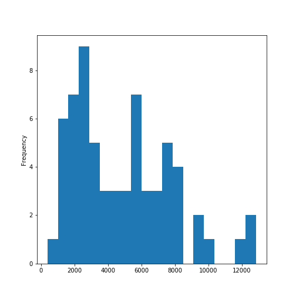
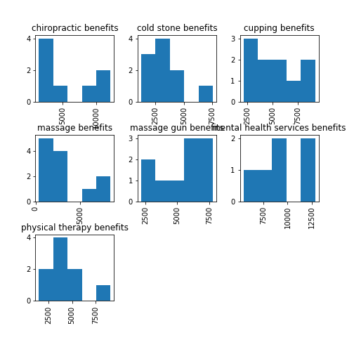

This uses a previous python3 script inside R with reticulate to communicate python code within R. This will classify a wellness or health category based on it being one of either articles pulled from the internet on: physical therapy benefits, massage therapy benefits, chiropractic benefits, massage gun benefits, benefits of mental health services, cold stone therapy benefits, or cupping benefits.

The python packages were sklearn, matplotlib, pandas, numpy, nltk, textBlob, and regex. Some versions that work are later modules, for instance the re package was used that made regex obsolete because it is a build version that replaced regex for my version of python, 3.6.

```{r}
# knitr::knit_engines$set(python = reticulate::eng_python)

library(reticulate)
```

```{r}
conda_list(conda = "auto") 

```

Without having my python IDE, Anaconda, open in the console I want to use the python36 environment, all the environments in Anaconda for python are listed above.

```{r}
use_condaenv(condaenv = "python36")

```

```{python}
import pandas as pd 
import matplotlib.pyplot as plt 
from textblob import TextBlob 
import sklearn 
import numpy as np 
from sklearn.feature_extraction.text import CountVectorizer 
from sklearn.naive_bayes import MultinomialNB 
from sklearn.metrics import classification_report, f1_score, accuracy_score, confusion_matrix 
 
np.random.seed(47) 
```

The following data table will not show in your Rstudio environment, but python inside your python IDE will store the table.
```{python}
modalities = pd.read_csv('benefitsContraindications.csv', encoding = 'unicode_escape') 
```


```{python}
print(modalities.head())
print(modalities.tail())
```


```{python}
print(modalities.shape)
```


```{python}
import regex
def preprocessor(text):
    text = regex.sub('<[^>]*>', '', text)
    emoticons = regex.findall('(?::|;|=)(?:-)?(?:\)|\(|D|P)', text)
    text = regex.sub('[\W]+', ' ', text.lower()) +\
        ' '.join(emoticons).replace('-', '')
    return text
```


```{python}
modalities.tail()
```

Reorder the observations so that they are mixed and not grouped together as they are in the original file.
```{python}
import numpy as np

modalities = modalities.reindex(np.random.permutation(modalities.index))

print(modalities.head())
print(modalities.tail())
```


```{python}
modalities.columns
modalities.groupby('Topic').describe()
```


```{python}
modalities['length'] = modalities['Document'].map(lambda text: len(text))
print(modalities.head())
```


```{python,eval=FALSE}
#%matplotlib inline 
modalities.length.plot(bins=20, kind='hist')
plt.show()
```

```{r echo=FALSE, out.width='100%'}

```


```{python}
modalities.length.describe()
```


```{python}
print(list(modalities.Document[modalities.length > 4200].index))
print(list(modalities.Topic[modalities.length > 420]))

```


```{python, eval=FALSE}

modalities.hist(column='length', by='Topic', bins=5)


plt.show()
```

```{r echo=FALSE, out.width='100%'}

```

```{python}
def split_into_tokens(review):
    
    #review = unicode(review, 'iso-8859-1')# in python 3 the default of str() previously python2 as unicode() is utf-8
    return TextBlob(review).words
```


```{python}
modalities.Document.head().apply(split_into_tokens)
```


```{python}
TextBlob("hello world, how is it going?").tags  # list of (word, POS) pairs
```


```{python}
import nltk
nltk.download('stopwords')

```


```{python}
from nltk.corpus import stopwords

stop = stopwords.words('english')
stop = stop + [u'a',u'b',u'c',u'd',u'e',u'f',u'g',u'h',u'i',u'j',u'k',u'l',u'm',u'n',u'o',u'p',u'q',u'r',u's',u't',u'v',u'w',u'x',u'y',u'z']


```


```{python}
def split_into_lemmas(review):
    #review = unicode(review, 'iso-8859-1')
    review = review.lower()
    #review = unicode(review, 'utf8').lower()
    #review = str(review).lower()
    words = TextBlob(review).words
    # for each word, take its "base form" = lemma 
    return [word.lemma for word in words if word not in stop]

modalities.Document.head().apply(split_into_lemmas)
```


```{python}
bow_transformer = CountVectorizer(analyzer=split_into_lemmas).fit(modalities['Document'])
print(len(bow_transformer.vocabulary_))
```


```{python}
modality4 = modalities['Document'][42]
print(modality4)
```


```{python}
bow4 = bow_transformer.transform([modality4])
print(bow4)
```


```{python}
modalities_bow = bow_transformer.transform(modalities['Document'])
print('sparse matrix shape:', modalities_bow.shape)
print('number of non-zeros:', modalities_bow.nnz)
print('sparsity: %.2f%%' % (100.0 * modalities_bow.nnz / (modalities_bow.shape[0] * modalities_bow.shape[1])))
```

```{python}
modalities_bow
```

Indexing is different in python compared to R. Python includes zero and when indicating a slice, the last value is ignored, so only up to the value. So it is used to slice, so that the next can start and include that number up to the empty slice which indicates the last value. 
```{python}

# Split/splice into training ~ 80% and testing ~ 20%
modalities_bow_train = modalities_bow[:53]
modalities_bow_test = modalities_bow[53:]
modalities_sentiment_train = modalities['Topic'][:53]
modalities_sentiment_test = modalities['Topic'][53:]

print(modalities_bow_train.shape)
print(modalities_bow_test.shape)
```


```{python}
modalities_sentiment = MultinomialNB().fit(modalities_bow_train, modalities_sentiment_train)
```


```{python}
print('predicted:', modalities_sentiment.predict(bow4)[0])
print('expected:', modalities.Topic[42])
```


```{python}
predictions = modalities_sentiment.predict(modalities_bow_test)
print(predictions)
```


```{python}
print('accuracy', accuracy_score(modalities_sentiment_test, predictions))
print('confusion matrix\n', confusion_matrix(modalities_sentiment_test, predictions))
print('(row=expected, col=predicted)')
```
This model generated a 92% accuracy using multinomial naive bayes. 

```{python}
print(classification_report(modalities_sentiment_test, predictions))
```
From the above, precision accounts for type 1 errors (how many real negatives classified as positives-False Positives: TP/(TP+FP)) and type 2 errors (how many real posiives classified as negatives-False Negatives: TP/(TP+FN)) are part of recall.

```{python}
modalitiesu = modalities.Topic.unique()
mus = np.sort(modalitiesu)
mus
```

```{python}

def predict_modality(new_review): 
    new_sample = bow_transformer.transform([new_review])
    pr = np.around(modalities_sentiment.predict_proba(new_sample),2)
    print(new_review,'\n\n', pr)
    print('\n\nThe respective order:\n 1-chiropractic therapy\n 2-cold stone therapy\n 3-cupping therapy\n 4-massage therapy\n 5-massage gun therapy\n 6-mental health therapy\n 7-physical therapy\n\n')
    
    if (pr[0][0] == max(pr[0])):
        print('The max probability is chiropractic therapy for this recommendation with ', pr[0][0]*100,'%')
    elif (pr[0][1] == max(pr[0])):
        print('The max probability is cold stone massage for this recommendation with ', pr[0][1]*100,'%')
    elif (pr[0][2] == max(pr[0])):
        print('The max probability is cupping therapy for this recommendation with ', pr[0][2]*100,'%')
    elif (pr[0][3] == max(pr[0])):
        print('The max probability is massage therapy for this recommendation with ', pr[0][3]*100,'%')
    elif (pr[0][4] == max(pr[0])):
        print('The max probability is massage gun therapy for this recommendation with ', pr[0][4]*100,'%')
    elif (pr[0][5] == max(pr[0])):
        print('The max probability is mental health therapy for this recommendation with ', pr[0][5]*100,'%')
    else:
        print('The max probability is physical therapy for this recommendation with ', pr[0][6]*100,'%')
    print('-----------------------------------------\n\n')

```


```{python}
predict_modality('Headaches, body sweats, depressed.')

predict_modality('sleepless, energy depraved, cold, tension')

predict_modality('body aches from working out')
predict_modality('can\'t move my arm. stuck at home. worried about my neck.')
```

```{python}
predict_modality('breathing ragged, tired, headaches, dizzy, nausious ')

```

```{python}
predict_modality("relief from this pain. can't sleep. feet hurt. chills.")
```
The above shows that this sentiment put into the function predicted the sentiment to be a 1 rating by 57%, and next best was a 4 rating with 15%

```{python}
predict_modality('love this place better than others')
```


```{python}
predict_modality('massage guns and cupping are great for my post workout aches')
```


```{python}
predict_modality('It looks like bruises on my back. Paranoid somebody will tease me about them. I feel better, but still some aches and pains.')
```
This was a quick python 3 recommender based on google searched results for those ten topics. The underlying data only used 65 articles online. When entering a phrase for possible reasons customers could have to want a massage or describe a massage or their health and wellness afterwards, the results mostly recommended massage therapy. The one phrase,"I love this place better than others." recommended mental health therapy and another complaining about not moving his or her arm and having pain in the neck recommended chiropractic therapy. This is based entirely on the tokenized and lemmatized words of the selected articles. Some articles included image descriptions and sponsored ads. It would be helpful to see the word clouds of these articles by topic to visualize the results.


***

```{r,error=FALSE,message=FALSE,warning=FALSE}
library(tidytext)
library(tm)
library(dplyr)
library(ggplot2)
library(tidyr)
library(wordcloud)
```


Lets read in the csv file if you don't have it stored as Reviews15_results.
```{r,error=FALSE, message=FALSE,warning=FALSE}
modalities <- read.csv('benefitsContraindications.csv',
                              sep=',', header=TRUE, na.strings=c('',' ','NA'))
```

```{r,error=FALSE, message=FALSE,warning=FALSE}
colnames(modalities)
```

Lets just use the userReviewOnlyContent and the userRatingValue columns.
```{r,error=FALSE, message=FALSE,warning=FALSE}
modalities1 <- modalities[,c(1,3)]
head(modalities1)
```
We are to make our data table into a dplyr tibble.
```{r,error=FALSE, message=FALSE,warning=FALSE}

text_df <- tibble(line=1:65, text=modalities1$Document,
                  Recommend=modalities1$Topic)
head(text_df)
```

Now for the word counts by line or in our case by review which is line.This uses the tidytext package to unnest the words as tokens from each review. We will use the ngrams method of tokenizing to get the sequential groups of threes for words used in combination. This will be very useful to us in predicting our ratings accurately. As we have seen that using a word like 'like' or 'good' has very similar word counts in ratings of 1 and ratings of 5 but not so much in the 2-4 range. This is because some of those likes are in ngrams of 2-3 with word pairings such as 'don't like', 'not as good', etc. 
```{r,error=FALSE, message=FALSE,warning=FALSE}

text_df$text <- as.character(paste(text_df$text))

fills <- as.data.frame(c('of','the','a','an','in','by','it','as','or','go','goes','am','and','to'))
colnames(fills) <- 'fillers'

text_df0 <- text_df %>% unnest_tokens(bigram,text,token='ngrams',n=2) %>%
  separate(bigram, c('word1','word2'), sep=' ') 

text_df01 <- anti_join(text_df0,fills, by=c("word1"="fillers"))
text_df02 <- anti_join(text_df01,fills, by=c("word2"="fillers"))

text_df02$bigram <- paste(text_df02$word1,text_df02$word2,sep=' ')
text_df03 <- text_df02[,-c(2:4)]

text_df1 <- text_df %>% unnest_tokens(bigram,text, token='ngrams',n=2)
text_df2 <- merge(text_df1,text_df03, by.x='bigram', by.y='bigram', all.y=FALSE)

text_df3 <- text_df2[,-4]
colnames(text_df3)[2] <- 'line'
head(text_df3,30)
```

We see from the above it basically goes along every string word and counts each white space to separate a character from a non-character and get each word, but it also does it for any three combinations, so that almost every word is part of the beginning of one trigram (as we set n to 3 for the number of ngrams, thus trigram), the middle of one trigram, or the end of a trigram. Look at 'wonderful' above and see what I am referring to.


```{r,error=FALSE, message=FALSE,warning=FALSE}
text_df4 <- text_df3 %>% group_by(bigram) %>% count(bigram, sort=TRUE) %>% ungroup
head(text_df4,30)
```
The above shows all documents bigram occurences of word pairs.

We want the recommended modality or health care option for each category counts of bigrams.
```{r}
chiropractor <- subset(text_df3, text_df3$Recommend=='chiropractic benefits')
massage <- subset(text_df3, text_df3$Recommend=='massage benefits')
physicalTherapy <- subset(text_df3, text_df3$Recommend=='physical therapy benefits')
mental <- subset(text_df3, text_df3$Recommend=='mental health services benefits')
cupping <- subset(text_df3, text_df3$Recommend=='cupping benefits')
massageGun <- subset(text_df3, text_df3$Recommend=='massage gun benefits')
coldStone <- subset(text_df3, text_df3$Recommend=='cold stone benefits')
```

Group each category into bigram counts.
```{r}
chiropractor2 <- chiropractor %>% group_by(bigram) %>% count(bigram, sort=TRUE) 
chiropractor3 <- spread(chiropractor2,bigram,n)
freqChiropractor <- colSums(chiropractor3)

massage2 <- massage %>% group_by(bigram) %>% count(bigram, sort=TRUE) 
massage3 <- spread(massage2,bigram,n)
freqMassage <- colSums(massage3)

physical2 <- physicalTherapy %>% group_by(bigram) %>% count(bigram, sort=TRUE) 
physical3 <- spread(physical2,bigram,n)
freqPhysical <- colSums(physical3)

mental2 <- mental %>% group_by(bigram) %>% count(bigram, sort=TRUE) 
mental3 <- spread(mental2,bigram,n)
freqMental <- colSums(mental3)

cupping2 <- cupping %>% group_by(bigram) %>% count(bigram, sort=TRUE) 
cupping3 <- spread(cupping2,bigram,n)
freqCupping <- colSums(cupping3)

massageGun2 <- massageGun %>% group_by(bigram) %>% count(bigram, sort=TRUE) 
massageGun3 <- spread(massageGun2,bigram,n)
freqMassageGun <- colSums(massageGun3)

coldStone2 <- coldStone %>% group_by(bigram) %>% count(bigram, sort=TRUE) 
coldStone3 <- spread(coldStone2,bigram,n)
freqColdStone <- colSums(coldStone3)

```

```{r}
wordcloud(names(freqChiropractor), freqChiropractor,
          min.freq=80,colors=brewer.pal(3,'Dark2'))
```

```{r}
wordcloud(names(freqMassage), freqMassage, min.freq=80,colors=brewer.pal(3,'Dark2'))
```

```{r}
wordcloud(names(freqPhysical), freqPhysical,
          min.freq=80,colors=brewer.pal(3,'Dark2'))
```

```{r}
wordcloud(names(freqMental), freqMental,
          min.freq=80,colors=brewer.pal(3,'Dark2'))
```

```{r}
wordcloud(names(freqCupping), freqCupping,
          min.freq=80,colors=brewer.pal(3,'Dark2'))
```

```{r}
wordcloud(names(freqMassageGun), freqMassageGun,
          min.freq=80,colors=brewer.pal(3,'Dark2'))
```

```{r}
wordcloud(names(freqColdStone), freqColdStone,
          min.freq=80,colors=brewer.pal(3,'Dark2'))
```


