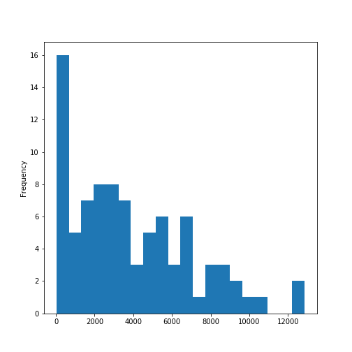
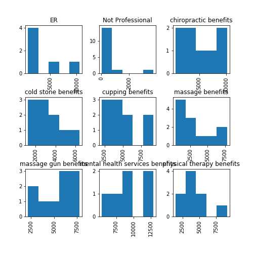

This uses a previous python3 script inside R with reticulate to communicate python code within R. This will classify a wellness or health category based on it being one of either articles pulled from the internet on: physical therapy benefits, massage therapy benefits, chiropractic benefits, massage gun benefits, benefits of mental health services, cold stone therapy benefits, or cupping benefits. Then some 'non professional' google and twitter massage posts were added in to this selection to see how well the classifier could discriminate between one of the seven professional healthcare recommendations and a non-professional recommendation. This script also uses added data on medical professional or ER visit recommended based on user input. This data now has 9 categories to classify based on user input. Also, the risks, effects, and contraindications were scrubbed from the document of each class if it existed and placed into their corresponding feature of 'contraindication' or 'risksAdverseEffect.' This should improve the accuracy in classifying a recommendation for user inputs based on his or her requests.

The python packages were sklearn, matplotlib, pandas, numpy, nltk, textBlob, and regex. Some versions that work are later modules, for instance the re package was used that made regex obsolete because it is a build version that replaced regex for my version of python, 3.6.

```{r}
library(reticulate)
```

```{r}
conda_list(conda = "auto") 

```

Without having my python IDE, Anaconda, open in the console I want to use the python36 environment, all the environments in Anaconda for python are listed above.

```{r}
use_condaenv(condaenv = "python36")

```

```{python}
import pandas as pd 
import matplotlib.pyplot as plt 
from textblob import TextBlob 
import sklearn 
import numpy as np 
from sklearn.feature_extraction.text import CountVectorizer, TfidfVectorizer 
from sklearn.naive_bayes import MultinomialNB 
from sklearn.metrics import classification_report, f1_score, accuracy_score, confusion_matrix 

import re
import string
import nltk 

np.random.seed(47) 
```

```{r}
set.seed(47)
```

The following data table will not show in your Rstudio environment, but python inside your python IDE will store the table.
```{python}
modalities = pd.read_csv('benefitsContraindications3.csv', encoding = 'unicode_escape') 
```


```{python}
print(modalities.head())
print(modalities.tail())
```


```{python}
print(modalities.shape)
print(modalities.columns)
```


```{python}
import regex
def preprocessor(text):
    text = regex.sub('<[^>]*>', '', text)
    emoticons = regex.findall('(?::|;|=)(?:-)?(?:\)|\(|D|P)', text)
    text = regex.sub('[\W]+', ' ', text.lower()) +\
        ' '.join(emoticons).replace('-', '')
    return text
```


```{python}
modalities.tail()
```

Reorder the observations so that they are mixed and not grouped together as they are in the original file.
```{python}
import numpy as np

modalities = modalities.reindex(np.random.permutation(modalities.index))

print(modalities.head())
print(modalities.tail())
```


```{python}
modalities.columns
modalities.groupby('Topic').describe()
```


```{python}
modalities['length'] = modalities['Document'].map(lambda text: len(text))
print(modalities.head())
```


```{python,eval=FALSE}
modalities.length.plot(bins=20, kind='hist')
plt.show()
```

```{r echo=FALSE, out.width='100%'}

```


```{python}
modalities.length.describe()
```


```{python}
print(list(modalities.Document[modalities.length > 3800].index))
print(list(modalities.Topic[modalities.length > 3800]))

```


```{python,eval=FALSE}

modalities.hist(column='length', by='Topic', bins=5)


plt.show()
```

```{r echo=FALSE, out.width='100%'}

```

```{python}
def split_into_tokens(review):
    
    return TextBlob(review).words
```


```{python}
modalities.Document.head().apply(split_into_tokens)
```


```{python}
TextBlob("hello world, how is it going?").tags  # list of (word, POS) pairs
```


```{python}
import nltk
nltk.download('stopwords')

```


```{python}
from nltk.corpus import stopwords

stop = stopwords.words('english')
stop = stop + [u'a',u'b',u'c',u'd',u'e',u'f',u'g',u'h',u'i',u'j',u'k',u'l',u'm',u'n',u'o',u'p',u'q',u'r',u's',u't',u'v',u'w',u'x',u'y',u'z']


```


```{python}
def split_into_lemmas(review):
    #review = unicode(review, 'iso-8859-1')
    review = review.lower()
    #review = unicode(review, 'utf8').lower()
    #review = str(review).lower()
    words = TextBlob(review).words
    # for each word, take its "base form" = lemma 
    return [word.lemma for word in words if word not in stop]

modalities.Document.head().apply(split_into_lemmas)
```


```{python}
bow_transformer = CountVectorizer(analyzer=split_into_lemmas).fit(modalities['Document'])
print(len(bow_transformer.vocabulary_))
```


```{python}
modality4 = modalities['Document'][40]
print(modality4)
```


```{python}
bow4 = bow_transformer.transform([modality4])
print(bow4)
```


```{python}
modalities_bow = bow_transformer.transform(modalities['Document'])
print('sparse matrix shape:', modalities_bow.shape)
print('number of non-zeros:', modalities_bow.nnz)
print('sparsity: %.2f%%' % (100.0 * modalities_bow.nnz / (modalities_bow.shape[0] * modalities_bow.shape[1])))
```

```{python}
modalities_bow
```

Indexing is different in python compared to R. Python includes zero and when indicating a slice, the last value is ignored, so only up to the value. So it is used to slice, so that the next can start and include that number up to the empty slice which indicates the last value. 
```{python}

# Split/splice into training ~ 80% and testing ~ 20%
modalities_bow_train = modalities_bow[:69]
modalities_bow_test = modalities_bow[69:]
modalities_sentiment_train = modalities['Topic'][:69]
modalities_sentiment_test = modalities['Topic'][69:]

print(modalities_bow_train.shape)
print(modalities_bow_test.shape)
print
```


```{python}
modalities_sentiment = MultinomialNB().fit(modalities_bow_train, modalities_sentiment_train)
```


```{python}
print('predicted:', modalities_sentiment.predict(bow4)[0])
print('expected:', modalities.Topic[40])
```


```{python}
predictions = modalities_sentiment.predict(modalities_bow_test)
#print(predictions)


prd = pd.DataFrame(predictions)
prd.columns=['predictions']
prd.index=modalities_sentiment_test.index
pred=pd.concat([pd.DataFrame(prd),modalities_sentiment_test],axis=1)
print(pred)

```


```{python}
print('accuracy', accuracy_score(modalities_sentiment_test, predictions))
print('confusion matrix\n', confusion_matrix(modalities_sentiment_test, predictions))
print('(row=expected, col=predicted)')
```

```{python}
print(classification_report(modalities_sentiment_test, predictions))
```
From the above, precision accounts for type 1 errors (how many real negatives classified as positives-False Positives: TP/(TP+FP)) and type 2 errors (how many real posiives classified as negatives-False Negatives: TP/(TP+FN)) are part of recall.

```{python}
modalitiesu = modalities.Topic.unique()
mus = np.sort(modalitiesu)
mus
```
The 'Not Professional' class is not getting sorted alphabetically with the others nor is the ER class. This may be because of the uppercase priority in sorting that effects the order of probability readings.


```{python}

def predict_modality(new_review): 
    new_sample = bow_transformer.transform([new_review])
    pr = np.around(modalities_sentiment.predict_proba(new_sample),2)
    print(new_review,'\n\n', pr)
    print('\n\nThe respective order:\n 0-ER\n 1-Non Professional\n 2-chiropractic therapy\n 3-cold stone therapy\n 4-cupping therapy\n 5-massage therapy\n 6-massage gun therapy\n 7-mental health therapy\n 8-physical therapy\n\n')
    
    if (pr[0][0] == max(pr[0])):
        print('The max probability is Emergency Room services for this recommendation with ', pr[0][0]*100,'%')
    elif (pr[0][1] == max(pr[0])):
        print('The max probability is Non-Professional services for this recommendation with ', pr[0][1]*100,'%')
        
    elif (pr[0][2] == max(pr[0])):
        print('The max probability is chiropractic therapy for this recommendation with ', pr[0][2]*100,'%')
        
    elif (pr[0][3] == max(pr[0])):
        print('The max probability is cold stone massage for this recommendation with ', pr[0][3]*100,'%')
        
    elif (pr[0][4] == max(pr[0])):
        print('The max probability is cupping therapy for this recommendation with ', pr[0][4]*100,'%')
   
    elif (pr[0][5] == max(pr[0])):
        print('The max probability is massage therapy for this recommendation with ', pr[0][5]*100,'%')
    
    elif (pr[0][6] == max(pr[0])):
        print('The max probability is massage gun therapy for this recommendation with ', pr[0][6]*100,'%')
    
    elif (pr[0][7] == max(pr[0])):
        print('The max probability is mental health therapy for this recommendation with ', pr[0][7]*100,'%')
    
    else:
        print('The max probability is physical therapy for this recommendation with ', pr[0][8]*100,'%')
    
    print('-----------------------------------------\n\n')

```


```{python}
predict_modality('Headaches, body sweats, depressed.')

predict_modality('sleepless, energy depraved, cold, tension')

predict_modality('body aches from working out')
predict_modality('can\'t move my arm. stuck at home. worried about my neck.')
```

```{python}
predict_modality('breathing ragged, tired, headaches, dizzy, nausious ')

```
The above should be under contraindications for massage, but we didn't move that far. Those are listings of contraindications for massage in mentioning the dizzy, nausious, and breathing ragged. But we didn't add in any medical professional services categories to our data to classify. We should do that later.

```{python}
predict_modality("relief from this pain. can't sleep. feet hurt. chills.")
```

```{python}
predict_modality('love this place better than others')
```


***

```{python}

from sklearn.feature_extraction.text import TfidfVectorizer

bow_transformerTFIDF = TfidfVectorizer(analyzer=split_into_lemmas).fit(modalities['Document'])
print(len(bow_transformerTFIDF.vocabulary_))
```


```{python}
modality4 = modalities['Document'][40]
print(modality4)
```


```{python}
bow4 = bow_transformerTFIDF.transform([modality4])
print(bow4)
```


```{python}
modalities_bow = bow_transformerTFIDF.transform(modalities['Document'])
print('sparse matrix shape:', modalities_bow.shape)
print('number of non-zeros:', modalities_bow.nnz)
print('sparsity: %.2f%%' % (100.0 * modalities_bow.nnz / (modalities_bow.shape[0] * modalities_bow.shape[1])))
```


```{python}
modalities_bow
```

```{python}

# Split/splice into training ~ 80% and testing ~ 20%
modalities_bow_train = modalities_bow[:69]
modalities_bow_test = modalities_bow[69:]
modalities_sentiment_train = modalities['Topic'][:69]
modalities_sentiment_test = modalities['Topic'][69:]

print(modalities_bow_train.shape)
print(modalities_bow_test.shape)
print
```


```{python}
modalities_sentiment = MultinomialNB().fit(modalities_bow_train, modalities_sentiment_train)
```


```{python}
print('predicted:', modalities_sentiment.predict(bow4)[0])
print('expected:', modalities.Topic[40])
```


```{python}
predictions = modalities_sentiment.predict(modalities_bow_test)
# print(predictions)

prd = pd.DataFrame(predictions)
prd.columns=['predictions']

prd.index=modalities_sentiment_test.index
pred=pd.concat([pd.DataFrame(prd),modalities_sentiment_test],axis=1)
print(pred)

```


```{python}
print('accuracy', accuracy_score(modalities_sentiment_test, predictions))
print('confusion matrix\n', confusion_matrix(modalities_sentiment_test, predictions))
print('(row=expected, col=predicted)')
```

```{python}
print(classification_report(modalities_sentiment_test, predictions))
```
From the above, precision accounts for type 1 errors (how many real negatives classified as positives-False Positives: TP/(TP+FP)) and type 2 errors (how many real posiives classified as negatives-False Negatives: TP/(TP+FN)) are part of recall.

```{python}
modalitiesu = modalities.Topic.unique()
mus = np.sort(modalitiesu)
mus
```


```{python}

def predict_modality(new_review): 
    new_sample = bow_transformerTFIDF.transform([new_review])
    pr = np.around(modalities_sentiment.predict_proba(new_sample),2)
    print(new_review,'\n\n', pr)
    print('\n\nThe respective order:\n 0-ER\n 1-Non Professional\n 2-chiropractic therapy\n 3-cold stone therapy\n 4-cupping therapy\n 5-massage therapy\n 6-massage gun therapy\n 7-mental health therapy\n 8-physical therapy\n\n')
    
    if (pr[0][0] == max(pr[0])):
        print('The max probability is Emergency Room services for this recommendation with ', pr[0][0]*100,'%')
    elif (pr[0][1] == max(pr[0])):
        print('The max probability is Non-Professional services for this recommendation with ', pr[0][1]*100,'%')
        
    elif (pr[0][2] == max(pr[0])):
        print('The max probability is chiropractic therapy for this recommendation with ', pr[0][2]*100,'%')
        
    elif (pr[0][3] == max(pr[0])):
        print('The max probability is cold stone massage for this recommendation with ', pr[0][3]*100,'%')
        
    elif (pr[0][4] == max(pr[0])):
        print('The max probability is cupping therapy for this recommendation with ', pr[0][4]*100,'%')
   
    elif (pr[0][5] == max(pr[0])):
        print('The max probability is massage therapy for this recommendation with ', pr[0][5]*100,'%')
    
    elif (pr[0][6] == max(pr[0])):
        print('The max probability is massage gun therapy for this recommendation with ', pr[0][6]*100,'%')
    
    elif (pr[0][7] == max(pr[0])):
        print('The max probability is mental health therapy for this recommendation with ', pr[0][7]*100,'%')
    
    else:
        print('The max probability is physical therapy for this recommendation with ', pr[0][8]*100,'%')
    
    print('-----------------------------------------\n\n')

```


```{python}
predict_modality('Headaches, body sweats, depressed.')

predict_modality('sleepless, energy depraved, cold, tension')

predict_modality('body aches from working out')
predict_modality('can\'t move my arm. stuck at home. worried about my neck.')
```

```{python}
predict_modality('breathing ragged, tired, headaches, dizzy, nausious ')

```

```{python}
predict_modality("relief from this pain. can't sleep. feet hurt. chills.")
```

```{python}
predict_modality('love this place better than others')
```


The TF-IDF vectorized dtm performed worse in recommending an accurate class for the testing set and the short user inputs. Lets try out the N-grams and see if it is better.


***


**N-gram Vectorization**
```{python}
modalities = pd.read_csv('benefitsContraindications3.csv', encoding = 'unicode_escape') 
```


```{python}
import regex
def preprocessor(text):
    text = regex.sub('<[^>]*>', '', text)
    emoticons = regex.findall('(?::|;|=)(?:-)?(?:\)|\(|D|P)', text)
    text = regex.sub('[\W]+', ' ', text.lower()) +\
        ' '.join(emoticons).replace('-', '')
    return text
```


Reorder the observations so that they are mixed and not grouped together as they are in the original file.
```{python}
import numpy as np

modalities = modalities.reindex(np.random.permutation(modalities.index))

print(modalities.head())
print(modalities.tail())
```


```{python}
def split_into_tokens(review):
    
    return TextBlob(review).words
```


```{python}
modalities.Document.head().apply(split_into_tokens)
```


```{python}
TextBlob("hello world, how is it going?").tags  # list of (word, POS) pairs
```


```{python}
import nltk
nltk.download('stopwords')

```


```{python}
from nltk.corpus import stopwords

stop = stopwords.words('english')
stop = stop + [u'a',u'b',u'c',u'd',u'e',u'f',u'g',u'h',u'i',u'j',u'k',u'l',u'm',u'n',u'o',u'p',u'q',u'r',u's',u't',u'v',u'w',u'x',u'y',u'z']


```


```{python}
def split_into_lemmas(review):
    #review = unicode(review, 'iso-8859-1')
    review = review.lower()
    #review = unicode(review, 'utf8').lower()
    #review = str(review).lower()
    words = TextBlob(review).words
    # for each word, take its "base form" = lemma 
    return [word.lemma for word in words if word not in stop]

modalities.Document.head().apply(split_into_lemmas)
```

```{python}
bow_transformerNgrams = CountVectorizer(analyzer=split_into_lemmas,ngram_range=(2,2)).fit(modalities['Document'])
          
print(len(bow_transformerNgrams.vocabulary_))


```


```{python}
modality4 = modalities['Document'][40]
print(modality4)
```


```{python}
bow4 = bow_transformerNgrams.transform([modality4])
print(bow4)
```


```{python}
modalities_bow = bow_transformerNgrams.transform(modalities['Document'])
print('sparse matrix shape:', modalities_bow.shape)
print('number of non-zeros:', modalities_bow.nnz)
print('sparsity: %.2f%%' % (100.0 * modalities_bow.nnz / (modalities_bow.shape[0] * modalities_bow.shape[1])))
```


```{python}
modalities_bow
```

```{python}

# Split/splice into training ~ 80% and testing ~ 20%
modalities_bow_train = modalities_bow[:69]
modalities_bow_test = modalities_bow[69:]
modalities_sentiment_train = modalities['Topic'][:69]
modalities_sentiment_test = modalities['Topic'][69:]

print(modalities_bow_train.shape)
print(modalities_bow_test.shape)
print
```


```{python}
modalities_sentiment = MultinomialNB().fit(modalities_bow_train, modalities_sentiment_train)
```


```{python}
print('predicted:', modalities_sentiment.predict(bow4)[0])
print('expected:', modalities.Topic[40])
```


```{python, error=FALSE, message=FALSE, warning=FALSE}
predictions = modalities_sentiment.predict(modalities_bow_test)

prd = pd.DataFrame(predictions)
prd.columns=['predictions']
prd.index=modalities_sentiment_test.index
pred=pd.concat([pd.DataFrame(prd),modalities_sentiment_test],axis=1)
print(pred)

```


```{python}
print('accuracy', accuracy_score(modalities_sentiment_test, predictions))
print('confusion matrix\n', confusion_matrix(modalities_sentiment_test, predictions))
print('(row=expected, col=predicted)')
```

```{python}
print(classification_report(modalities_sentiment_test, predictions))
```
From the above, precision accounts for type 1 errors (how many real negatives classified as positives-False Positives: TP/(TP+FP)) and type 2 errors (how many real posiives classified as negatives-False Negatives: TP/(TP+FN)) are part of recall.

```{python}
modalitiesu = modalities.Topic.unique()
mus = np.sort(modalitiesu)
mus
```


```{python}

def predict_modality(new_review): 
    new_sample = bow_transformerNgrams.transform([new_review])
    pr = np.around(modalities_sentiment.predict_proba(new_sample),2)
    print(new_review,'\n\n', pr)
    print('\n\nThe respective order:\n 0-ER\n 1-Non Professional\n 2-chiropractic therapy\n 3-cold stone therapy\n 4-cupping therapy\n 5-massage therapy\n 6-massage gun therapy\n 7-mental health therapy\n 8-physical therapy\n\n')
    
    if (pr[0][0] == max(pr[0])):
        print('The max probability is Emergency Room services for this recommendation with ', pr[0][0]*100,'%')
    elif (pr[0][1] == max(pr[0])):
        print('The max probability is Non-Professional services for this recommendation with ', pr[0][1]*100,'%')
        
    elif (pr[0][2] == max(pr[0])):
        print('The max probability is chiropractic therapy for this recommendation with ', pr[0][2]*100,'%')
        
    elif (pr[0][3] == max(pr[0])):
        print('The max probability is cold stone massage for this recommendation with ', pr[0][3]*100,'%')
        
    elif (pr[0][4] == max(pr[0])):
        print('The max probability is cupping therapy for this recommendation with ', pr[0][4]*100,'%')
   
    elif (pr[0][5] == max(pr[0])):
        print('The max probability is massage therapy for this recommendation with ', pr[0][5]*100,'%')
    
    elif (pr[0][6] == max(pr[0])):
        print('The max probability is massage gun therapy for this recommendation with ', pr[0][6]*100,'%')
    
    elif (pr[0][7] == max(pr[0])):
        print('The max probability is mental health therapy for this recommendation with ', pr[0][7]*100,'%')
    
    else:
        print('The max probability is physical therapy for this recommendation with ', pr[0][8]*100,'%')
    
    print('-----------------------------------------\n\n')

```


```{python}
predict_modality('Headaches, body sweats, depressed.')

predict_modality('sleepless, energy depraved, cold, tension')

predict_modality('body aches from working out')
predict_modality('can\'t move my arm. stuck at home. worried about my neck.')
```

```{python}
predict_modality('breathing ragged, tired, headaches, dizzy, nausious ')

```

```{python}
predict_modality("relief from this pain. can't sleep. feet hurt. chills.")
```

```{python}
predict_modality('love this place better than others')
```


I would say the TF-IDF predicted better than count on this data for the vectorization, but lets try the ngrams vectorization with bigrams or adjacent word pairs.

With the new scrubbed risks data and the new class added of ER services to this data, we can conclude there was no improvement on accuracy or class prediction. We did get to test out the TF-IDF and N-grams vectorization and found that TF-IDF did well on the testing set or decent but not so well at all on the short user inputs when making a prediction. And the N-grams scored very poorly on the testing set and equally as badly on the short user inputs. It is safe to conclude that these vectorizations, and this data scrubbed of contraindications and with an added ER services group did terrible. We could see if just keeping the data being only scrubbed contraindications and without the added ER does well and also if the data not scrubbed of risks but having an added ER services class does well. But, for whatever reason, possibly needing more observations of Non Professional services that are just as long as the other web pulled documents or having more observations would do better as that is usually the case. 

For now lets look at the word clouds now, when the data is scrubbed of risks/negative side effects/contraindications, and with the ER services class.
***

```{r,error=FALSE,message=FALSE,warning=FALSE}
library(tidytext)
library(tm)
library(dplyr)
library(ggplot2)
library(tidyr)
library(wordcloud)
```


Lets read in the csv file if you don't have it stored as Reviews15_results.
```{r,error=FALSE, message=FALSE,warning=FALSE}
modalities <- read.csv('benefitsContraindications3.csv',
                              sep=',', header=TRUE, na.strings=c('',' ','NA'))
```

```{r,error=FALSE, message=FALSE,warning=FALSE}
colnames(modalities)
```

Lets just use the userReviewOnlyContent and the userRatingValue columns.
```{r,error=FALSE, message=FALSE,warning=FALSE}
modalities1 <- modalities[,c(1,3)]
head(modalities1)
```
We are to make our data table into a dplyr tibble.
```{r,error=FALSE, message=FALSE,warning=FALSE}

text_df <- tibble(line=1:87, text=modalities1$Document,
                  Recommend=modalities1$Topic)
head(text_df)
```

Now for the word counts by line or in our case by review which is line.This uses the tidytext package to unnest the words as tokens from each review. We will use the ngrams method of tokenizing to get the sequential groups of threes for words used in combination. This will be very useful to us in predicting our ratings accurately. As we have seen that using a word like 'like' or 'good' has very similar word counts in ratings of 1 and ratings of 5 but not so much in the 2-4 range. This is because some of those likes are in ngrams of 2-3 with word pairings such as 'don't like', 'not as good', etc. 
```{r,error=FALSE, message=FALSE,warning=FALSE}

text_df$text <- as.character(paste(text_df$text))

fills <- as.data.frame(c('of','the','a','an','in','by','it','as','or','go','goes','am','and','to'))
colnames(fills) <- 'fillers'

text_df0 <- text_df %>% unnest_tokens(bigram,text,token='ngrams',n=2) %>%
  separate(bigram, c('word1','word2'), sep=' ') 

text_df01 <- anti_join(text_df0,fills, by=c("word1"="fillers"))
text_df02 <- anti_join(text_df01,fills, by=c("word2"="fillers"))

text_df02$bigram <- paste(text_df02$word1,text_df02$word2,sep=' ')
text_df03 <- text_df02[,-c(2:4)]

text_df1 <- text_df %>% unnest_tokens(bigram,text, token='ngrams',n=2)
text_df2 <- merge(text_df1,text_df03, by.x='bigram', by.y='bigram', all.y=FALSE)

text_df3 <- text_df2[,-4]
colnames(text_df3)[2] <- 'line'
head(text_df3,30)
```

We see from the above it basically goes along every string word and counts each white space to separate a character from a non-character and get each word, but it also does it for any three combinations, so that almost every word is part of the beginning of one trigram (as we set n to 3 for the number of ngrams, thus trigram), the middle of one trigram, or the end of a trigram. Look at 'wonderful' above and see what I am referring to.


```{r,error=FALSE, message=FALSE,warning=FALSE}
text_df4 <- text_df3 %>% group_by(bigram) %>% count(bigram, sort=TRUE) %>% ungroup
head(text_df4,30)
```
The above shows all documents bigram occurences of word pairs.

We want the recommended modality or health care option for each category counts of bigrams.
```{r}
er <- subset(text_df3, text_df3$Recommend=='ER')
nonPro <- subset(text_df3, text_df3$Recommend=='Not Professional')
chiropractor <- subset(text_df3, text_df3$Recommend=='chiropractic benefits')
massage <- subset(text_df3, text_df3$Recommend=='massage benefits')
physicalTherapy <- subset(text_df3, text_df3$Recommend=='physical therapy benefits')
mental <- subset(text_df3, text_df3$Recommend=='mental health services benefits')
cupping <- subset(text_df3, text_df3$Recommend=='cupping benefits')
massageGun <- subset(text_df3, text_df3$Recommend=='massage gun benefits')
coldStone <- subset(text_df3, text_df3$Recommend=='cold stone benefits')
```

Group each category into bigram counts.
```{r}
er2 <- er %>% group_by(bigram) %>% count(bigram, sort=TRUE) 
er3 <- spread(er2,bigram,n)
freqER <- colSums(er3)

nonPro2 <- nonPro %>% group_by(bigram) %>% count(bigram, sort=TRUE) 
nonPro3 <- spread(nonPro2,bigram,n)
freqNonPro <- colSums(nonPro3)

chiropractor2 <- chiropractor %>% group_by(bigram) %>% count(bigram, sort=TRUE) 
chiropractor3 <- spread(chiropractor2,bigram,n)
freqChiropractor <- colSums(chiropractor3)

massage2 <- massage %>% group_by(bigram) %>% count(bigram, sort=TRUE) 
massage3 <- spread(massage2,bigram,n)
freqMassage <- colSums(massage3)

physical2 <- physicalTherapy %>% group_by(bigram) %>% count(bigram, sort=TRUE) 
physical3 <- spread(physical2,bigram,n)
freqPhysical <- colSums(physical3)

mental2 <- mental %>% group_by(bigram) %>% count(bigram, sort=TRUE) 
mental3 <- spread(mental2,bigram,n)
freqMental <- colSums(mental3)

cupping2 <- cupping %>% group_by(bigram) %>% count(bigram, sort=TRUE) 
cupping3 <- spread(cupping2,bigram,n)
freqCupping <- colSums(cupping3)

massageGun2 <- massageGun %>% group_by(bigram) %>% count(bigram, sort=TRUE) 
massageGun3 <- spread(massageGun2,bigram,n)
freqMassageGun <- colSums(massageGun3)

coldStone2 <- coldStone %>% group_by(bigram) %>% count(bigram, sort=TRUE) 
coldStone3 <- spread(coldStone2,bigram,n)
freqColdStone <- colSums(coldStone3)

```

```{r}
wordcloud(names(freqER), freqER,
          min.freq=10,colors=brewer.pal(3,'Dark2'))
```

```{r}
wordcloud(names(freqNonPro), freqNonPro,
          min.freq=5,colors=brewer.pal(3,'Dark2'))
```
The above shows most bigrams or double word pairings in the non-professional services category.

```{r}
wordcloud(names(freqChiropractor), freqChiropractor,
          min.freq=80,colors=brewer.pal(3,'Dark2'))
```
The above word cloud shows the top frequency bigram word pairs for chiropractic services.

```{r}
wordcloud(names(freqMassage), freqMassage, min.freq=100,colors=brewer.pal(3,'Dark2'))
```
The above word cloud is for massage therapy services word pairs used most often.


```{r}
wordcloud(names(freqPhysical), freqPhysical,
          min.freq=80,colors=brewer.pal(3,'Dark2'))
```
The above word cloud is the bigram word pairs used in physical therapy services documents in the data.


```{r}
wordcloud(names(freqMental), freqMental,
          min.freq=80,colors=brewer.pal(3,'Dark2'))
```
The above word cloud is for word pairs used frequently in mental health documents.


```{r}
wordcloud(names(freqCupping), freqCupping,
          min.freq=80,colors=brewer.pal(3,'Dark2'))
```
The above word cloud is for cupping therapy services.


```{r}
wordcloud(names(freqMassageGun), freqMassageGun,
          min.freq=80,colors=brewer.pal(3,'Dark2'))
```
The above word cloud is for the massage gun services bigram word pairings in our documents on that category.


```{r}
wordcloud(names(freqColdStone), freqColdStone,
          min.freq=80,colors=brewer.pal(3,'Dark2'))
```
This last word cloud above is for cold stone massage therapy bigram word pairs in the documents on cold stone therapy benefits and contraindications.


Looking forward to improving this recommendation system for healthcare services, we need to test these vectorizations, TF-IDF and N-grams, on the previous dataset withou scrubbed risks and without the ER added class and see how well the results produced get towards 100% accuracy. Also, maybe adding in longer inputs for the Non Professional services, but there is a huge caveat of digging into offensive domain territory and being exposed to non-professional and vagrant smut in the process that could open this source to computer virus attacks or inappropriate recommender systems based on the cookies stored when visiting those sites. The latter could be prevented by deleting cookies and browsing private, but the exposure to offensive materials exists in scrubbing the web of longer document content to fill the Non Professional services category, so that the short user inputs won't keep classifying them as 'Non Professional Services' when clearly some are options for massage gun, chiroprator, ER, or physical therapy. 

Another approach would be to take those words that are useful or beneficial to each healthcare service as a recommendation, without the filler content and then make a list of those risks and contraindications for each class of healthcare services or non-professional services. Then in those lists, when the user input is short and concise, the list of options to choose from will be calculated as the option with the highest probability, and if the user separately lists in a different user input any health problems and/or symptoms as a list, then that could choose to knock out the healthcare services that those symptoms are a contraindication for. Such as, if a user says they have pain in their back, but can't sleep because of the pain, have been feeling overheated, have a history of seizures, and maybe is nautious, then the first recommnder will recommend massage, physical therapy, or any other professional healthcare services, but once the user puts in the list of symptoms, the massage and possibly chiropractic and non-professional services would be eliminated leaving only the recommendation for ER services, chiropractic, or physical therapy healthcare services.

Another option to add to the above, is to use the single word or ngrams equal to one word clouds and eliminating stopwords.


***


Lets see what the single standout words are in this wordcloud.
Lets read in the csv file if you don't have it stored as Reviews15_results.
```{r,error=FALSE, message=FALSE,warning=FALSE}
modalities <- read.csv('benefitsContraindications3.csv',
                              sep=',', header=TRUE, na.strings=c('',' ','NA'))
```

```{r,error=FALSE, message=FALSE,warning=FALSE}
colnames(modalities)
```

Lets just use the userReviewOnlyContent and the userRatingValue columns.
```{r,error=FALSE, message=FALSE,warning=FALSE}
modalities1 <- modalities[,c(1,3)]
head(modalities1)
```
We are to make our data table into a dplyr tibble.
```{r,error=FALSE, message=FALSE,warning=FALSE}

text_df <- tibble(line=1:87, text=modalities1$Document,
                  Recommend=modalities1$Topic)
head(text_df)
```

Now for the word counts by line or in our case by review which is line.This uses the tidytext package to unnest the words as tokens from each review. We will use the ngrams method of tokenizing to get the sequential groups of threes for words used in combination. This will be very useful to us in predicting our ratings accurately. As we have seen that using a word like 'like' or 'good' has very similar word counts in ratings of 1 and ratings of 5 but not so much in the 2-4 range. This is because some of those likes are in ngrams of 2-3 with word pairings such as 'don't like', 'not as good', etc. 
```{r,error=FALSE, message=FALSE,warning=FALSE}

text_df$text <- as.character(paste(text_df$text))

library(stopwords)
stop <- as.data.frame(stopwords())
colnames(stop) <- 'fillers'
# fills <- as.data.frame(c('of','the','a','an','in','by','it','as','or','go','goes','am','and','to'))
# colnames(fills) <- 'fillers'

text_df0 <- text_df %>% unnest_tokens(unigram,text,token='ngrams',n=1)

text_df01 <- anti_join(text_df0,stop, by=c("unigram"="fillers"))

```

We see from the above it basically goes along every string word and counts each white space to separate a character from a non-character and get each word, but it also does it for any three combinations, so that almost every word is part of the beginning of one trigram (as we set n to 3 for the number of ngrams, thus trigram), the middle of one trigram, or the end of a trigram. Look at 'wonderful' above and see what I am referring to.


```{r,error=FALSE, message=FALSE,warning=FALSE}
text_df4 <- text_df01 %>% group_by(unigram) %>% count(unigram, sort=TRUE) 
head(text_df4,30)
```
The above shows all documents bigram occurences of word pairs.

We want the recommended modality or health care option for each category counts of bigrams.
```{r}
er <- subset(text_df01, text_df01$Recommend=='ER')
nonPro <- subset(text_df01, text_df01$Recommend=='Not Professional')
chiropractor <- subset(text_df01, text_df01$Recommend=='chiropractic benefits')
massage <- subset(text_df01, text_df01$Recommend=='massage benefits')
physicalTherapy <- subset(text_df01, text_df01$Recommend=='physical therapy benefits')
mental <- subset(text_df01, text_df01$Recommend=='mental health services benefits')
cupping <- subset(text_df01, text_df01$Recommend=='cupping benefits')
massageGun <- subset(text_df01, text_df01$Recommend=='massage gun benefits')
coldStone <- subset(text_df01, text_df01$Recommend=='cold stone benefits')
```

Group each category into bigram counts.
```{r}
er2 <- er %>% group_by(unigram) %>% count(unigram, sort=TRUE) 
er3 <- spread(er2,unigram,n)
freqER <- colSums(er3)

nonPro2 <- nonPro %>% group_by(unigram) %>% count(unigram, sort=TRUE) 
nonPro3 <- spread(nonPro2,unigram,n)
freqNonPro <- colSums(nonPro3)

chiropractor2 <- chiropractor %>% group_by(unigram) %>% count(unigram, sort=TRUE) 
chiropractor3 <- spread(chiropractor2,unigram,n)
freqChiropractor <- colSums(chiropractor3)

massage2 <- massage %>% group_by(unigram) %>% count(unigram, sort=TRUE) 
massage3 <- spread(massage2,unigram,n)
freqMassage <- colSums(massage3)

physical2 <- physicalTherapy %>% group_by(unigram) %>% count(unigram, sort=TRUE) 
physical3 <- spread(physical2,unigram,n)
freqPhysical <- colSums(physical3)

mental2 <- mental %>% group_by(unigram) %>% count(unigram, sort=TRUE) 
mental3 <- spread(mental2,unigram,n)
freqMental <- colSums(mental3)

cupping2 <- cupping %>% group_by(unigram) %>% count(unigram, sort=TRUE) 
cupping3 <- spread(cupping2,unigram,n)
freqCupping <- colSums(cupping3)

massageGun2 <- massageGun %>% group_by(unigram) %>% count(unigram, sort=TRUE) 
massageGun3 <- spread(massageGun2,unigram,n)
freqMassageGun <- colSums(massageGun3)

coldStone2 <- coldStone %>% group_by(unigram) %>% count(unigram, sort=TRUE) 
coldStone3 <- spread(coldStone2,unigram,n)
freqColdStone <- colSums(coldStone3)

```

```{r}
wordcloud(names(freqER), freqER,
          min.freq=10,colors=brewer.pal(3,'Dark2'))
```
The above word cloud is for Emergency Room services from qualified medical staff such as doctors and nurses.

```{r}
wordcloud(names(freqNonPro), freqNonPro,
          min.freq=2,colors=brewer.pal(3,'Dark2'))
```
The word cloud above is for non-professional services. It was scrubbed from twitter using massage, but these tweets were not for professional massage services or requests.

```{r}
wordcloud(names(freqChiropractor), freqChiropractor,
          min.freq=9,colors=brewer.pal(3,'Dark2'))
```
The word cloud above is for chiropractic services.

```{r}
wordcloud(names(freqMassage), freqMassage, min.freq=9,colors=brewer.pal(3,'Dark2'))
```
The word cloud above is for massage therapy.

```{r}
wordcloud(names(freqPhysical), freqPhysical,
          min.freq=10,colors=brewer.pal(3,'Dark2'))
```
The word cloud above is for physical therapy.

```{r}
wordcloud(names(freqMental), freqMental,
          min.freq=10,colors=brewer.pal(3,'Dark2'))
```
The word cloud above is for mental health services.

```{r}
wordcloud(names(freqCupping), freqCupping,
          min.freq=10,colors=brewer.pal(3,'Dark2'))
```
The word cloud above is for cupping therapy.

```{r}
wordcloud(names(freqMassageGun), freqMassageGun,
          min.freq=10,colors=brewer.pal(3,'Dark2'))
```
The wordcloud above is for massage gun therapy.

```{r}
wordcloud(names(freqColdStone), freqColdStone,
          min.freq=10,colors=brewer.pal(3,'Dark2'))
```
This word cloud above is for Cold stone therapy.

***

We saw how the count, tf-idf, and n-grams vectorized tokens for a dtm work. And found that the range of accuracy with our new added category for ER services, and the scrubbed risks and contraindications out of our health services' documents, did score better than the last script with the added 'Not Professional Services' category and keeping the risks and contraindications within each document. Because that other previous model scored 62% on the testing set using only the count vectorization. And this script's models ranged from 72-83% accuracy on the testing sets, with some questionable recommendations on the short user inputs. Both of the count and n-grams set to bigrams or 2 word adjacent pairings scored 72% on the testing sets, and the tf-idf scored 83% on the testing set. We saw in the first and second script that excluded the added 'Not Professional Services' category and included  the risks and contraindications scored 92% and had better recommendations in the short user inputs as well. 

Any of these models would be ok to use for fun, but they would still need to be improved by supplying better data in the first place, or by testing out other algorithms that could be time consuming such as the trees that random forest and rpart or gradient boosting trees. 